# Seurat: the standard scRNA-seq workflow


- [Setup](#setup)
- [Get the data](#get-the-data)
- [Build a Seurat object](#build-a-seurat-object)
- [Quality control](#quality-control)
- [Normalization](#normalization)
- [Variable features](#variable-features)
- [Scaling](#scaling)
- [Linear dimensional reduction](#linear-dimensional-reduction)
- [Clustering](#clustering)
- [Finding marker genes](#finding-marker-genes)
- [Assigning cell type identities](#assigning-cell-type-identities)
- [Save your work](#save-your-work)
- [Session information](#session-information)

This tutorial walks through the standard Seurat workflow on a dataset of
2,700 peripheral blood mononuclear cells (PBMCs) sequenced on the 10x
Genomics platform. By the end you will have gone from a raw count matrix
to annotated cell types on a UMAP.

Everything here runs inside the course container. If you have not built
it yet, go back to the in-class assignment before starting.

## Setup

Before you run anything, change `NETID` below to your own NetID.
Everything this tutorial writes goes into your own directory under the
course space on `/xdisk`.

``` r
library(Seurat)
library(dplyr)
library(patchwork)
library(ggplot2)

# CHANGE THIS to your NetID.
NETID <- "your_netid"

if (nzchar(Sys.getenv("CMM523_NETID"))) NETID <- Sys.getenv("CMM523_NETID")

WORK <- file.path("/xdisk/darrenc/cmm_523", NETID, "seurat_intro")
dir.create(file.path(WORK, "output"), recursive = TRUE, showWarnings = FALSE)

# Rendering only: keep the multi-GB knitr cache off /home.
knitr::opts_chunk$set(
  cache.path = file.path(
    Sys.getenv("CMM523_CACHE", unset = "/xdisk/darrenc/darrenc/cmm523_cache"),
    "01_seurat_intro/"
  )
)

WORK
```

    #> [1] "/xdisk/darrenc/cmm_523/darrenc/seurat_intro"

## Get the data

The PBMC dataset is distributed by 10x Genomics as a gzipped tarball.
This only downloads if the file is not already present, so it is safe to
re-run.

``` r
tarball <- file.path(WORK, "pbmc3k_filtered_gene_bc_matrices.tar.gz")

if (!file.exists(tarball)) {
  download.file(
    "https://cf.10xgenomics.com/samples/cell/pbmc3k/pbmc3k_filtered_gene_bc_matrices.tar.gz",
    tarball, mode = "wb"
  )
  untar(tarball, exdir = WORK)
}

list.files(file.path(WORK, "filtered_gene_bc_matrices", "hg19"))
```

    #> [1] "barcodes.tsv" "genes.tsv"    "matrix.mtx"

Three files: `barcodes.tsv`, `genes.tsv`, and `matrix.mtx`. This is the
standard Cell Ranger output format — a sparse matrix plus the row and
column names for it.

## Build a Seurat object

`Read10X()` reads those three files into a sparse matrix of counts, with
genes as rows and cells as columns.

``` r
pbmc.data <- Read10X(data.dir = file.path(WORK, "filtered_gene_bc_matrices", "hg19"))

pbmc <- CreateSeuratObject(
  counts = pbmc.data,
  project = "pbmc3k",
  min.cells = 3,
  min.features = 200
)

pbmc
```

    #> An object of class Seurat 
    #> 13714 features across 2700 samples within 1 assay 
    #> Active assay: RNA (13714 features, 0 variable features)
    #>  1 layer present: counts

The two filters do different things. `min.cells = 3` drops genes
detected in fewer than three cells — these carry almost no information
and slow everything down. `min.features = 200` drops cells with fewer
than 200 genes detected, which are usually empty droplets or dying
cells.

## Quality control

The standard QC metrics are the number of genes per cell, the number of
UMIs per cell, and the percentage of reads coming from mitochondrial
genes. High mitochondrial content usually means a dying or lysed cell,
whose cytoplasmic RNA has leaked out.

`PercentageFeatureSet()` computes the percentage of counts belonging to
a set of genes. In human data mitochondrial genes are prefixed `MT-`.

``` r
pbmc[["percent.mt"]] <- PercentageFeatureSet(pbmc, pattern = "^MT-")

head(pbmc@meta.data, 5)
```

    #>                  orig.ident nCount_RNA nFeature_RNA percent.mt
    #> AAACATACAACCAC-1     pbmc3k       2419          779  3.0177759
    #> AAACATTGAGCTAC-1     pbmc3k       4903         1352  3.7935958
    #> AAACATTGATCAGC-1     pbmc3k       3147         1129  0.8897363
    #> AAACCGTGCTTCCG-1     pbmc3k       2639          960  1.7430845
    #> AAACCGTGTATGCG-1     pbmc3k        980          521  1.2244898

``` r
VlnPlot(pbmc, features = c("nFeature_RNA", "nCount_RNA", "percent.mt"), ncol = 3)
```

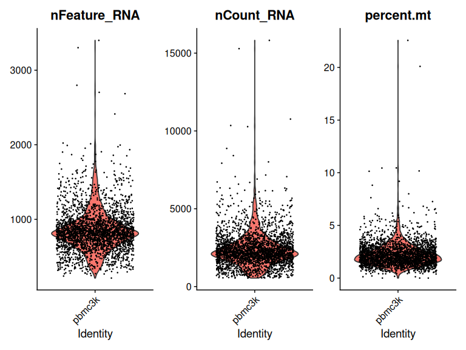

``` r
plot1 <- FeatureScatter(pbmc, feature1 = "nCount_RNA", feature2 = "percent.mt")
plot2 <- FeatureScatter(pbmc, feature1 = "nCount_RNA", feature2 = "nFeature_RNA")
plot1 + plot2
```

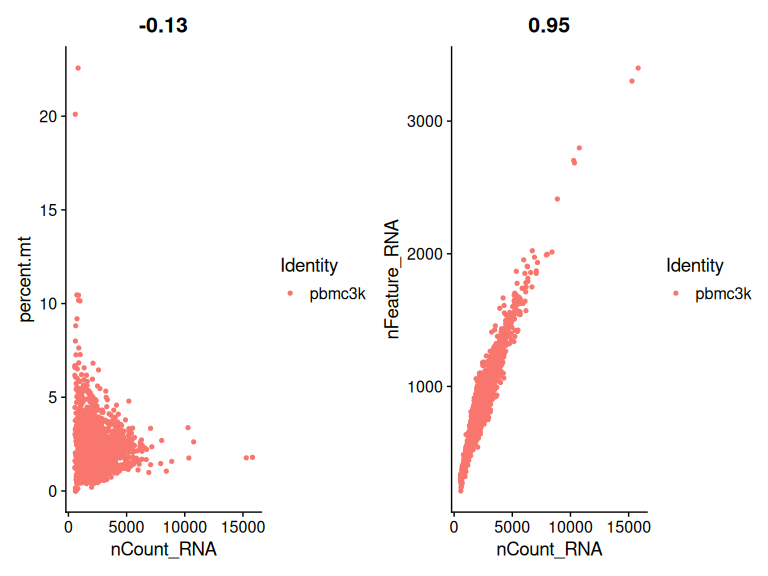

The scatter plots are worth reading carefully. `nCount_RNA` against
`nFeature_RNA` should be tightly correlated — cells with more UMIs
detect more genes. Points falling below that line are suspicious.

Now filter. These thresholds are specific to this dataset; they are not
universal constants.

``` r
pbmc <- subset(
  pbmc,
  subset = nFeature_RNA > 200 & nFeature_RNA < 2500 & percent.mt < 5
)

pbmc
```

    #> An object of class Seurat 
    #> 13714 features across 2638 samples within 1 assay 
    #> Active assay: RNA (13714 features, 0 variable features)
    #>  1 layer present: counts

## Normalization

Cells differ in sequencing depth, so raw counts are not comparable
between them. The default normalization divides each count by the total
counts for that cell, multiplies by 10,000, and log-transforms the
result.

``` r
pbmc <- NormalizeData(pbmc)
```

## Variable features

Most genes are not informative for distinguishing cell types.
Restricting to the genes that vary most across cells sharpens the
downstream structure and cuts the computation substantially.

``` r
pbmc <- FindVariableFeatures(pbmc, selection.method = "vst", nfeatures = 2000)

top10 <- head(VariableFeatures(pbmc), 10)
top10
```

    #>  [1] "PPBP"   "LYZ"    "S100A9" "IGLL5"  "GNLY"   "FTL"    "PF4"    "FTH1"  
    #>  [9] "GNG11"  "S100A8"

``` r
plot1 <- VariableFeaturePlot(pbmc)
LabelPoints(plot = plot1, points = top10, repel = TRUE)
```

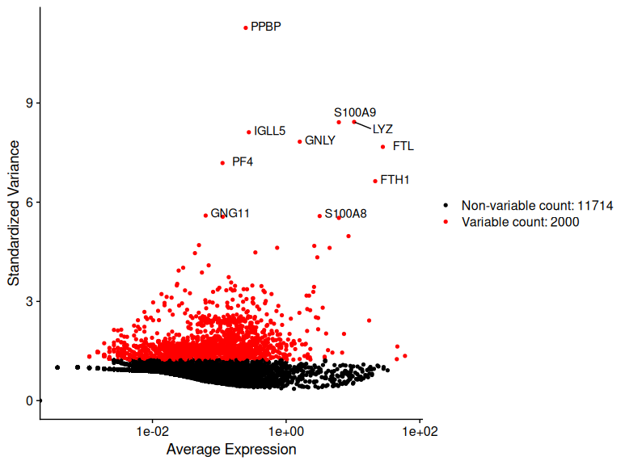

Notice what comes out on top: PPBP (platelets), LYZ (monocytes), GNLY
and GNG11. These are marker genes for specific populations, which is
exactly what you would hope a variance-based selection would find.

## Scaling

PCA requires that genes be centered and scaled, otherwise highly
expressed genes dominate purely because of their magnitude.

``` r
all.genes <- rownames(pbmc)
pbmc <- ScaleData(pbmc, features = all.genes)
```

## Linear dimensional reduction

``` r
pbmc <- RunPCA(pbmc, features = VariableFeatures(object = pbmc))

print(pbmc[["pca"]], dims = 1:5, nfeatures = 5)
```

    #> PC_ 1 
    #> Positive:  CST3, TYROBP, LST1, AIF1, FTL 
    #> Negative:  MALAT1, LTB, IL32, IL7R, CD2 
    #> PC_ 2 
    #> Positive:  CD79A, MS4A1, TCL1A, HLA-DQA1, HLA-DQB1 
    #> Negative:  NKG7, PRF1, CST7, GZMB, GZMA 
    #> PC_ 3 
    #> Positive:  HLA-DQA1, CD79A, CD79B, HLA-DQB1, HLA-DPB1 
    #> Negative:  PPBP, PF4, SDPR, SPARC, GNG11 
    #> PC_ 4 
    #> Positive:  HLA-DQA1, CD79B, CD79A, MS4A1, HLA-DQB1 
    #> Negative:  VIM, IL7R, S100A6, IL32, S100A8 
    #> PC_ 5 
    #> Positive:  GZMB, NKG7, S100A8, FGFBP2, GNLY 
    #> Negative:  LTB, IL7R, CKB, VIM, MS4A7

``` r
VizDimLoadings(pbmc, dims = 1:2, reduction = "pca")
```

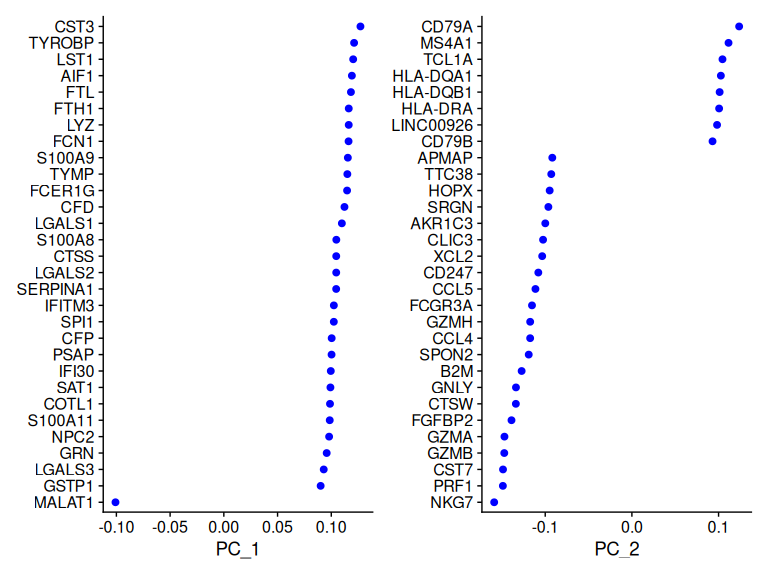

``` r
DimPlot(pbmc, reduction = "pca") + NoLegend()
```

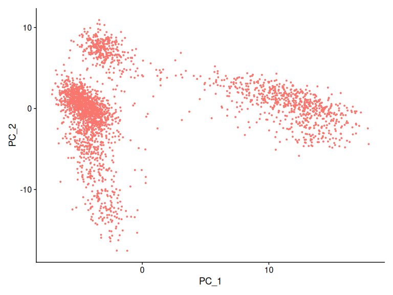

`DimHeatmap()` is a useful way to judge how many components carry real
signal. Each panel shows the cells and genes with the most extreme
loadings on that component, ordered. A component with clear block
structure is capturing something; one that looks like noise probably is.

``` r
DimHeatmap(pbmc, dims = 1, cells = 500, balanced = TRUE)
```

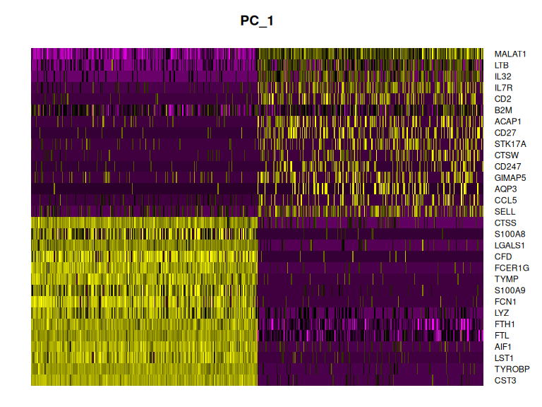

``` r
DimHeatmap(pbmc, dims = 1:15, cells = 500, balanced = TRUE)
```

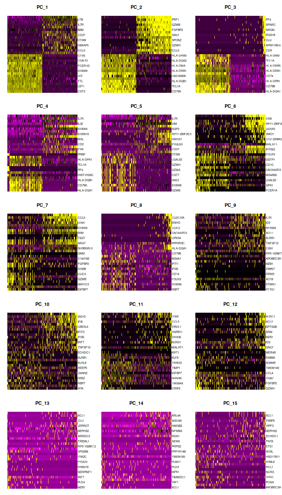

The elbow plot ranks components by the variance they explain. The
“elbow” — the point where the curve flattens — is a rough guide to how
many to keep.

``` r
ElbowPlot(pbmc)
```

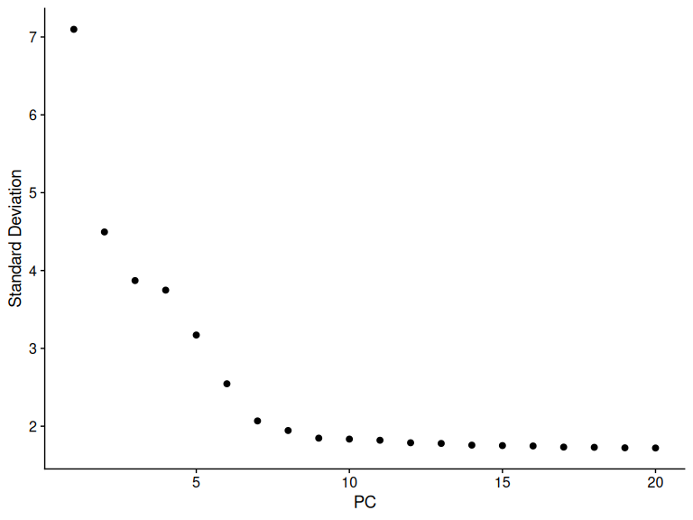

There is an elbow around PC 9–10 here. We will use 10. This choice is a
judgment call, and it is worth checking that your conclusions do not
depend heavily on it.

## Clustering

Seurat clusters cells by building a shared nearest neighbor graph and
then partitioning it. The `resolution` parameter controls granularity:
higher values give more clusters.

``` r
pbmc <- FindNeighbors(pbmc, dims = 1:10)
pbmc <- FindClusters(pbmc, resolution = 0.5)
```

    #> Modularity Optimizer version 1.3.0 by Ludo Waltman and Nees Jan van Eck
    #> 
    #> Number of nodes: 2638
    #> Number of edges: 95927
    #> 
    #> Running Louvain algorithm...
    #> Maximum modularity in 10 random starts: 0.8728
    #> Number of communities: 9
    #> Elapsed time: 0 seconds

``` r
head(Idents(pbmc), 5)
```

    #> AAACATACAACCAC-1 AAACATTGAGCTAC-1 AAACATTGATCAGC-1 AAACCGTGCTTCCG-1 
    #>                2                3                2                1 
    #> AAACCGTGTATGCG-1 
    #>                6 
    #> Levels: 0 1 2 3 4 5 6 7 8

``` r
pbmc <- RunUMAP(pbmc, dims = 1:10)
DimPlot(pbmc, reduction = "umap")
```

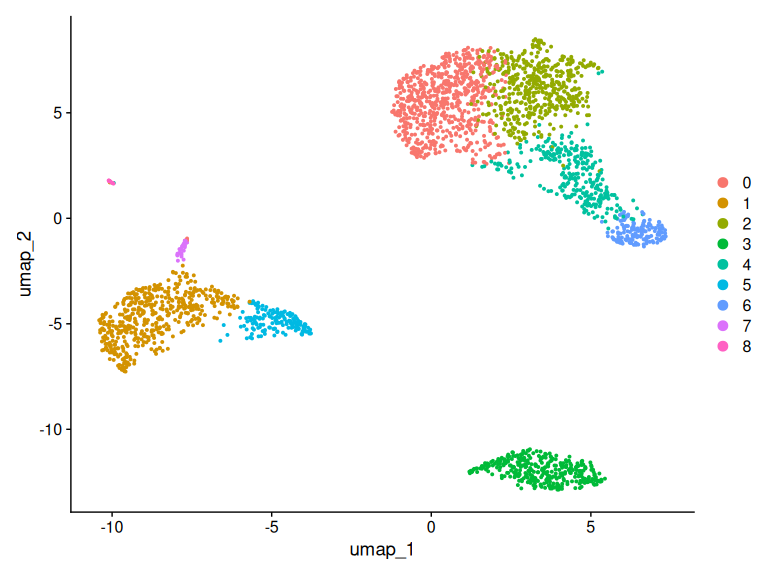

## Finding marker genes

A cluster is only useful if you can say what it is. `FindAllMarkers()`
tests each cluster against all the others and returns the genes that
distinguish it.

``` r
pbmc.markers <- FindAllMarkers(pbmc, only.pos = TRUE)

pbmc.markers %>%
  group_by(cluster) %>%
  dplyr::filter(avg_log2FC > 1) %>%
  slice_head(n = 3) %>%
  ungroup()
```

    #> # A tibble: 27 × 7
    #>        p_val avg_log2FC pct.1 pct.2 p_val_adj cluster gene  
    #>        <dbl>      <dbl> <dbl> <dbl>     <dbl> <fct>   <chr> 
    #>  1 3.75e-112       1.21 0.912 0.592 5.14e-108 0       LDHB  
    #>  2 9.57e- 88       2.40 0.447 0.108 1.31e- 83 0       CCR7  
    #>  3 1.15e- 76       1.06 0.845 0.406 1.58e- 72 0       CD3D  
    #>  4 0               6.65 0.975 0.121 0         1       S100A8
    #>  5 0               5.65 0.909 0.059 0         1       LGALS2
    #>  6 0               6.18 0.996 0.215 0         1       S100A9
    #>  7 2.89e- 90       1.31 0.947 0.465 3.97e- 86 2       IL32  
    #>  8 1.06e- 86       1.33 0.981 0.643 1.45e- 82 2       LTB   
    #>  9 8.79e- 71       1.06 0.922 0.432 1.21e- 66 2       CD3D  
    #> 10 0               6.91 0.936 0.041 0         3       CD79A 
    #> # ℹ 17 more rows

You can also test specific comparisons. Here, cluster 5 against clusters
0 and 3:

``` r
cluster5.markers <- FindMarkers(pbmc, ident.1 = 5, ident.2 = c(0, 3))
head(cluster5.markers, n = 5)
```

    #>                       p_val avg_log2FC pct.1 pct.2     p_val_adj
    #> FCGR3A        8.246578e-205   6.794969 0.975 0.040 1.130936e-200
    #> IFITM3        1.677613e-195   6.192558 0.975 0.049 2.300678e-191
    #> CFD           2.401156e-193   6.015172 0.938 0.038 3.292945e-189
    #> CD68          2.900384e-191   5.530330 0.926 0.035 3.977587e-187
    #> RP11-290F20.3 2.513244e-186   6.297999 0.840 0.017 3.446663e-182

Plotting known markers across the UMAP is the quickest way to orient
yourself.

``` r
FeaturePlot(pbmc, features = c("MS4A1", "GNLY", "CD3E", "CD14", "FCER1A",
                               "FCGR3A", "LYZ", "PPBP", "CD8A"))
```

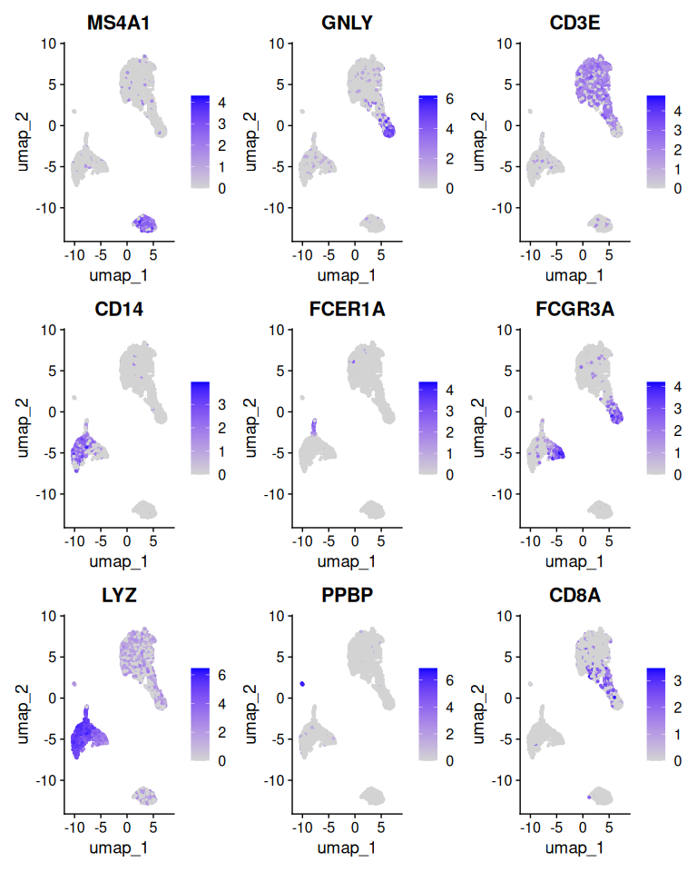

``` r
pbmc.markers %>%
  group_by(cluster) %>%
  dplyr::filter(avg_log2FC > 1) %>%
  slice_head(n = 10) %>%
  ungroup() -> top10_markers

DoHeatmap(pbmc, features = top10_markers$gene) + NoLegend()
```

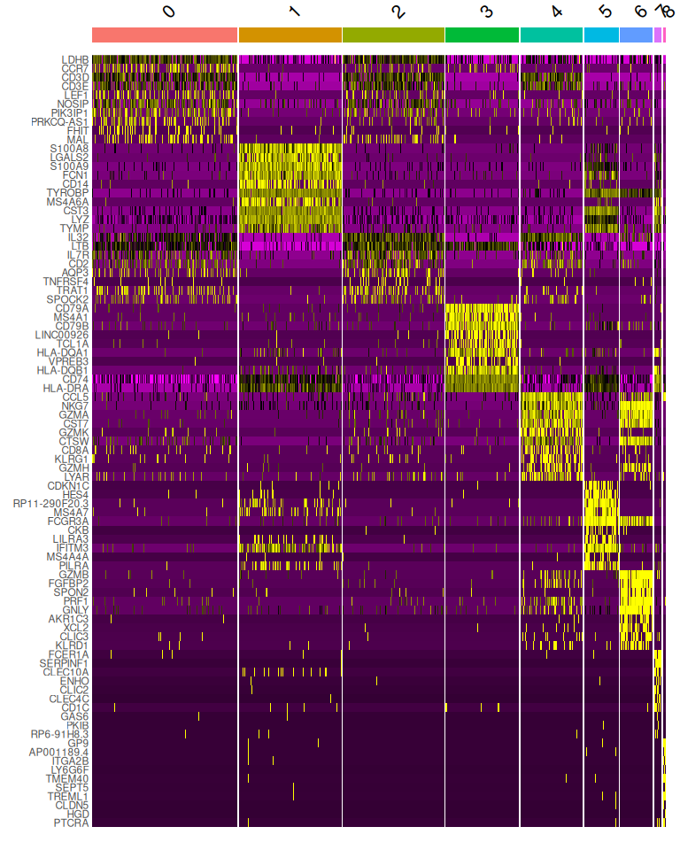

## Assigning cell type identities

With canonical markers in hand, the clusters can be named. This mapping
is specific to this dataset at this resolution — if your clustering
differs, so will the numbering.

| Cluster | Markers       | Cell type    |
|---------|---------------|--------------|
| 0       | IL7R, CCR7    | Naive CD4 T  |
| 1       | CD14, LYZ     | CD14+ Mono   |
| 2       | IL7R, S100A4  | Memory CD4 T |
| 3       | MS4A1         | B            |
| 4       | CD8A          | CD8 T        |
| 5       | FCGR3A, MS4A7 | FCGR3A+ Mono |
| 6       | GNLY, NKG7    | NK           |
| 7       | FCER1A, CST3  | DC           |
| 8       | PPBP          | Platelet     |

``` r
new.cluster.ids <- c("Naive CD4 T", "CD14+ Mono", "Memory CD4 T", "B",
                     "CD8 T", "FCGR3A+ Mono", "NK", "DC", "Platelet")

stopifnot(length(new.cluster.ids) == length(levels(pbmc)))
names(new.cluster.ids) <- levels(pbmc)
pbmc <- RenameIdents(pbmc, new.cluster.ids)

DimPlot(pbmc, reduction = "umap", label = TRUE, pt.size = 0.5) + NoLegend()
```

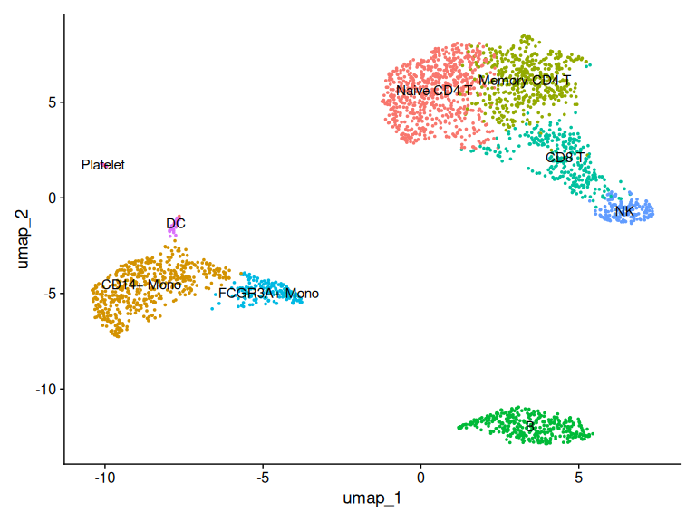

## Save your work

``` r
plot <- DimPlot(pbmc, reduction = "umap", label = TRUE, label.size = 4.5) +
  xlab("UMAP 1") + ylab("UMAP 2") +
  theme(axis.title = element_text(size = 18),
        legend.text = element_text(size = 18)) +
  guides(colour = guide_legend(override.aes = list(size = 10)))

ggsave(file.path(WORK, "output", "pbmc3k_umap.jpg"),
       plot = plot, height = 7, width = 12)

saveRDS(pbmc, file = file.path(WORK, "output", "pbmc3k_final.rds"))
```

Keep that `.rds`. Several later tutorials start from a processed object,
and re-running this one takes long enough to be annoying.

## Session information

``` r
sessionInfo()
```

    #> R version 4.6.1 (2026-06-24)
    #> Platform: x86_64-pc-linux-gnu
    #> Running under: Ubuntu 24.04.4 LTS
    #> 
    #> Matrix products: default
    #> BLAS:   /usr/lib/x86_64-linux-gnu/openblas-pthread/libblas.so.3 
    #> LAPACK: /usr/lib/x86_64-linux-gnu/openblas-pthread/libopenblasp-r0.3.26.so;  LAPACK version 3.12.0
    #> 
    #> locale:
    #>  [1] LC_CTYPE=C.UTF-8       LC_NUMERIC=C           LC_TIME=C.UTF-8       
    #>  [4] LC_COLLATE=C.UTF-8     LC_MONETARY=C.UTF-8    LC_MESSAGES=C.UTF-8   
    #>  [7] LC_PAPER=C.UTF-8       LC_NAME=C              LC_ADDRESS=C          
    #> [10] LC_TELEPHONE=C         LC_MEASUREMENT=C.UTF-8 LC_IDENTIFICATION=C   
    #> 
    #> time zone: Etc/UTC
    #> tzcode source: system (glibc)
    #> 
    #> attached base packages:
    #> [1] stats     graphics  grDevices utils     datasets  methods   base     
    #> 
    #> other attached packages:
    #> [1] future_1.75.0      ggplot2_4.0.3      patchwork_1.3.2    dplyr_1.2.1       
    #> [5] Seurat_5.5.1       SeuratObject_5.4.0 sp_2.2-3          
    #> 
    #> loaded via a namespace (and not attached):
    #>   [1] deldir_2.0-4           pbapply_1.7-4          gridExtra_2.3.1       
    #>   [4] rlang_1.3.0            magrittr_2.0.5         RcppAnnoy_0.0.23      
    #>   [7] otel_0.2.0             spatstat.geom_3.8-2    matrixStats_1.5.0     
    #>  [10] ggridges_0.5.7         compiler_4.6.1         systemfonts_1.3.2     
    #>  [13] png_0.1-9              vctrs_0.7.3            reshape2_1.4.5        
    #>  [16] stringr_1.6.0          pkgconfig_2.0.3        fastmap_1.2.0         
    #>  [19] labeling_0.4.3         utf8_1.2.6             promises_1.5.0        
    #>  [22] rmarkdown_2.31         ragg_1.5.2             purrr_1.2.2           
    #>  [25] xfun_0.60              jsonlite_2.0.0         goftest_1.2-3         
    #>  [28] later_1.4.8            spatstat.utils_3.2-4   irlba_2.3.7           
    #>  [31] parallel_4.6.1         cluster_2.1.8.3        R6_2.6.1              
    #>  [34] ica_1.0-3              stringi_1.8.9          RColorBrewer_1.1-3    
    #>  [37] spatstat.data_3.1-9    limma_3.68.5           reticulate_1.46.0     
    #>  [40] parallelly_1.48.0      spatstat.univar_3.2-0  lmtest_0.9-40         
    #>  [43] scattermore_1.2        Rcpp_1.1.2             knitr_1.51            
    #>  [46] tensor_1.5.1           future.apply_1.20.2    zoo_1.9-0             
    #>  [49] R.utils_2.13.0         sctransform_0.4.3      httpuv_1.6.17         
    #>  [52] Matrix_1.7-6           splines_4.6.1          igraph_2.3.3          
    #>  [55] tidyselect_1.2.1       dichromat_2.0-1        abind_1.4-8           
    #>  [58] yaml_2.3.12            spatstat.random_3.5-1  codetools_0.2-20      
    #>  [61] miniUI_0.1.2           spatstat.explore_3.8-2 listenv_1.0.0         
    #>  [64] lattice_0.22-9         tibble_3.3.1           plyr_1.8.9            
    #>  [67] withr_3.0.3            shiny_1.14.0           S7_0.2.2              
    #>  [70] ROCR_1.0-12            evaluate_1.0.5         Rtsne_0.17            
    #>  [73] fastDummies_1.7.6      survival_3.8-9         polyclip_1.10-7       
    #>  [76] fitdistrplus_1.2-6     pillar_1.11.1          KernSmooth_2.23-26    
    #>  [79] plotly_4.12.1          generics_0.1.4         RcppHNSW_0.7.0        
    #>  [82] scales_1.4.0           globals_0.19.1         xtable_1.8-8          
    #>  [85] glue_1.8.1             tools_4.6.1            data.table_1.18.4     
    #>  [88] RSpectra_0.16-2        RANN_2.6.2             dotCall64_1.2         
    #>  [91] cowplot_1.2.0          grid_4.6.1             tidyr_1.3.2           
    #>  [94] nlme_3.1-170           cli_3.6.6              spatstat.sparse_3.2-0 
    #>  [97] textshaping_1.0.5      spam_2.11-4            viridisLite_0.4.3     
    #> [100] uwot_0.2.4             gtable_0.3.6           R.methodsS3_1.8.2     
    #> [103] digest_0.6.39          progressr_1.0.0        ggrepel_0.9.8         
    #> [106] htmlwidgets_1.6.4      farver_2.1.2           R.oo_1.27.1           
    #> [109] htmltools_0.5.9        lifecycle_1.0.5        httr_1.4.8            
    #> [112] statmod_1.5.2          mime_0.13              MASS_7.3-66

------------------------------------------------------------------------

*Adapted from the [Seurat PBMC3K guided
tutorial](https://satijalab.org/seurat/articles/pbmc3k_tutorial.html)
(Satija Lab), updated for Seurat 5 and R 4.6.*
