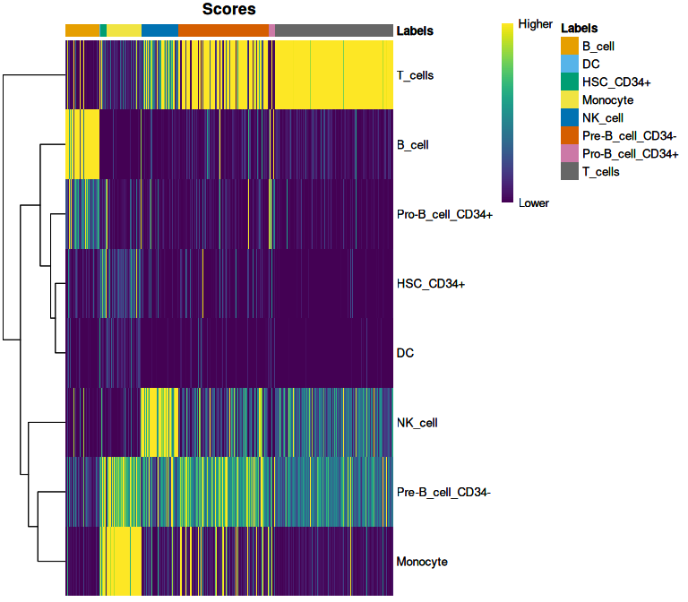
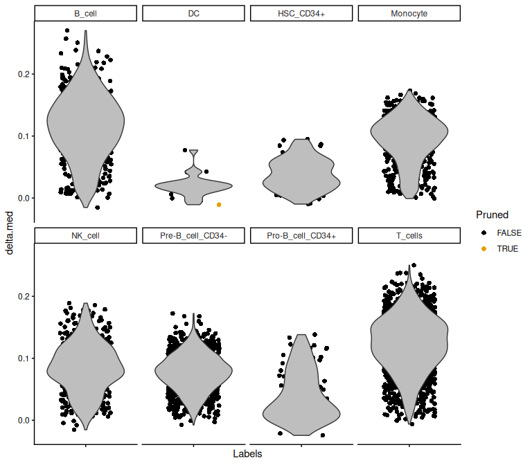
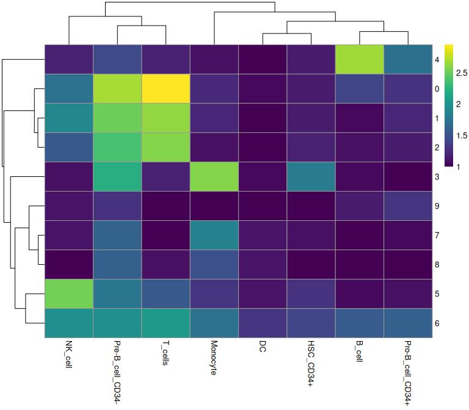
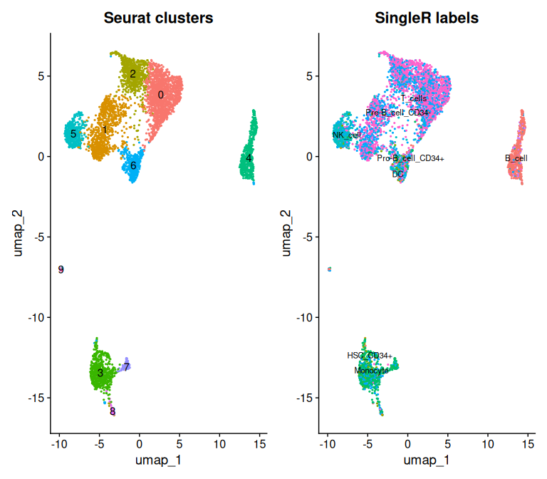

# SingleR: automated cell type annotation


- [Setup](#setup)
- [Get a reference](#get-a-reference)
- [Get some data to annotate](#get-some-data-to-annotate)
- [Run SingleR](#run-singler)
- [Assess the assignments](#assess-the-assignments)
- [Fine-grained labels](#fine-grained-labels)
- [Comparing SingleR to your
  clusters](#comparing-singler-to-your-clusters)
- [Labels on a UMAP](#labels-on-a-umap)
- [A caution about references](#a-caution-about-references)
- [Save your work](#save-your-work)
- [Session information](#session-information)

In the [Seurat intro](01_seurat_intro.md) you annotated clusters by
hand: look up canonical markers, decide what each cluster is, type in
the names. That works, but it is slow, it requires you to already know
the markers, and it is hard to defend when someone asks why cluster 4 is
a CD8 T cell and not something else.

SingleR takes a different approach. Given a reference dataset of known
cell types, it correlates each of your cells against that reference and
assigns the best match. It annotates **cells**, not clusters, which
means you can also use it to check whether your clustering is carving
the data at sensible joints.

## Setup

``` r
library(Seurat)
library(SingleR)
library(celldex)
library(scRNAseq)
library(pheatmap)
library(viridis)
library(ggplot2)

# CHANGE THIS to your NetID.
NETID <- "your_netid"

if (nzchar(Sys.getenv("CMM523_NETID"))) NETID <- Sys.getenv("CMM523_NETID")

WORK <- file.path("/xdisk/darrenc/cmm_523", NETID, "singler")
dir.create(file.path(WORK, "output"), recursive = TRUE, showWarnings = FALSE)

# Rendering only: keep the multi-GB knitr cache off /home.
knitr::opts_chunk$set(
  cache.path = file.path(
    Sys.getenv("CMM523_CACHE", unset = "/xdisk/darrenc/darrenc/cmm523_cache"),
    "02_singler/"
  )
)

WORK
```

    #> [1] "/xdisk/darrenc/cmm_523/darrenc/singler"

## Get a reference

`celldex` provides several curated reference datasets. The Human Primary
Cell Atlas is a good general-purpose starting point for blood and immune
data.

The first call downloads and caches the reference, which takes a minute.
The cache location is set by the container, so it lands on `/xdisk`
rather than in your home directory.

``` r
ref <- celldex::HumanPrimaryCellAtlasData()
ref
```

    #> class: SummarizedExperiment 
    #> dim: 19363 713 
    #> metadata(0):
    #> assays(1): logcounts
    #> rownames(19363): A1BG A1BG-AS1 ... ZZEF1 ZZZ3
    #> rowData names(0):
    #> colnames(713): GSM112490 GSM112491 ... GSM92233 GSM92234
    #> colData names(3): label.main label.fine label.ont

Each reference has two label columns. `label.main` is coarse (T cell, B
cell, monocyte); `label.fine` is granular (naive CD4 T, memory CD8 T,
and so on). Which you want depends on the question.

``` r
table(ref$label.main)[1:15]
```

    #> 
    #>            Astrocyte               B_cell                   BM 
    #>                    2                   26                    7 
    #>           BM & Prog.         Chondrocytes                  CMP 
    #>                    1                    8                    2 
    #>                   DC Embryonic_stem_cells    Endothelial_cells 
    #>                   88                   17                   64 
    #>     Epithelial_cells         Erythroblast          Fibroblasts 
    #>                   16                    8                   10 
    #>          Gametocytes                  GMP          Hepatocytes 
    #>                    5                    2                    3

The Human Primary Cell Atlas covers many tissues, most of which are
irrelevant for PBMCs. Subsetting to the relevant lineages makes the
assignment both faster and more accurate — a reference full of
hepatocytes gives SingleR opportunities to be wrong in uninteresting
ways.

``` r
keep <- grepl("DC|B_cell|T_cells|Monocyte|NK_cell|^HSC_CD34", ref$label.main)
ref <- ref[, keep]

table(ref$label.main)
```

    #> 
    #>           B_cell               DC        HSC_CD34+         Monocyte 
    #>               26               88                6               60 
    #>          NK_cell Pre-B_cell_CD34- Pro-B_cell_CD34+          T_cells 
    #>                5                2                2               68

## Get some data to annotate

We will use a PBMC dataset from `scRNAseq` rather than the object from
the last tutorial, so this tutorial stands alone.

``` r
sce <- scRNAseq::KotliarovPBMCData()
sce
```

    #> class: SingleCellExperiment 
    #> dim: 32738 58654 
    #> metadata(0):
    #> assays(1): counts
    #> rownames(32738): MIR1302-10 FAM138A ... AC002321.2 AC002321.1
    #> rowData names(0):
    #> colnames(58654): AAACCTGAGAGCCCAA_H1B1ln1 AAACCTGAGGCGTACA_H1B1ln1 ...
    #>   TTTGTCATCGGTTCGG_H1B2ln6 TTTGTCATCTACCTGC_H1B2ln6
    #> colData names(24): nGene nUMI ... dmx_hto_match timepoint

    #> reducedDimNames(0):
    #> mainExpName: NULL

    #> altExpNames(1): ADT

That is around 58,000 cells — more than we need to demonstrate anything
here, and enough to exhaust a modest memory allocation. Subsample it.

``` r
set.seed(42)
sce <- sce[, sample(ncol(sce), 5000)]
dim(sce)
```

    #> [1] 32738  5000

Subsampling for a tutorial is fine. Subsampling for an analysis is a
decision you should make deliberately and report — rare populations are
exactly the ones a random subsample is most likely to lose.

SingleR expects log-normalized expression. The dataset arrives as a
`SingleCellExperiment`, but since the rest of this course works in
Seurat, we will convert it and normalize the Seurat way. SingleR does
not care which object the matrix came from.

``` r
pbmc <- CreateSeuratObject(counts = counts(sce), project = "kotliarov")
pbmc <- NormalizeData(pbmc)

pbmc
```

    #> An object of class Seurat 
    #> 32738 features across 5000 samples within 1 assay 
    #> Active assay: RNA (32738 features, 0 variable features)
    #>  2 layers present: counts, data

## Run SingleR

``` r
norm_counts <- LayerData(pbmc, assay = "RNA", layer = "data")

pred.main <- SingleR(
  test = norm_counts,
  ref = ref,
  labels = ref$label.main,
  de.method = "wilcox"
)

table(pred.main$pruned.labels, useNA = "ifany")
```

    #> 
    #>           B_cell               DC        HSC_CD34+         Monocyte 
    #>              511               21               97              530 
    #>          NK_cell Pre-B_cell_CD34- Pro-B_cell_CD34+          T_cells 
    #>              562             1376              103             1799 
    #>             <NA> 
    #>                1

The `de.method = "wilcox"` argument tells SingleR to pick marker genes
by Wilcoxon test rather than the default t-test. This is the recommended
setting for single-cell references.

`pruned.labels` is the important column. SingleR assigns every cell a
label, but then prunes assignments where the score is not meaningfully
better than the alternatives. Those become `NA`. A cell with `NA` is one
SingleR is not confident about, which is more useful than a confident
wrong answer.

## Assess the assignments

The score heatmap shows, for each cell, how well it matched every label
in the reference. Good assignments look like a single bright band.

``` r
plotScoreHeatmap(pred.main)
```



The delta distribution is the gap between the best score and the median
score for each cell. Small deltas mean the cell matched everything about
equally well, which is a warning sign.

``` r
plotDeltaDistribution(pred.main, ncol = 4, dots.on.top = FALSE)
```



## Fine-grained labels

``` r
pred.fine <- SingleR(
  test = norm_counts,
  ref = ref,
  labels = ref$label.fine,
  de.method = "wilcox"
)

head(sort(table(pred.fine$pruned.labels, useNA = "ifany"), decreasing = TRUE), 15)
```

    #> 
    #>           T_cell:CD4+_Naive T_cell:CD4+_effector_memory 
    #>                         605                         457 
    #> T_cell:CD8+_effector_memory              Monocyte:CD16- 
    #>                         384                         362 
    #>  T_cell:CD4+_central_memory                 T_cell:CD8+ 
    #>                         345                         340 
    #>              Monocyte:CD16+            Pre-B_cell_CD34- 
    #>                         329                         241 
    #>                     NK_cell             B_cell:immature 
    #>                         206                         194 
    #>        NK_cell:CD56hiCD62L+                 T_cell:CD4+ 
    #>                         191                         135 
    #>              Monocyte:CD14+          T_cell:gamma-delta 
    #>                         124                         120 
    #>                B_cell:Naive 
    #>                          95

Fine labels are more informative and less reliable. Distinguishing naive
from central memory CD4 T cells from transcriptome alone is genuinely
hard, and the pruning is correspondingly more aggressive. Use fine
labels when you need the resolution, and check the delta plot before you
trust them.

## Comparing SingleR to your clusters

This is where SingleR earns its keep. If you have already clustered your
data, cross-tabulating clusters against SingleR labels tells you whether
the clusters correspond to recognizable cell types.

``` r
pbmc <- AddMetaData(pbmc, pred.main$pruned.labels, col.name = "SingleR_main")

# A quick standard clustering to compare against
pbmc <- FindVariableFeatures(pbmc, nfeatures = 2000)
pbmc <- ScaleData(pbmc)
pbmc <- RunPCA(pbmc, npcs = 20)
pbmc <- FindNeighbors(pbmc, dims = 1:20)
pbmc <- FindClusters(pbmc, resolution = 0.5)
```

    #> Modularity Optimizer version 1.3.0 by Ludo Waltman and Nees Jan van Eck
    #> 
    #> Number of nodes: 5000
    #> Number of edges: 213053
    #> 
    #> Running Louvain algorithm...
    #> Maximum modularity in 10 random starts: 0.9009
    #> Number of communities: 10
    #> Elapsed time: 0 seconds

``` r
tab <- table(cluster = pbmc$seurat_clusters, label = pbmc$SingleR_main)
tab
```

    #>        label
    #> cluster B_cell  DC HSC_CD34+ Monocyte NK_cell Pre-B_cell_CD34- Pro-B_cell_CD34+
    #>       0     15   1         4        7      43              465                9
    #>       1      1   0         4        6      70              310                6
    #>       2      2   0         5        2      24              229                4
    #>       3      1   1        54      380       2              155                0
    #>       4    461   0         4        2       5               18               42
    #>       5      1   3         9       10     330               50                2
    #>       6     26  10        15       44      82               80               29
    #>       7      0   3         2       59       3               31                1
    #>       8      0   3         0       20       0               29                0
    #>       9      4   0         0        0       3                9               10
    #>        label
    #> cluster T_cells
    #>       0     874
    #>       1     418
    #>       2     371
    #>       3       5
    #>       4       5
    #>       5      24
    #>       6     100
    #>       7       0
    #>       8       2
    #>       9       0

``` r
pheatmap(log10(tab + 10), color = viridis::viridis(100))
```



Read this heatmap carefully, because it is diagnostic in both
directions. A cluster that maps cleanly onto one label is well behaved.
A cluster spread across several labels may be under-clustered. Several
clusters mapping to the same label may mean you over-clustered, or may
mean there is real substructure the reference cannot name.

The single most useful summary is the dominant label per cluster:

``` r
apply(tab, 1, function(x) names(which.max(x)))
```

    #>                  0                  1                  2                  3 
    #>          "T_cells"          "T_cells"          "T_cells"         "Monocyte" 
    #>                  4                  5                  6                  7 
    #>           "B_cell"          "NK_cell"          "T_cells"         "Monocyte" 
    #>                  8                  9 
    #> "Pre-B_cell_CD34-" "Pro-B_cell_CD34+"

## Labels on a UMAP

``` r
pbmc <- RunUMAP(pbmc, dims = 1:20)

p1 <- DimPlot(pbmc, group.by = "seurat_clusters", label = TRUE) +
  NoLegend() + ggtitle("Seurat clusters")
p2 <- DimPlot(pbmc, group.by = "SingleR_main", label = TRUE, label.size = 3) +
  NoLegend() + ggtitle("SingleR labels")

p1 + p2
```



One detail worth noting in the code above: we pulled the expression
matrix with `LayerData(pbmc, assay = "RNA", layer = "data")`. If you
find older code using `GetAssayData(slot = "data")`, that is the Seurat
4 spelling — in Seurat 5 the term is “layer” rather than “slot”, and the
old argument is deprecated.

## A caution about references

SingleR is only as good as its reference, and this is not a minor
caveat. If your cells are a type the reference does not contain, SingleR
will still assign them a label — the closest available match,
confidently or not. Tumor cells annotated against a healthy-tissue
reference are a classic way to get nonsense that looks authoritative.

Always check the delta distribution, always look at what fraction of
cells got pruned to `NA`, and treat a label as a hypothesis rather than
a fact.

## Save your work

``` r
saveRDS(pred.main, file = file.path(WORK, "output", "singler_main.rds"))
saveRDS(pred.fine, file = file.path(WORK, "output", "singler_fine.rds"))
```

## Session information

``` r
sessionInfo()
```

    #> R version 4.6.1 (2026-06-24)
    #> Platform: x86_64-pc-linux-gnu
    #> Running under: Ubuntu 24.04.4 LTS
    #> 
    #> Matrix products: default
    #> BLAS:   /usr/lib/x86_64-linux-gnu/openblas-pthread/libblas.so.3 
    #> LAPACK: /usr/lib/x86_64-linux-gnu/openblas-pthread/libopenblasp-r0.3.26.so;  LAPACK version 3.12.0
    #> 
    #> locale:
    #>  [1] LC_CTYPE=C.UTF-8       LC_NUMERIC=C           LC_TIME=C.UTF-8       
    #>  [4] LC_COLLATE=C.UTF-8     LC_MONETARY=C.UTF-8    LC_MESSAGES=C.UTF-8   
    #>  [7] LC_PAPER=C.UTF-8       LC_NAME=C              LC_ADDRESS=C          
    #> [10] LC_TELEPHONE=C         LC_MEASUREMENT=C.UTF-8 LC_IDENTIFICATION=C   
    #> 
    #> time zone: Etc/UTC
    #> tzcode source: system (glibc)
    #> 
    #> attached base packages:
    #> [1] stats4    stats     graphics  grDevices utils     datasets  methods  
    #> [8] base     
    #> 
    #> other attached packages:
    #>  [1] future_1.75.0               ggplot2_4.0.3              
    #>  [3] viridis_0.6.5               viridisLite_0.4.3          
    #>  [5] pheatmap_1.0.13             scRNAseq_2.26.0            
    #>  [7] SingleCellExperiment_1.34.0 celldex_1.22.0             
    #>  [9] SingleR_2.14.1              SummarizedExperiment_1.42.0
    #> [11] Biobase_2.72.0              GenomicRanges_1.64.0       
    #> [13] Seqinfo_1.2.0               IRanges_2.46.0             
    #> [15] S4Vectors_0.50.2            BiocGenerics_0.58.1        
    #> [17] generics_0.1.4              MatrixGenerics_1.24.0      
    #> [19] matrixStats_1.5.0           Seurat_5.5.1               
    #> [21] SeuratObject_5.4.0          sp_2.2-3                   
    #> 
    #> loaded via a namespace (and not attached):
    #>   [1] RcppAnnoy_0.0.23          splines_4.6.1            
    #>   [3] later_1.4.8               BiocIO_1.22.0            
    #>   [5] bitops_1.1-0              filelock_1.0.3           
    #>   [7] tibble_3.3.1              polyclip_1.10-7          
    #>   [9] XML_3.99-0.23             fastDummies_1.7.6        
    #>  [11] lifecycle_1.0.5           httr2_1.3.0              
    #>  [13] ensembldb_2.36.1          globals_0.19.1           
    #>  [15] lattice_0.22-9            MASS_7.3-66              
    #>  [17] alabaster.base_1.12.1     magrittr_2.0.5           
    #>  [19] plotly_4.12.1             rmarkdown_2.31           
    #>  [21] yaml_2.3.12               httpuv_1.6.17            
    #>  [23] otel_0.2.0                sctransform_0.4.3        
    #>  [25] spam_2.11-4               spatstat.sparse_3.2-0    
    #>  [27] reticulate_1.46.0         cowplot_1.2.0            
    #>  [29] pbapply_1.7-4             DBI_1.3.0                
    #>  [31] RColorBrewer_1.1-3        abind_1.4-8              
    #>  [33] Rtsne_0.17                purrr_1.2.2              
    #>  [35] AnnotationFilter_1.36.0   RCurl_1.98-1.19          
    #>  [37] rappdirs_0.3.4            ggrepel_0.9.8            
    #>  [39] irlba_2.3.7               alabaster.sce_1.12.0     
    #>  [41] listenv_1.0.0             spatstat.utils_3.2-4     
    #>  [43] goftest_1.2-3             RSpectra_0.16-2          
    #>  [45] spatstat.random_3.5-1     fitdistrplus_1.2-6       
    #>  [47] parallelly_1.48.0         DelayedMatrixStats_1.34.0
    #>  [49] codetools_0.2-20          DelayedArray_0.38.2      
    #>  [51] tidyselect_1.2.1          UCSC.utils_1.8.0         
    #>  [53] farver_2.1.2              BiocFileCache_3.2.0      
    #>  [55] spatstat.explore_3.8-2    GenomicAlignments_1.48.0 
    #>  [57] jsonlite_2.0.0            BiocNeighbors_2.6.0      
    #>  [59] progressr_1.0.0           ggridges_0.5.7           
    #>  [61] survival_3.8-9            tools_4.6.1              
    #>  [63] ica_1.0-3                 Rcpp_1.1.2               
    #>  [65] glue_1.8.1                gridExtra_2.3.1          
    #>  [67] SparseArray_1.12.2        xfun_0.60                
    #>  [69] GenomeInfoDb_1.48.0       HDF5Array_1.40.0         
    #>  [71] dplyr_1.2.1               gypsum_1.8.0             
    #>  [73] withr_3.0.3               BiocManager_1.30.27      
    #>  [75] fastmap_1.2.0             rhdf5filters_1.24.1      
    #>  [77] digest_0.6.39             R6_2.6.1                 
    #>  [79] mime_0.13                 scattermore_1.2          
    #>  [81] tensor_1.5.1              dichromat_2.0-1          
    #>  [83] spatstat.data_3.1-9       RSQLite_3.53.3           
    #>  [85] cigarillo_1.2.1           h5mread_1.4.1            
    #>  [87] tidyr_1.3.2               data.table_1.18.4        
    #>  [89] rtracklayer_1.72.0        httr_1.4.8               
    #>  [91] htmlwidgets_1.6.4         S4Arrays_1.12.0          
    #>  [93] uwot_0.2.4                pkgconfig_2.0.3          
    #>  [95] gtable_0.3.6              blob_1.3.0               
    #>  [97] lmtest_0.9-40             S7_0.2.2                 
    #>  [99] XVector_0.52.0            htmltools_0.5.9          
    #> [101] dotCall64_1.2             ProtGenerics_1.44.0      
    #> [103] scales_1.4.0              alabaster.matrix_1.12.0  
    #> [105] png_0.1-9                 spatstat.univar_3.2-0    
    #> [107] knitr_1.51                rjson_0.2.23             
    #> [109] reshape2_1.4.5            nlme_3.1-170             
    #> [111] curl_7.1.0                zoo_1.9-0                
    #> [113] cachem_1.1.0              rhdf5_2.56.0             
    #> [115] stringr_1.6.0             BiocVersion_3.23.1       
    #> [117] KernSmooth_2.23-26        parallel_4.6.1           
    #> [119] miniUI_0.1.2              AnnotationDbi_1.74.0     
    #> [121] restfulr_0.0.17           pillar_1.11.1            
    #> [123] grid_4.6.1                alabaster.schemas_1.12.0 
    #> [125] vctrs_0.7.3               RANN_2.6.2               
    #> [127] promises_1.5.0            dbplyr_2.6.0             
    #> [129] beachmat_2.28.0           xtable_1.8-8             
    #> [131] cluster_2.1.8.3           evaluate_1.0.5           
    #> [133] GenomicFeatures_1.64.0    Rsamtools_2.28.0         
    #> [135] cli_3.6.6                 compiler_4.6.1           
    #> [137] rlang_1.3.0               crayon_1.5.3             
    #> [139] future.apply_1.20.2       labeling_0.4.3           
    #> [141] plyr_1.8.9                stringi_1.8.9            
    #> [143] BiocParallel_1.46.0       alabaster.se_1.12.0      
    #> [145] deldir_2.0-4              Biostrings_2.80.2        
    #> [147] lazyeval_0.2.3            spatstat.geom_3.8-2      
    #> [149] scrapper_1.6.3            Matrix_1.7-6             
    #> [151] ExperimentHub_3.2.2       RcppHNSW_0.7.0           
    #> [153] patchwork_1.3.2           sparseMatrixStats_1.24.0 
    #> [155] bit64_4.8.2               Rhdf5lib_2.0.0           
    #> [157] KEGGREST_1.52.2           shiny_1.14.0             
    #> [159] alabaster.ranges_1.12.0   AnnotationHub_4.2.2      
    #> [161] ROCR_1.0-12               igraph_2.3.3             
    #> [163] memoise_2.0.1             bit_4.6.0

------------------------------------------------------------------------

*Adapted from the [SingleR
book](https://bioconductor.org/books/release/SingleRBook/) and the
biostatsquid SingleR tutorial, updated for Bioconductor 3.23 and R 4.6.*
