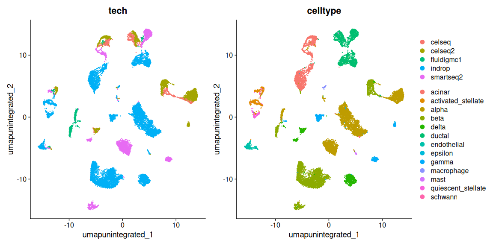
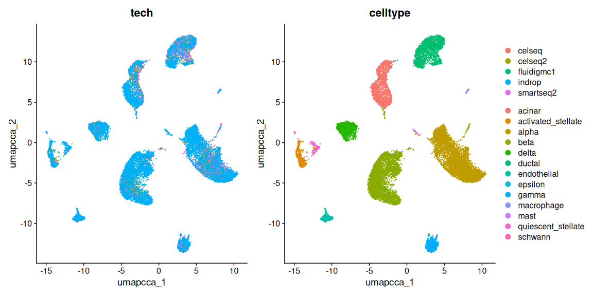
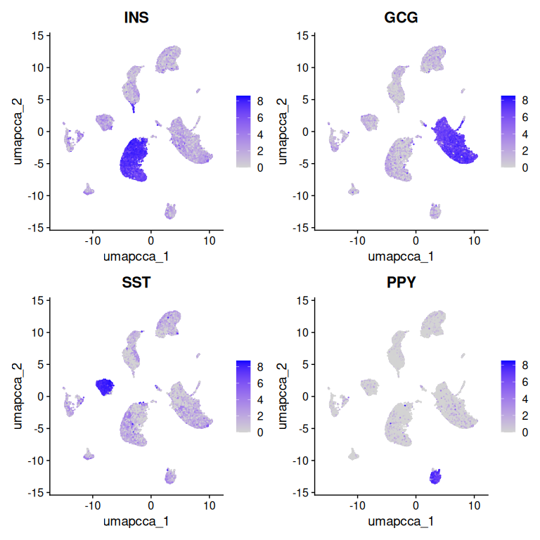
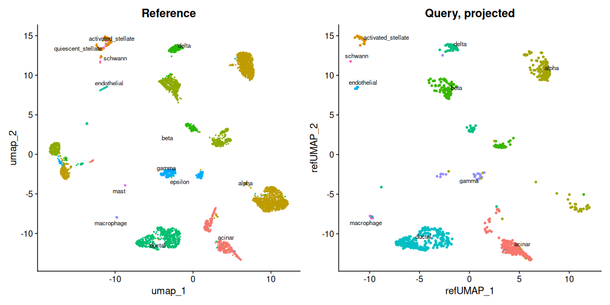
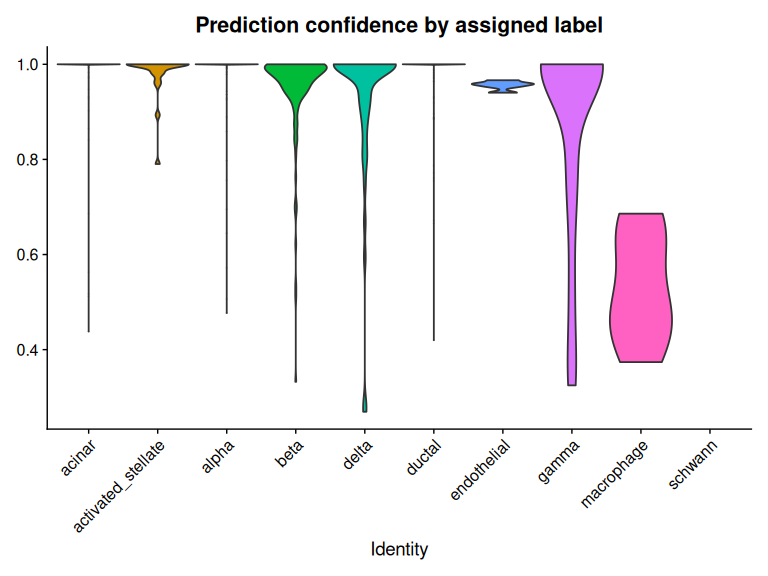

# Integration and label transfer


- [Before you start](#before-you-start)
- [Setup](#setup)
- [The data](#the-data)
- [Why integration is needed](#why-integration-is-needed)
- [Integration](#integration)
- [Rejoining layers](#rejoining-layers)
- [Judging integration](#judging-integration)
- [Label transfer](#label-transfer)
- [How good are the predictions?](#how-good-are-the-predictions)
- [Save your work](#save-your-work)
- [Session information](#session-information)

Almost no real study is a single sample. You have cells from several
donors, or several timepoints, or several technologies, and you want to
analyze them together. The problem is that if you simply concatenate
them and cluster, the dominant structure is usually the batch rather
than the biology — cells separate by which experiment they came from,
not by what kind of cell they are.

Integration is the family of methods that addresses this. This tutorial
covers the Seurat approach and one of its most useful applications:
transferring annotations from a labeled reference onto unlabeled query
cells.

## Before you start

This tutorial needs about **24 GB of memory** and runs in **30–40
minutes**.

``` bash
interactive -a cusanovichlab -n 8 -t 03:00:00 --mem=32G
```

Integration holds several copies of the data in memory at once, so it is
more demanding than the single-sample workflow.

## Setup

``` r
library(Seurat)
library(SeuratData)
library(patchwork)
library(ggplot2)
library(dplyr)

# CHANGE THIS to your NetID.
NETID <- "your_netid"

if (nzchar(Sys.getenv("CMM523_NETID"))) NETID <- Sys.getenv("CMM523_NETID")

WORK <- file.path("/xdisk/darrenc/cmm_523", NETID, "integration")
dir.create(file.path(WORK, "output"), recursive = TRUE, showWarnings = FALSE)

# SeuratData datasets live in a shared read-only library on /xdisk. They are
# data, not code, so they sit outside the container -- baking a 200 MB dataset
# into every image would be wasteful, and the container is meant to define your
# software environment, not carry your data. If a dataset is missing from the
# shared library, the fallback below installs it into your own space.
SHARED_DATA <- "/xdisk/darrenc/cmm_523/references/Rdatalib"
MY_DATA     <- file.path("/xdisk/darrenc/cmm_523", NETID, "Rdatalib")
dir.create(MY_DATA, recursive = TRUE, showWarnings = FALSE)
.libPaths(c(MY_DATA, SHARED_DATA, .libPaths()))

knitr::opts_chunk$set(
  cache.path = file.path(
    Sys.getenv("CMM523_CACHE", unset = "/xdisk/darrenc/darrenc/cmm523_cache"),
    "03_integration/"
  )
)

options(future.globals.maxSize = 8000 * 1024^2)
WORK
```

    #> [1] "/xdisk/darrenc/cmm_523/darrenc/integration"

## The data

`SeuratData` distributes curated datasets for exactly this purpose.
`panc8` is human pancreatic islet cells from eight donors across four
different single-cell technologies — a harder integration problem than
most real studies, which makes it a good demonstration.

``` r
# panc8 should already be present in the shared library. The InstallData()
# call is only a fallback -- it needs somewhere writable, which is why the
# setup chunk above put your own directory on the library path first.
if (!requireNamespace("panc8.SeuratData", quietly = TRUE)) {
  message("panc8 not found in the shared library; downloading (117 MB)...")
  InstallData("panc8")
}
data("panc8", package = "panc8.SeuratData")

# panc8 was serialized under Seurat v3 and predates several slots that
# Seurat 5 objects have. Loading it as-is fails with errors like
# "no slot of name 'images'". UpdateSeuratObject() migrates it forward.
# Any Seurat object you are handed from a paper, a collaborator, or an older
# SeuratData package may need this -- objects do not migrate themselves.
panc8 <- UpdateSeuratObject(panc8)

panc8
```

    #> An object of class Seurat 
    #> 34363 features across 14890 samples within 1 assay 
    #> Active assay: RNA (34363 features, 0 variable features)
    #>  2 layers present: counts, data

``` r
table(panc8$tech)
```

    #> 
    #>     celseq    celseq2 fluidigmc1     indrop  smartseq2 
    #>       1004       2285        638       8569       2394

``` r
table(panc8$celltype)[1:10]
```

    #> 
    #>             acinar activated_stellate              alpha               beta 
    #>               1864                474               4615               3679 
    #>              delta             ductal        endothelial            epsilon 
    #>               1013               1954                296                 30 
    #>              gamma         macrophage 
    #>                625                 79

Four technologies. `celltype` is the published annotation, which we will
use both to check the integration and, later, as the labels to transfer.

## Why integration is needed

Before integrating, look at what happens if you don’t. Seurat 5 keeps
samples as separate **layers** within one object, so splitting is a
metadata operation rather than a restructuring.

``` r
panc8[["RNA"]] <- split(panc8[["RNA"]], f = panc8$tech)
panc8
```

    #> An object of class Seurat 
    #> 34363 features across 14890 samples within 1 assay 
    #> Active assay: RNA (34363 features, 0 variable features)
    #>  10 layers present: counts.celseq, counts.celseq2, counts.smartseq2, counts.fluidigmc1, counts.indrop, data.celseq, data.celseq2, data.smartseq2, data.fluidigmc1, data.indrop

``` r
panc8 <- NormalizeData(panc8)
panc8 <- FindVariableFeatures(panc8)
panc8 <- ScaleData(panc8)
panc8 <- RunPCA(panc8)

panc8 <- FindNeighbors(panc8, dims = 1:30, reduction = "pca")
panc8 <- FindClusters(panc8, resolution = 0.5, cluster.name = "unintegrated_clusters")
```

    #> Modularity Optimizer version 1.3.0 by Ludo Waltman and Nees Jan van Eck
    #> 
    #> Number of nodes: 14890
    #> Number of edges: 565763
    #> 
    #> Running Louvain algorithm...
    #> Maximum modularity in 10 random starts: 0.9576
    #> Number of communities: 25
    #> Elapsed time: 1 seconds

``` r
panc8 <- RunUMAP(panc8, dims = 1:30, reduction = "pca",
                 reduction.name = "umap.unintegrated")
```

``` r
DimPlot(panc8, reduction = "umap.unintegrated",
        group.by = c("tech", "celltype"), label = FALSE) +
  plot_layout(guides = "collect")
```



This is the problem, drawn. Cells of the same type sit in different
places depending on which technology produced them. Any clustering here
recovers technology, not biology.

## Integration

Seurat 5 handles this with a single function, `IntegrateLayers()`. You
pass a method; the function returns a new dimensional reduction in which
shared cell types are co-embedded across batches.

``` r
panc8 <- IntegrateLayers(
  object = panc8,
  method = CCAIntegration,
  orig.reduction = "pca",
  new.reduction = "integrated.cca",
  verbose = FALSE
)
```

Note what did *not* happen: no `FindIntegrationAnchors()`, no
`IntegrateData()`, no separate “integrated” assay. If you find older
tutorials using that pattern, they are written for Seurat v4. The result
is comparable; the interface is simpler.

Now cluster and embed using the integrated reduction rather than the raw
PCA.

``` r
panc8 <- FindNeighbors(panc8, reduction = "integrated.cca", dims = 1:30)
panc8 <- FindClusters(panc8, resolution = 0.5, cluster.name = "cca_clusters")
```

    #> Modularity Optimizer version 1.3.0 by Ludo Waltman and Nees Jan van Eck
    #> 
    #> Number of nodes: 14890
    #> Number of edges: 653700
    #> 
    #> Running Louvain algorithm...
    #> Maximum modularity in 10 random starts: 0.9191
    #> Number of communities: 14
    #> Elapsed time: 2 seconds

``` r
panc8 <- RunUMAP(panc8, reduction = "integrated.cca", dims = 1:30,
                 reduction.name = "umap.cca")
```

``` r
DimPlot(panc8, reduction = "umap.cca",
        group.by = c("tech", "celltype"), label = FALSE) +
  plot_layout(guides = "collect")
```



Compare against the unintegrated version above. Technologies now
overlap; cell types separate. That is what success looks like.

## Rejoining layers

While the layers are split, expression-level operations act per-layer.
Before running differential expression or anything else that treats the
data as one dataset, rejoin them.

``` r
panc8 <- JoinLayers(panc8)
panc8
```

    #> An object of class Seurat 
    #> 34363 features across 14890 samples within 1 assay 
    #> Active assay: RNA (34363 features, 2000 variable features)
    #>  3 layers present: data, counts, scale.data
    #>  4 dimensional reductions calculated: pca, umap.unintegrated, integrated.cca, umap.cca

Forgetting this is a common source of confusing errors in Seurat 5 —
functions either fail or silently operate on only one batch.

## Judging integration

Integration is a balance between two failure modes, and both are easy to
reach. Under-correct and batch effects remain. Over-correct and you
erase real biological differences — including, in the worst case,
merging distinct cell types because they came from different samples.

There is no single number that tells you which you have. The practical
checks are: do batches mix, do known cell types stay separate, and do
marker genes still behave as they should?

``` r
table(panc8$cca_clusters, panc8$tech)
```

    #>     
    #>      celseq celseq2 fluidigmc1 indrop smartseq2
    #>   0     157     704        182   1117       824
    #>   1     297     255         33    911       443
    #>   2     230     279         22   1185       187
    #>   3      98     322        181   1067       216
    #>   4      32     109         55   1157       150
    #>   5      40      67         23    948        33
    #>   6      50     194         21    598       124
    #>   7      20      71         56    483        73
    #>   8      21     115         18    269       217
    #>   9      22     102         22    300        59
    #>   10      5      21         14    251        22
    #>   11      1       9          0    179         5
    #>   12     25      24          7     93        15
    #>   13      6      13          4     11        26

Rows where one technology dominates are suspicious — either genuine
biology specific to one experiment, or incomplete integration.

``` r
FeaturePlot(panc8, reduction = "umap.cca",
            features = c("INS", "GCG", "SST", "PPY"))
```



Insulin, glucagon, somatostatin and pancreatic polypeptide mark beta,
alpha, delta and gamma cells. Each should light up one region. If two of
these overlap after integration, you have over-corrected.

## Label transfer

Now the practical payoff. You have a well-annotated reference and a new
unlabeled dataset. Rather than annotating from scratch, project the
reference labels onto the query.

Split the pancreas data: three technologies as reference, one held out
as query.

``` r
pancreas.ref   <- subset(panc8, tech %in% c("celseq2", "smartseq2", "fluidigmc1"))
pancreas.query <- subset(panc8, tech == "celseq")

pancreas.ref   <- NormalizeData(pancreas.ref)
pancreas.ref   <- FindVariableFeatures(pancreas.ref)
pancreas.ref   <- ScaleData(pancreas.ref)
pancreas.ref   <- RunPCA(pancreas.ref)
pancreas.ref   <- RunUMAP(pancreas.ref, dims = 1:30, return.model = TRUE)

pancreas.query <- NormalizeData(pancreas.query)
```

`return.model = TRUE` matters. Without it the UMAP cannot be reused to
project new cells, and the mapping step below will fail.

``` r
anchors <- FindTransferAnchors(
  reference = pancreas.ref,
  query = pancreas.query,
  dims = 1:30,
  reference.reduction = "pca"
)
```

Anchors are pairs of cells — one in the reference, one in the query —
that appear to be the same cell type. They are the bridge across which
labels travel.

``` r
pancreas.query <- MapQuery(
  anchorset = anchors,
  reference = pancreas.ref,
  query = pancreas.query,
  refdata = list(celltype = "celltype"),
  reference.reduction = "pca",
  reduction.model = "umap"
)
```

``` r
p1 <- DimPlot(pancreas.ref, reduction = "umap", group.by = "celltype",
              label = TRUE, label.size = 3, repel = TRUE) +
  NoLegend() + ggtitle("Reference")

p2 <- DimPlot(pancreas.query, reduction = "ref.umap",
              group.by = "predicted.celltype",
              label = TRUE, label.size = 3, repel = TRUE) +
  NoLegend() + ggtitle("Query, projected")

p1 + p2
```



## How good are the predictions?

Because these cells came with published annotations, we can grade the
transfer directly — a luxury you will not have on real data.

``` r
table(predicted = pancreas.query$predicted.celltype,
      actual = pancreas.query$celltype)
```

    #>                     actual
    #> predicted            acinar activated_stellate alpha beta delta ductal
    #>   acinar                227                  0    10    0     0      6
    #>   activated_stellate      0                 19     2    0     0      0
    #>   alpha                   0                  0   186    2     0      0
    #>   beta                    0                  0     1  158     0      0
    #>   delta                   0                  0     2    1    50      0
    #>   ductal                  2                  0     3    0     0    298
    #>   endothelial             0                  0     0    0     0      0
    #>   gamma                   0                  0     2    0     0      0
    #>   macrophage              0                  0     7    0     0      0
    #>   schwann                 0                  0     0    0     0      0
    #>                     actual
    #> predicted            endothelial epsilon gamma macrophage mast
    #>   acinar                       0       0     0          1    0
    #>   activated_stellate           0       0     0          0    0
    #>   alpha                        0       0     1          0    0
    #>   beta                         0       0     0          0    0
    #>   delta                        0       0     0          0    0
    #>   ductal                       0       0     0          0    1
    #>   endothelial                  5       0     0          0    0
    #>   gamma                        0       1    17          0    0
    #>   macrophage                   0       0     0          0    0
    #>   schwann                      0       0     0          0    0
    #>                     actual
    #> predicted            quiescent_stellate schwann
    #>   acinar                              0       0
    #>   activated_stellate                  1       0
    #>   alpha                               0       0
    #>   beta                                0       0
    #>   delta                               0       0
    #>   ductal                              0       0
    #>   endothelial                         0       0
    #>   gamma                               0       0
    #>   macrophage                          0       0
    #>   schwann                             0       1

``` r
mean(pancreas.query$predicted.celltype == pancreas.query$celltype)
```

    #> [1] 0.9571713

On real data the substitute is the prediction score, which reports how
confident the transfer was for each cell.

``` r
VlnPlot(pancreas.query, features = "predicted.celltype.score",
        group.by = "predicted.celltype", pt.size = 0) +
  NoLegend() +
  labs(title = "Prediction confidence by assigned label")
```



Read this the way you read the SingleR delta plot. A label assigned with
a low score is a label to distrust. Cell types poorly represented in the
reference tend to show up here as broad, low distributions — which is
the honest signal that the reference could not really speak to those
cells.

## Save your work

``` r
saveRDS(panc8, file = file.path(WORK, "output", "panc8_integrated.rds"))
saveRDS(pancreas.query, file = file.path(WORK, "output", "pancreas_query_mapped.rds"))
```

## Session information

``` r
sessionInfo()
```

    #> R version 4.6.1 (2026-06-24)
    #> Platform: x86_64-pc-linux-gnu
    #> Running under: Ubuntu 24.04.4 LTS
    #> 
    #> Matrix products: default
    #> BLAS:   /usr/lib/x86_64-linux-gnu/openblas-pthread/libblas.so.3 
    #> LAPACK: /usr/lib/x86_64-linux-gnu/openblas-pthread/libopenblasp-r0.3.26.so;  LAPACK version 3.12.0
    #> 
    #> locale:
    #>  [1] LC_CTYPE=C.UTF-8       LC_NUMERIC=C           LC_TIME=C.UTF-8       
    #>  [4] LC_COLLATE=C.UTF-8     LC_MONETARY=C.UTF-8    LC_MESSAGES=C.UTF-8   
    #>  [7] LC_PAPER=C.UTF-8       LC_NAME=C              LC_ADDRESS=C          
    #> [10] LC_TELEPHONE=C         LC_MEASUREMENT=C.UTF-8 LC_IDENTIFICATION=C   
    #> 
    #> time zone: Etc/UTC
    #> tzcode source: system (glibc)
    #> 
    #> attached base packages:
    #> [1] stats     graphics  grDevices utils     datasets  methods   base     
    #> 
    #> other attached packages:
    #> [1] future_1.75.0         dplyr_1.2.1           ggplot2_4.0.3        
    #> [4] patchwork_1.3.2       SeuratData_0.2.2.9002 Seurat_5.5.1         
    #> [7] SeuratObject_5.4.0    sp_2.2-3             
    #> 
    #> loaded via a namespace (and not attached):
    #>   [1] deldir_2.0-4           pbapply_1.7-4          gridExtra_2.3.1       
    #>   [4] rlang_1.3.0            magrittr_2.0.5         RcppAnnoy_0.0.23      
    #>   [7] otel_0.2.0             spatstat.geom_3.8-2    matrixStats_1.5.0     
    #>  [10] ggridges_0.5.7         compiler_4.6.1         png_0.1-9             
    #>  [13] vctrs_0.7.3            reshape2_1.4.5         stringr_1.6.0         
    #>  [16] crayon_1.5.3           pkgconfig_2.0.3        fastmap_1.2.0         
    #>  [19] labeling_0.4.3         promises_1.5.0         rmarkdown_2.31        
    #>  [22] ggbeeswarm_0.7.3       purrr_1.2.2            xfun_0.60             
    #>  [25] jsonlite_2.0.0         goftest_1.2-3          later_1.4.8           
    #>  [28] spatstat.utils_3.2-4   irlba_2.3.7            parallel_4.6.1        
    #>  [31] cluster_2.1.8.3        R6_2.6.1               ica_1.0-3             
    #>  [34] stringi_1.8.9          RColorBrewer_1.1-3     spatstat.data_3.1-9   
    #>  [37] reticulate_1.46.0      parallelly_1.48.0      spatstat.univar_3.2-0 
    #>  [40] lmtest_0.9-40          scattermore_1.2        Rcpp_1.1.2            
    #>  [43] knitr_1.51             tensor_1.5.1           future.apply_1.20.2   
    #>  [46] zoo_1.9-0              sctransform_0.4.3      httpuv_1.6.17         
    #>  [49] Matrix_1.7-6           splines_4.6.1          igraph_2.3.3          
    #>  [52] tidyselect_1.2.1       dichromat_2.0-1        abind_1.4-8           
    #>  [55] yaml_2.3.12            spatstat.random_3.5-1  codetools_0.2-20      
    #>  [58] miniUI_0.1.2           spatstat.explore_3.8-2 listenv_1.0.0         
    #>  [61] lattice_0.22-9         tibble_3.3.1           plyr_1.8.9            
    #>  [64] withr_3.0.3            shiny_1.14.0           S7_0.2.2              
    #>  [67] ROCR_1.0-12            ggrastr_1.0.2          evaluate_1.0.5        
    #>  [70] Rtsne_0.17             fastDummies_1.7.6      survival_3.8-9        
    #>  [73] polyclip_1.10-7        fitdistrplus_1.2-6     pillar_1.11.1         
    #>  [76] KernSmooth_2.23-26     plotly_4.12.1          generics_0.1.4        
    #>  [79] RcppHNSW_0.7.0         panc8.SeuratData_3.0.2 scales_1.4.0          
    #>  [82] globals_0.19.1         xtable_1.8-8           glue_1.8.1            
    #>  [85] tools_4.6.1            data.table_1.18.4      RSpectra_0.16-2       
    #>  [88] RANN_2.6.2             dotCall64_1.2          cowplot_1.2.0         
    #>  [91] grid_4.6.1             tidyr_1.3.2            nlme_3.1-170          
    #>  [94] beeswarm_0.4.0         vipor_0.4.7            cli_3.6.6             
    #>  [97] rappdirs_0.3.4         spatstat.sparse_3.2-0  spam_2.11-4           
    #> [100] viridisLite_0.4.3      uwot_0.2.4             gtable_0.3.6          
    #> [103] digest_0.6.39          progressr_1.0.0        ggrepel_0.9.8         
    #> [106] htmlwidgets_1.6.4      farver_2.1.2           htmltools_0.5.9       
    #> [109] lifecycle_1.0.5        httr_1.4.8             mime_0.13             
    #> [112] MASS_7.3-66

------------------------------------------------------------------------

*Adapted from the Seurat [introduction to
integration](https://satijalab.org/seurat/articles/integration_introduction.html)
and [mapping and
annotation](https://satijalab.org/seurat/articles/integration_mapping.html)
vignettes, updated to the Seurat 5 `IntegrateLayers` interface.*
