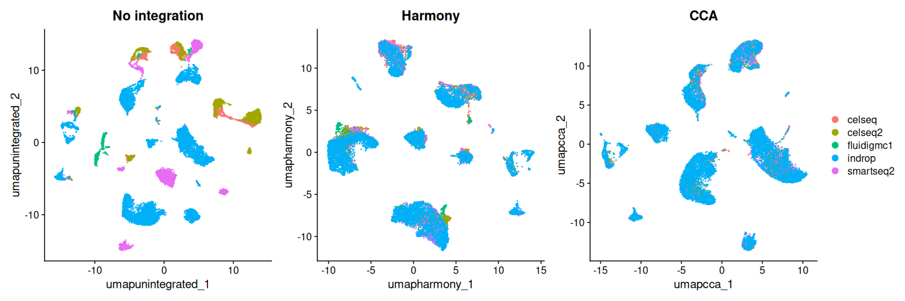
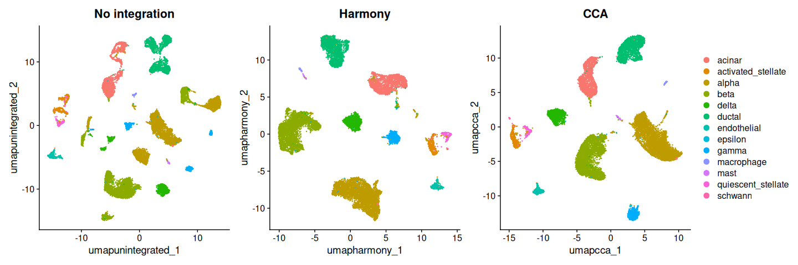

# Harmony: comparing integration methods


- [Before you start](#before-you-start)
- [Setup](#setup)
- [Data and baseline processing](#data-and-baseline-processing)
- [Running Harmony](#running-harmony)
- [Running CCA for comparison](#running-cca-for-comparison)
- [Three embeddings, one object](#three-embeddings-one-object)
- [Quantifying batch mixing](#quantifying-batch-mixing)
- [Clustering on each reduction](#clustering-on-each-reduction)
- [Which should you use?](#which-should-you-use)
- [Save your work](#save-your-work)
- [Session information](#session-information)

In the [previous tutorial](03_integration.md) you integrated the
pancreas data with CCA. That is one method among several, and the choice
matters: methods differ in how aggressively they correct, how they scale
to large datasets, and what they assume about your batches.

Harmony is the most widely used alternative. It works in PCA space,
iteratively nudging cells toward batch-mixed cluster centroids. It is
fast, it scales well, and it corrects more aggressively than CCA — which
is sometimes what you want and sometimes exactly what you don’t.

This tutorial runs both on the same data so you can see the difference
rather than take anyone’s word for it.

## Before you start

This tutorial needs about **24 GB of memory** and runs in **30–40
minutes**.

``` bash
interactive -a cusanovichlab -n 8 -t 03:00:00 --mem=32G
```

## Setup

``` r
library(Seurat)
library(SeuratData)
library(harmony)
library(patchwork)
library(ggplot2)
library(dplyr)

# CHANGE THIS to your NetID.
NETID <- "your_netid"

if (nzchar(Sys.getenv("CMM523_NETID"))) NETID <- Sys.getenv("CMM523_NETID")

WORK <- file.path("/xdisk/darrenc/cmm_523", NETID, "harmony")
dir.create(file.path(WORK, "output"), recursive = TRUE, showWarnings = FALSE)

# SeuratData datasets live in a shared read-only library on /xdisk. They are
# data, not code, so they sit outside the container -- baking a 200 MB dataset
# into every image would be wasteful, and the container is meant to define your
# software environment, not carry your data. If a dataset is missing from the
# shared library, the fallback below installs it into your own space.
SHARED_DATA <- "/xdisk/darrenc/cmm_523/references/Rdatalib"
MY_DATA     <- file.path("/xdisk/darrenc/cmm_523", NETID, "Rdatalib")
dir.create(MY_DATA, recursive = TRUE, showWarnings = FALSE)
.libPaths(c(MY_DATA, SHARED_DATA, .libPaths()))

knitr::opts_chunk$set(
  cache.path = file.path(
    Sys.getenv("CMM523_CACHE", unset = "/xdisk/darrenc/darrenc/cmm523_cache"),
    "04_harmony/"
  )
)

options(future.globals.maxSize = 8000 * 1024^2)
WORK
```

    #> [1] "/xdisk/darrenc/cmm_523/darrenc/harmony"

## Data and baseline processing

Same dataset as the integration tutorial, so the comparison is fair.

``` r
if (!requireNamespace("panc8.SeuratData", quietly = TRUE)) {
  message("panc8 not found in the shared library; downloading (117 MB)...")
  InstallData("panc8")
}
data("panc8", package = "panc8.SeuratData")

# panc8 was serialized under Seurat v3 and predates several slots that
# Seurat 5 objects have. Loading it as-is fails with errors like
# "no slot of name 'images'". UpdateSeuratObject() migrates it forward.
# Any Seurat object you are handed from a paper, a collaborator, or an older
# SeuratData package may need this -- objects do not migrate themselves.
panc8 <- UpdateSeuratObject(panc8)

panc8[["RNA"]] <- split(panc8[["RNA"]], f = panc8$tech)

panc8 <- NormalizeData(panc8)
panc8 <- FindVariableFeatures(panc8)
panc8 <- ScaleData(panc8)
panc8 <- RunPCA(panc8)

panc8
```

    #> An object of class Seurat 
    #> 34363 features across 14890 samples within 1 assay 
    #> Active assay: RNA (34363 features, 2000 variable features)
    #>  11 layers present: counts.celseq, counts.celseq2, counts.smartseq2, counts.fluidigmc1, counts.indrop, data.celseq, data.celseq2, data.smartseq2, data.fluidigmc1, data.indrop, scale.data
    #>  1 dimensional reduction calculated: pca

## Running Harmony

In Seurat 5, Harmony is available through the same `IntegrateLayers()`
interface as CCA. Only the `method` argument changes.

``` r
panc8 <- IntegrateLayers(
  object = panc8,
  method = HarmonyIntegration,
  orig.reduction = "pca",
  new.reduction = "harmony",
  verbose = FALSE
)
```

That interchangeability is worth pausing on. Integration methods are not
fundamentally different kinds of operation — they all take a dimensional
reduction contaminated by batch and return one that is less so. Swapping
one argument is the whole difference.

You will also encounter `RunHarmony()` in the wild, which is harmony’s
own interface and still perfectly current:

``` r
panc8 <- RunHarmony(panc8, group.by.vars = "tech")
```

Both work. `IntegrateLayers()` is preferable here only because it makes
the comparison below symmetric.

## Running CCA for comparison

``` r
panc8 <- IntegrateLayers(
  object = panc8,
  method = CCAIntegration,
  orig.reduction = "pca",
  new.reduction = "integrated.cca",
  verbose = FALSE
)
```

## Three embeddings, one object

An advantage of the Seurat 5 design: multiple reductions coexist in the
same object, so nothing has to be recomputed to compare them.

``` r
panc8 <- RunUMAP(panc8, dims = 1:30, reduction = "pca",
                 reduction.name = "umap.unintegrated")
panc8 <- RunUMAP(panc8, dims = 1:30, reduction = "harmony",
                 reduction.name = "umap.harmony")
panc8 <- RunUMAP(panc8, dims = 1:30, reduction = "integrated.cca",
                 reduction.name = "umap.cca")

Reductions(panc8)
```

    #> [1] "pca"               "harmony"           "integrated.cca"   
    #> [4] "umap.unintegrated" "umap.harmony"      "umap.cca"

``` r
p1 <- DimPlot(panc8, reduction = "umap.unintegrated", group.by = "tech") +
  ggtitle("No integration") + NoLegend()
p2 <- DimPlot(panc8, reduction = "umap.harmony", group.by = "tech") +
  ggtitle("Harmony") + NoLegend()
p3 <- DimPlot(panc8, reduction = "umap.cca", group.by = "tech") +
  ggtitle("CCA")

p1 + p2 + p3
```



``` r
p1 <- DimPlot(panc8, reduction = "umap.unintegrated", group.by = "celltype") +
  ggtitle("No integration") + NoLegend()
p2 <- DimPlot(panc8, reduction = "umap.harmony", group.by = "celltype") +
  ggtitle("Harmony") + NoLegend()
p3 <- DimPlot(panc8, reduction = "umap.cca", group.by = "celltype") +
  ggtitle("CCA")

p1 + p2 + p3
```



Look at both figures together. The first asks whether batches mixed; the
second asks whether cell types stayed distinct. A method that wins the
first and loses the second has not helped you.

## Quantifying batch mixing

Eyeballing UMAPs is a poor way to decide anything — UMAP distances are
not meaningful and the layout depends on the seed. A crude but honest
numeric check is to ask, for each cell, what fraction of its nearest
neighbors come from a different batch. Well-mixed data gives a high
fraction.

``` r
neighbor_purity <- function(obj, reduction, batch_var = "tech", k = 30) {
  emb <- Embeddings(obj, reduction)[, 1:30]
  nn <- RANN::nn2(emb, k = k + 1)$nn.idx[, -1]
  batch <- obj[[batch_var]][, 1]
  mean(apply(nn, 1, function(idx) mean(batch[idx] != batch[1])))
}

data.frame(
  reduction = c("pca", "harmony", "integrated.cca"),
  cross_batch_neighbors = c(
    neighbor_purity(panc8, "pca"),
    neighbor_purity(panc8, "harmony"),
    neighbor_purity(panc8, "integrated.cca")
  )
)
```

    #>        reduction cross_batch_neighbors
    #> 1            pca             0.9386971
    #> 2        harmony             0.9568816
    #> 3 integrated.cca             0.8913499

Higher is more mixed. Treat this as a rough diagnostic rather than a
score to optimize — pushing it to 1.0 would mean the batches are
indistinguishable, which is also what happens when you have destroyed
the biology.

## Clustering on each reduction

``` r
panc8 <- FindNeighbors(panc8, reduction = "harmony", dims = 1:30)
panc8 <- FindClusters(panc8, resolution = 0.5, cluster.name = "harmony_clusters")
```

    #> Modularity Optimizer version 1.3.0 by Ludo Waltman and Nees Jan van Eck
    #> 
    #> Number of nodes: 14890
    #> Number of edges: 581348
    #> 
    #> Running Louvain algorithm...
    #> Maximum modularity in 10 random starts: 0.9238
    #> Number of communities: 17
    #> Elapsed time: 2 seconds

``` r
panc8 <- FindNeighbors(panc8, reduction = "integrated.cca", dims = 1:30)
panc8 <- FindClusters(panc8, resolution = 0.5, cluster.name = "cca_clusters")
```

    #> Modularity Optimizer version 1.3.0 by Ludo Waltman and Nees Jan van Eck
    #> 
    #> Number of nodes: 14890
    #> Number of edges: 653700
    #> 
    #> Running Louvain algorithm...
    #> Maximum modularity in 10 random starts: 0.9191
    #> Number of communities: 14
    #> Elapsed time: 2 seconds

``` r
table(harmony = panc8$harmony_clusters, cca = panc8$cca_clusters)
```

    #>        cca
    #> harmony    0    1    2    3    4    5    6    7    8    9   10   11   12   13
    #>      0  2792    9    0    3   73    0    0    0    8    1    0    0    0    2
    #>      1     2 1913    1    0    2    1    0    0    0    0    0    0    4    1
    #>      2     0   10 1876    0    0    1    0    1    0    0    0    0    3   13
    #>      3     0    0    0 1670    0    9    2  141    0    0    0    0    0    0
    #>      4   110    1   14    0 1381    7    1    2    1    0    0    0    0    0
    #>      5     0    1    7  132    4 1077    1   16    0    0    0    0    0    0
    #>      6     0    0    0    3    0    4  977    0    4    0    0    0    0    0
    #>      7     1    0    0    3    2    1    0    0  620    0    0    0    0    0
    #>      8     1    0    0    5    0    0    0  502    0    0    0    0    0    0
    #>      9     0    0    0    0    0    1    0    0    0  498    0    1    0    0
    #>      10    0    0    0    0    0    0    0    0    0    0  313    0    0    0
    #>      11    0    0    0    0    0    0    0    0    0    5    0  193    0    0
    #>      12    0    0    0    0    2    0    0    0    0    0    0    0  132    0
    #>      13    0    0    0   61    0    3    0   39    0    0    0    0    0    0
    #>      14   12    5    5    7   25    7    6    2    7    0    0    0   24    0
    #>      15   65    0    0    0   14    0    0    0    0    0    0    0    1    0
    #>      16    1    0    0    0    0    0    0    0    0    1    0    0    0   44

A near-diagonal table means the two methods found essentially the same
structure. Off-diagonal mass means they disagree about which cells
belong together — and those cells are worth looking at, because they are
where the method choice actually changes your conclusions.

``` r
panc8 <- JoinLayers(panc8)
```

## Which should you use?

There is no general answer, which is itself the point worth taking away.

Harmony is fast and scales to very large datasets. It corrects
aggressively, which helps with strong batch effects and hurts when your
batches differ biologically — different treatments, different
timepoints, different disease states. If a real biological difference
happens to align with your batch structure, Harmony will remove it and
the result will look clean.

CCA is slower and more conservative. It tends to preserve
batch-associated biology better, at the cost of leaving more technical
variation behind.

The honest workflow is the one this tutorial demonstrates: run more than
one, compare, and check that your conclusions do not depend on which you
picked. If they do, that is a finding about the fragility of your
result, not a reason to pick the method that gives the answer you
prefer.

## Save your work

``` r
saveRDS(panc8, file = file.path(WORK, "output", "panc8_harmony_cca.rds"))
```

## Session information

``` r
sessionInfo()
```

    #> R version 4.6.1 (2026-06-24)
    #> Platform: x86_64-pc-linux-gnu
    #> Running under: Ubuntu 24.04.4 LTS
    #> 
    #> Matrix products: default
    #> BLAS:   /usr/lib/x86_64-linux-gnu/openblas-pthread/libblas.so.3 
    #> LAPACK: /usr/lib/x86_64-linux-gnu/openblas-pthread/libopenblasp-r0.3.26.so;  LAPACK version 3.12.0
    #> 
    #> locale:
    #>  [1] LC_CTYPE=C.UTF-8       LC_NUMERIC=C           LC_TIME=C.UTF-8       
    #>  [4] LC_COLLATE=C.UTF-8     LC_MONETARY=C.UTF-8    LC_MESSAGES=C.UTF-8   
    #>  [7] LC_PAPER=C.UTF-8       LC_NAME=C              LC_ADDRESS=C          
    #> [10] LC_TELEPHONE=C         LC_MEASUREMENT=C.UTF-8 LC_IDENTIFICATION=C   
    #> 
    #> time zone: Etc/UTC
    #> tzcode source: system (glibc)
    #> 
    #> attached base packages:
    #> [1] stats     graphics  grDevices utils     datasets  methods   base     
    #> 
    #> other attached packages:
    #>  [1] future_1.75.0         dplyr_1.2.1           ggplot2_4.0.3        
    #>  [4] patchwork_1.3.2       harmony_2.0.5         Rcpp_1.1.2           
    #>  [7] SeuratData_0.2.2.9002 Seurat_5.5.1          SeuratObject_5.4.0   
    #> [10] sp_2.2-3             
    #> 
    #> loaded via a namespace (and not attached):
    #>   [1] deldir_2.0-4           pbapply_1.7-4          gridExtra_2.3.1       
    #>   [4] rlang_1.3.0            magrittr_2.0.5         RcppAnnoy_0.0.23      
    #>   [7] otel_0.2.0             spatstat.geom_3.8-2    matrixStats_1.5.0     
    #>  [10] ggridges_0.5.7         compiler_4.6.1         png_0.1-9             
    #>  [13] vctrs_0.7.3            reshape2_1.4.5         stringr_1.6.0         
    #>  [16] crayon_1.5.3           pkgconfig_2.0.3        fastmap_1.2.0         
    #>  [19] labeling_0.4.3         promises_1.5.0         rmarkdown_2.31        
    #>  [22] purrr_1.2.2            xfun_0.60              jsonlite_2.0.0        
    #>  [25] goftest_1.2-3          later_1.4.8            spatstat.utils_3.2-4  
    #>  [28] irlba_2.3.7            parallel_4.6.1         cluster_2.1.8.3       
    #>  [31] R6_2.6.1               ica_1.0-3              stringi_1.8.9         
    #>  [34] RColorBrewer_1.1-3     spatstat.data_3.1-9    reticulate_1.46.0     
    #>  [37] parallelly_1.48.0      spatstat.univar_3.2-0  lmtest_0.9-40         
    #>  [40] scattermore_1.2        knitr_1.51             tensor_1.5.1          
    #>  [43] future.apply_1.20.2    zoo_1.9-0              sctransform_0.4.3     
    #>  [46] httpuv_1.6.17          Matrix_1.7-6           splines_4.6.1         
    #>  [49] igraph_2.3.3           tidyselect_1.2.1       dichromat_2.0-1       
    #>  [52] abind_1.4-8            yaml_2.3.12            spatstat.random_3.5-1 
    #>  [55] codetools_0.2-20       miniUI_0.1.2           spatstat.explore_3.8-2
    #>  [58] listenv_1.0.0          lattice_0.22-9         tibble_3.3.1          
    #>  [61] plyr_1.8.9             withr_3.0.3            shiny_1.14.0          
    #>  [64] S7_0.2.2               ROCR_1.0-12            evaluate_1.0.5        
    #>  [67] Rtsne_0.17             fastDummies_1.7.6      survival_3.8-9        
    #>  [70] polyclip_1.10-7        fitdistrplus_1.2-6     pillar_1.11.1         
    #>  [73] KernSmooth_2.23-26     plotly_4.12.1          generics_0.1.4        
    #>  [76] RcppHNSW_0.7.0         panc8.SeuratData_3.0.2 scales_1.4.0          
    #>  [79] globals_0.19.1         xtable_1.8-8           RhpcBLASctl_0.23-42   
    #>  [82] glue_1.8.1             tools_4.6.1            data.table_1.18.4     
    #>  [85] RSpectra_0.16-2        RANN_2.6.2             dotCall64_1.2         
    #>  [88] cowplot_1.2.0          grid_4.6.1             tidyr_1.3.2           
    #>  [91] nlme_3.1-170           cli_3.6.6              rappdirs_0.3.4        
    #>  [94] spatstat.sparse_3.2-0  spam_2.11-4            viridisLite_0.4.3     
    #>  [97] uwot_0.2.4             gtable_0.3.6           digest_0.6.39         
    #> [100] progressr_1.0.0        ggrepel_0.9.8          htmlwidgets_1.6.4     
    #> [103] farver_2.1.2           htmltools_0.5.9        lifecycle_1.0.5       
    #> [106] httr_1.4.8             mime_0.13              MASS_7.3-66

------------------------------------------------------------------------

*Adapted from the [Harmony
vignettes](https://portals.broadinstitute.org/harmony/) and the Seurat 5
integration documentation.*
