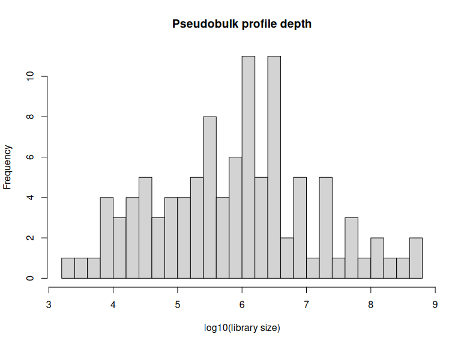
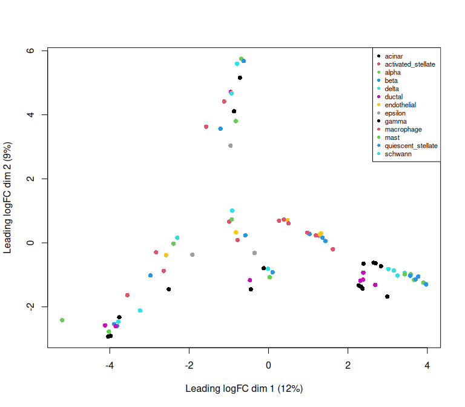
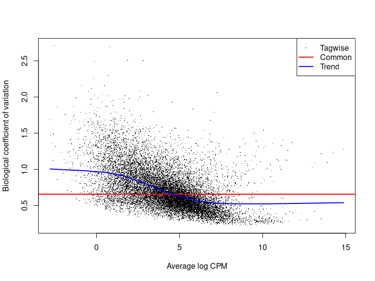
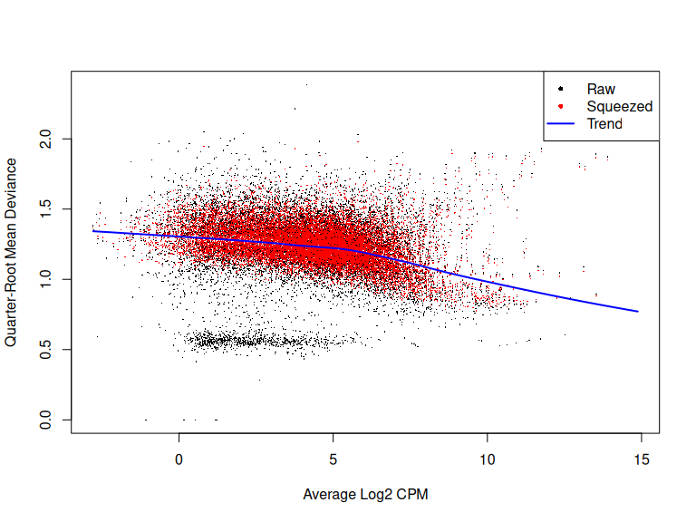
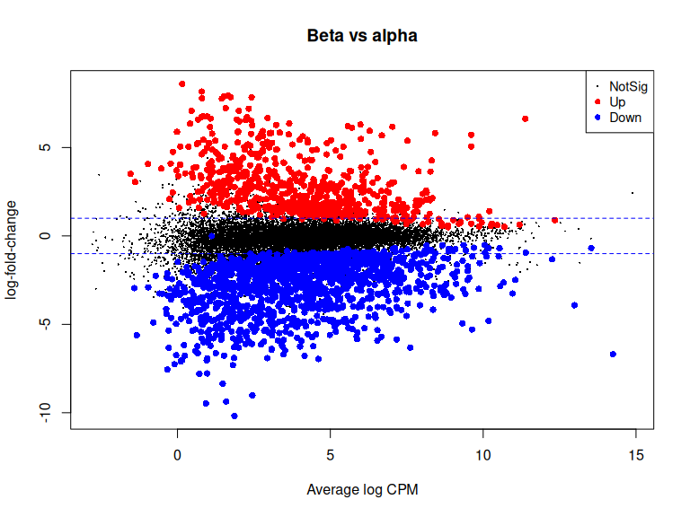

# Pseudobulk differential expression with edgeR


- [Before you start](#before-you-start)
- [Setup](#setup)
- [The data](#the-data)
- [Building pseudobulk profiles](#building-pseudobulk-profiles)
- [Filtering](#filtering)
- [Normalization](#normalization)
- [Looking at the structure](#looking-at-the-structure)
- [Setting up the test](#setting-up-the-test)
- [Estimating dispersion](#estimating-dispersion)
- [Testing](#testing)
- [Comparing against the cell-level
  test](#comparing-against-the-cell-level-test)
- [Save your work](#save-your-work)
- [Session information](#session-information)

By now you have found marker genes with `FindAllMarkers()`, which tests
every cell against every other cell. That works for identifying cell
types, and it is the wrong tool for asking whether a gene differs
between *conditions*.

The reason is that cells from the same donor are not independent
observations. If you sequence 5,000 cells from one patient, you do not
have 5,000 independent measurements of that patient’s biology — you have
one patient, measured 5,000 times. Treating those cells as independent
inflates your sample size enormously and produces p-values that are far
too small. Run a cell-level test between two conditions with three
donors each and you will get thousands of “significant” genes, most of
which are telling you about donor identity rather than condition.

Pseudobulk analysis fixes this by summing counts across all cells of a
given type within each sample, producing one profile per sample per cell
type. You then analyze those profiles with the same tools people have
used for bulk RNA-seq for fifteen years, which are well-tested and which
treat samples as the unit of replication — because they are.

## Before you start

This tutorial needs about **16 GB of memory** and runs in **15–20
minutes**.

``` bash
interactive -a cusanovichlab -n 8 -t 02:00:00
```

The `interactive` command takes `-m` as memory **per core**, so `-n 8`
with the default 4 GB per core gives you 32 GB in total. There is no
`--mem` flag.

## Setup

``` r
library(Seurat)
library(SeuratData)
library(edgeR)
library(ggplot2)
library(dplyr)

# CHANGE THIS to your NetID.
NETID <- "your_netid"

if (nzchar(Sys.getenv("CMM523_NETID"))) NETID <- Sys.getenv("CMM523_NETID")

WORK <- file.path("/xdisk/darrenc/cmm_523", NETID, "pseudobulk")
dir.create(file.path(WORK, "output"), recursive = TRUE, showWarnings = FALSE)

SHARED_DATA <- "/groups/darrenc/cmm_523/references/Rdatalib"
MY_DATA     <- file.path("/xdisk/darrenc/cmm_523", NETID, "Rdatalib")
dir.create(MY_DATA, recursive = TRUE, showWarnings = FALSE)
.libPaths(c(MY_DATA, SHARED_DATA, .libPaths()))

knitr::opts_chunk$set(
  cache.path = file.path(
    Sys.getenv("CMM523_CACHE", unset = "/xdisk/darrenc/darrenc/cmm523_cache"),
    "05_pseudobulk/"
  )
)

WORK
```

    #> [1] "/xdisk/darrenc/cmm_523/darrenc/pseudobulk"

## The data

We will reuse the pancreas dataset from the [integration
tutorial](03_integration.md). It is well suited to this: eight donors,
five technologies, and published cell type labels. Donor is our unit of
replication.

``` r
if (!requireNamespace("panc8.SeuratData", quietly = TRUE)) {
  InstallData("panc8")
}
data("panc8", package = "panc8.SeuratData")
panc8 <- UpdateSeuratObject(panc8)

table(panc8$dataset, panc8$celltype)[, 1:6]
```

    #>             
    #>              acinar activated_stellate alpha beta delta ductal
    #>   celseq        229                 19   213  161    50    304
    #>   celseq2       274                 90   844  445   203    257
    #>   fluidigmc1     21                 16   241  258    25     34
    #>   indrop1       113                 69   241  868   216    128
    #>   indrop2       115                 79   659  373   127    199
    #>   indrop3       845                102  1116  781   161    385
    #>   indrop4        79                 44   293  485   104    203
    #>   smartseq2     188                 55  1008  308   127    444

Look at that table before going further, because it determines what
questions you can ask. Each row is a donor, each column a cell type, and
the numbers are cell counts. Zeros and single digits are cell types that
donor barely contributed — those will produce pseudobulk profiles you
should not trust, and we filter them out below.

## Building pseudobulk profiles

edgeR provides `Seurat2PB()`, which does the aggregation for you. You
tell it which metadata column identifies the sample and which identifies
the cluster.

``` r
y <- Seurat2PB(panc8, sample = "dataset", cluster = "celltype")

y
```

    #> An object of class "DGEList"
    #> $counts
    #>          celseq_clusteracinar celseq_clusteractivated_stellate
    #> A1BG-AS1             0.000000                          0.00000
    #> A1BG                50.145186                         20.07069
    #> A1CF               105.459179                          0.00000
    #> A2M-AS1              4.007833                          0.00000
    #> A2ML1                6.011749                          0.00000
    #>          celseq_clusteralpha celseq_clusterbeta celseq_clusterdelta
    #> A1BG-AS1            4.011770           0.000000            0.000000
    #> A1BG              149.604332         134.630195           27.116019
    #> A1CF              188.906452          27.088398           21.076587
    #> A2M-AS1             7.017645           5.009791            2.003916
    #> A2ML1              33.470069           2.003916            0.000000
    #>          celseq_clusterductal celseq_clusterendothelial celseq_clusterepsilon
    #> A1BG-AS1             0.000000                         0              0.000000
    #> A1BG                11.021540                         0              1.001958
    #> A1CF                38.153370                         0              2.007853
    #> A2M-AS1              0.000000                         0              0.000000
    #> A2ML1                8.019603                         0              0.000000
    #>          celseq_clustergamma celseq_clustermacrophage celseq_clustermast
    #> A1BG-AS1            0.000000                        0                  0
    #> A1BG               15.053026                        0                  0
    #> A1CF               11.029414                        0                  0
    #> A2M-AS1             0.000000                        0                  0
    #> A2ML1               1.001958                        0                  0
    #>          celseq_clusterquiescent_stellate celseq_clusterschwann
    #> A1BG-AS1                         0.000000                     0
    #> A1BG                             1.001958                     0
    #> A1CF                             0.000000                     0
    #> A2M-AS1                          0.000000                     0
    #> A2ML1                            0.000000                     0
    #>          celseq2_clusteracinar celseq2_clusteractivated_stellate
    #> A1BG-AS1              0.000000                          2.003916
    #> A1BG                 10.019582                         30.090367
    #> A1CF                699.698200                         11.065160
    #> A2M-AS1               4.007833                          5.009791
    #> A2ML1                14.031352                          3.005875
    #>          celseq2_clusteralpha celseq2_clusterbeta celseq2_clusterdelta
    #> A1BG-AS1              0.00000            0.000000             0.000000
    #> A1BG                121.29600           86.298952            23.056850
    #> A1CF               3369.28402          759.981363           405.493117
    #> A2M-AS1              21.04506           14.027415             4.007833
    #> A2ML1                11.02154            6.011749             6.011749
    #>          celseq2_clusterductal celseq2_clusterendothelial
    #> A1BG-AS1              0.000000                   0.000000
    #> A1BG                  4.007833                   0.000000
    #> A1CF                103.757833                   2.003916
    #> A2M-AS1               4.011770                   0.000000
    #> A2ML1                 8.015666                   1.001958
    #>          celseq2_clusterepsilon celseq2_clustergamma celseq2_clustermacrophage
    #> A1BG-AS1                0.00000             0.000000                  0.000000
    #> A1BG                    0.00000            17.037227                  0.000000
    #> A1CF                   15.12049           194.422622                  6.071431
    #> A2M-AS1                 0.00000             3.005875                  0.000000
    #> A2ML1                   0.00000             2.003916                  1.001958
    #>          celseq2_clustermast celseq2_clusterquiescent_stellate
    #> A1BG-AS1             0.00000                          0.000000
    #> A1BG                 0.00000                          5.009791
    #> A1CF                 0.00000                          1.001958
    #> A2M-AS1              4.01177                          3.009812
    #> A2ML1                0.00000                          0.000000
    #>          celseq2_clusterschwann fluidigmc1_clusteracinar
    #> A1BG-AS1                      0                     0.00
    #> A1BG                          0                   255.05
    #> A1CF                          0                   958.00
    #> A2M-AS1                       0                     0.00
    #> A2ML1                         0                    51.72
    #>          fluidigmc1_clusteractivated_stellate fluidigmc1_clusteralpha
    #> A1BG-AS1                                 0.00                    0.00
    #> A1BG                                   339.33                 4883.81
    #> A1CF                                     0.00                40326.32
    #> A2M-AS1                                  0.00                    0.00
    #> A2ML1                                   27.40                  457.93
    #>          fluidigmc1_clusterbeta fluidigmc1_clusterdelta
    #> A1BG-AS1                   0.00                    0.00
    #> A1BG                    5873.97                  287.50
    #> A1CF                   11919.00                 2227.50
    #> A2M-AS1                    0.00                    0.00
    #> A2ML1                    533.85                   95.86
    #>          fluidigmc1_clusterductal fluidigmc1_clusterendothelial
    #> A1BG-AS1                     0.00                          0.00
    #> A1BG                       395.57                        151.73
    #> A1CF                       114.13                        681.00
    #> A2M-AS1                      0.00                          0.00
    #> A2ML1                      244.09                         21.73
    #>          fluidigmc1_clusterepsilon fluidigmc1_clustergamma
    #> A1BG-AS1                      0.00                     0.0
    #> A1BG                         21.55                   477.3
    #> A1CF                          8.00                  1580.0
    #> A2M-AS1                       0.00                     0.0
    #> A2ML1                         3.22                    48.6
    #>          fluidigmc1_clustermacrophage fluidigmc1_clustermast
    #> A1BG-AS1                         0.00                   0.00
    #> A1BG                            45.44                   9.81
    #> A1CF                             0.00                 149.00
    #> A2M-AS1                          0.00                   0.00
    #> A2ML1                            5.81                   5.12
    #>          fluidigmc1_clusterquiescent_stellate fluidigmc1_clusterschwann
    #> A1BG-AS1                                 0.00                      0.00
    #> A1BG                                     8.49                     21.86
    #> A1CF                                     0.00                    191.00
    #> A2M-AS1                                  0.00                      0.00
    #> A2ML1                                    0.00                     14.04
    #>          indrop1_clusteracinar indrop1_clusteractivated_stellate
    #> A1BG-AS1                     0                                 0
    #> A1BG                         0                                 1
    #> A1CF                        33                                 0
    #> A2M-AS1                      0                                 0
    #> A2ML1                        0                                 0
    #>          indrop1_clusteralpha indrop1_clusterbeta indrop1_clusterdelta
    #> A1BG-AS1                    0                   0                    0
    #> A1BG                        2                  13                    2
    #> A1CF                      106                 162                   71
    #> A2M-AS1                     0                   0                    0
    #> A2ML1                       0                   0                    0
    #>          indrop1_clusterductal indrop1_clusterendothelial
    #> A1BG-AS1                     0                          0
    #> A1BG                         0                          1
    #> A1CF                        11                          4
    #> A2M-AS1                      0                          0
    #> A2ML1                        0                          0
    #>          indrop1_clusterepsilon indrop1_clustergamma indrop1_clustermacrophage
    #> A1BG-AS1                      0                    0                         0
    #> A1BG                          1                    3                         0
    #> A1CF                          8                   16                         0
    #> A2M-AS1                       0                    0                         0
    #> A2ML1                         0                    0                         0
    #>          indrop1_clustermast indrop1_clusterquiescent_stellate
    #> A1BG-AS1                   0                                 0
    #> A1BG                       0                                 2
    #> A1CF                       0                                 0
    #> A2M-AS1                    0                                 0
    #> A2ML1                      0                                 0
    #>          indrop1_clusterschwann indrop2_clusteracinar
    #> A1BG-AS1                      0                     0
    #> A1BG                          0                     0
    #> A1CF                          0                    17
    #> A2M-AS1                       0                     0
    #> A2ML1                         0                     0
    #>          indrop2_clusteractivated_stellate indrop2_clusteralpha
    #> A1BG-AS1                                 0                    0
    #> A1BG                                     0                    4
    #> A1CF                                     2                  360
    #> A2M-AS1                                  0                    0
    #> A2ML1                                    0                    0
    #>          indrop2_clusterbeta indrop2_clusterdelta indrop2_clusterductal
    #> A1BG-AS1                   0                    0                     0
    #> A1BG                       2                    2                     1
    #> A1CF                      42                   63                     9
    #> A2M-AS1                    0                    0                     0
    #> A2ML1                      0                    0                     0
    #>          indrop2_clusterendothelial indrop2_clusterepsilon indrop2_clustergamma
    #> A1BG-AS1                          0                      0                    0
    #> A1BG                              0                      0                    1
    #> A1CF                              0                      0                   25
    #> A2M-AS1                           0                      0                    0
    #> A2ML1                             0                      0                    0
    #>          indrop2_clustermacrophage indrop2_clustermast
    #> A1BG-AS1                         0                   0
    #> A1BG                             0                   0
    #> A1CF                             4                   2
    #> A2M-AS1                          0                   0
    #> A2ML1                            0                   0
    #>          indrop2_clusterquiescent_stellate indrop2_clusterschwann
    #> A1BG-AS1                                 0                      0
    #> A1BG                                     0                      0
    #> A1CF                                     1                      0
    #> A2M-AS1                                  0                      0
    #> A2ML1                                    0                      0
    #>          indrop3_clusteracinar indrop3_clusteractivated_stellate
    #> A1BG-AS1                     0                                 0
    #> A1BG                         1                                 0
    #> A1CF                       103                                 1
    #> A2M-AS1                      0                                 0
    #> A2ML1                        0                                 0
    #>          indrop3_clusteralpha indrop3_clusterbeta indrop3_clusterdelta
    #> A1BG-AS1                    0                   0                    0
    #> A1BG                        1                   1                    2
    #> A1CF                      325                  99                   34
    #> A2M-AS1                     0                   0                    0
    #> A2ML1                       0                   0                    0
    #>          indrop3_clusterductal indrop3_clusterendothelial
    #> A1BG-AS1                     0                          0
    #> A1BG                         0                          0
    #> A1CF                         7                          0
    #> A2M-AS1                      0                          0
    #> A2ML1                        0                          0
    #>          indrop3_clusterepsilon indrop3_clustergamma indrop3_clustermacrophage
    #> A1BG-AS1                      0                    0                         0
    #> A1BG                          0                    0                         0
    #> A1CF                          1                   14                         0
    #> A2M-AS1                       0                    0                         0
    #> A2ML1                         0                    0                         0
    #>          indrop3_clustermast indrop3_clusterquiescent_stellate
    #> A1BG-AS1                   0                                 0
    #> A1BG                       0                                 0
    #> A1CF                       0                                 2
    #> A2M-AS1                    0                                 0
    #> A2ML1                      0                                 0
    #>          indrop3_clusterschwann indrop4_clusteracinar
    #> A1BG-AS1                      0                     0
    #> A1BG                          0                     0
    #> A1CF                          0                    35
    #> A2M-AS1                       0                     0
    #> A2ML1                         0                     0
    #>          indrop4_clusteractivated_stellate indrop4_clusteralpha
    #> A1BG-AS1                                 0                    0
    #> A1BG                                     0                    1
    #> A1CF                                     1                  221
    #> A2M-AS1                                  0                    0
    #> A2ML1                                    0                    0
    #>          indrop4_clusterbeta indrop4_clusterdelta indrop4_clusterductal
    #> A1BG-AS1                   0                    0                     0
    #> A1BG                       2                    1                     0
    #> A1CF                      59                   47                     6
    #> A2M-AS1                    0                    0                     0
    #> A2ML1                      0                    0                     0
    #>          indrop4_clusterendothelial indrop4_clusterepsilon indrop4_clustergamma
    #> A1BG-AS1                          0                      0                    0
    #> A1BG                              0                      0                    0
    #> A1CF                              0                      0                   27
    #> A2M-AS1                           0                      0                    0
    #> A2ML1                             0                      0                    0
    #>          indrop4_clustermacrophage indrop4_clustermast
    #> A1BG-AS1                         0                   0
    #> A1BG                             0                   0
    #> A1CF                             0                   1
    #> A2M-AS1                          0                   0
    #> A2ML1                            0                   0
    #>          indrop4_clusterquiescent_stellate indrop4_clusterschwann
    #> A1BG-AS1                                 0                      0
    #> A1BG                                     0                      0
    #> A1CF                                     0                      0
    #> A2M-AS1                                  0                      0
    #> A2ML1                                    0                      0
    #>          smartseq2_clusteracinar smartseq2_clusteractivated_stellate
    #> A1BG-AS1                      21                                  69
    #> A1BG                         474                                1436
    #> A1CF                        3970                                  42
    #> A2M-AS1                       33                                   3
    #> A2ML1                          3                                   0
    #>          smartseq2_clusteralpha smartseq2_clusterbeta smartseq2_clusterdelta
    #> A1BG-AS1                    720                   123                     26
    #> A1BG                      27049                  5677                   2706
    #> A1CF                      52724                  4273                   4723
    #> A2M-AS1                     884                   448                    109
    #> A2ML1                        31                    34                      0
    #>          smartseq2_clusterductal smartseq2_clusterendothelial
    #> A1BG-AS1                      20                            4
    #> A1BG                         289                          145
    #> A1CF                        1266                            0
    #> A2M-AS1                      184                           19
    #> A2ML1                         11                            0
    #>          smartseq2_clusterepsilon smartseq2_clustergamma
    #> A1BG-AS1                        0                    179
    #> A1BG                           89                   7807
    #> A1CF                         1003                   7228
    #> A2M-AS1                         0                    301
    #> A2ML1                           0                     16
    #>          smartseq2_clustermacrophage smartseq2_clustermast
    #> A1BG-AS1                           0                     8
    #> A1BG                              72                    88
    #> A1CF                              35                     1
    #> A2M-AS1                           23                     0
    #> A2ML1                              0                     0
    #>          smartseq2_clusterquiescent_stellate smartseq2_clusterschwann
    #> A1BG-AS1                                   2                        0
    #> A1BG                                      48                       51
    #> A1CF                                      83                        0
    #> A2M-AS1                                    1                        0
    #> A2ML1                                      0                        0
    #> 34358 more rows ...
    #> 
    #> $samples
    #>                                  group  lib.size norm.factors sample
    #> celseq_clusteracinar                 1 3561789.9            1 celseq
    #> celseq_clusteractivated_stellate     1  247829.1            1 celseq
    #> celseq_clusteralpha                  1 2236187.2            1 celseq
    #> celseq_clusterbeta                   1 1320794.5            1 celseq
    #> celseq_clusterdelta                  1  387488.4            1 celseq
    #>                                             cluster
    #> celseq_clusteracinar                         acinar
    #> celseq_clusteractivated_stellate activated_stellate
    #> celseq_clusteralpha                           alpha
    #> celseq_clusterbeta                             beta
    #> celseq_clusterdelta                           delta
    #> 99 more rows ...
    #> 
    #> $genes
    #>              gene
    #> A1BG-AS1 A1BG-AS1
    #> A1BG         A1BG
    #> A1CF         A1CF
    #> A2M-AS1   A2M-AS1
    #> A2ML1       A2ML1
    #> 34358 more rows ...

What came back is a `DGEList` — edgeR’s bulk RNA-seq container. Columns
are now sample-by-celltype combinations rather than cells. The object
went from ~15,000 columns to a few dozen, which is the whole point.

``` r
head(y$samples, 10)
```

    #>                                  group    lib.size norm.factors sample
    #> celseq_clusteracinar                 1 3561789.896            1 celseq
    #> celseq_clusteractivated_stellate     1  247829.098            1 celseq
    #> celseq_clusteralpha                  1 2236187.217            1 celseq
    #> celseq_clusterbeta                   1 1320794.524            1 celseq
    #> celseq_clusterdelta                  1  387488.389            1 celseq
    #> celseq_clusterductal                 1 3204483.688            1 celseq
    #> celseq_clusterendothelial            1   36727.030            1 celseq
    #> celseq_clusterepsilon                1    6746.376            1 celseq
    #> celseq_clustergamma                  1  156647.518            1 celseq
    #> celseq_clustermacrophage             1   20855.424            1 celseq
    #>                                             cluster
    #> celseq_clusteracinar                         acinar
    #> celseq_clusteractivated_stellate activated_stellate
    #> celseq_clusteralpha                           alpha
    #> celseq_clusterbeta                             beta
    #> celseq_clusterdelta                           delta
    #> celseq_clusterductal                         ductal
    #> celseq_clusterendothelial               endothelial
    #> celseq_clusterepsilon                       epsilon
    #> celseq_clustergamma                           gamma
    #> celseq_clustermacrophage                 macrophage

``` r
dim(y)
```

    #> [1] 34363   104

## Filtering

Two filters matter here, and they do different jobs.

First, drop pseudobulk profiles that are too thin to be worth anything.
A profile aggregated from four cells is noise dressed up as data.

`Seurat2PB()` does not report how many cells went into each profile, so
we use library size as the stand-in: a profile built from very few cells
has very few total counts. There is no universal threshold. Look at the
distribution and pick somewhere sensible for your data rather than
copying a number.

``` r
summary(y$samples$lib.size)
```

    #>      Min.   1st Qu.    Median      Mean   3rd Qu.      Max. 
    #>      1779     99458    882263  21178108   3591425 482480131

``` r
hist(log10(y$samples$lib.size), breaks = 20,
     xlab = "log10(library size)", main = "Pseudobulk profile depth")
```



``` r
MIN_LIB <- 5e4

keep.samples <- y$samples$lib.size >= MIN_LIB
table(keep.samples)
```

    #> keep.samples
    #> FALSE  TRUE 
    #>    21    83

``` r
# Fail loudly rather than silently returning an empty object. A filter that
# removes everything is a mistake, not a result, and an empty DGEList produces
# confusing errors several steps later rather than here.
stopifnot(sum(keep.samples) >= 3)

y <- y[, keep.samples]
dim(y)
```

    #> [1] 34363    83

Second, drop genes that are not expressed at a useful level.
`filterByExpr()` does this using the design of the experiment rather
than a flat cutoff, which is why you pass it the group structure.

``` r
keep.genes <- filterByExpr(y, group = y$samples$cluster)
table(keep.genes)
```

    #> keep.genes
    #> FALSE  TRUE 
    #> 17752 16611

``` r
y <- y[keep.genes, , keep.lib.sizes = FALSE]
dim(y)
```

    #> [1] 16611    83

## Normalization

``` r
y <- normLibSizes(y)
head(y$samples)
```

    #>                                  group  lib.size norm.factors sample
    #> celseq_clusteracinar                 1 3554613.4    0.7788234 celseq
    #> celseq_clusteractivated_stellate     1  247493.3    1.1653558 celseq
    #> celseq_clusteralpha                  1 2216342.3    0.9350082 celseq
    #> celseq_clusterbeta                   1 1317700.5    1.0891185 celseq
    #> celseq_clusterdelta                  1  386621.5    1.0746937 celseq
    #> celseq_clusterductal                 1 3194707.9    1.1194747 celseq
    #>                                             cluster
    #> celseq_clusteracinar                         acinar
    #> celseq_clusteractivated_stellate activated_stellate
    #> celseq_clusteralpha                           alpha
    #> celseq_clusterbeta                             beta
    #> celseq_clusterdelta                           delta
    #> celseq_clusterductal                         ductal

`normLibSizes()` computes TMM normalization factors, correcting for the
fact that a handful of very highly expressed genes can otherwise make
everything else look depleted. If you find older code calling
`calcNormFactors()`, that is the previous name for this function — it
still works, but `normLibSizes()` is the current one.

## Looking at the structure

Before testing anything, look at how the samples relate to each other.
An MDS plot is the bulk RNA-seq equivalent of a UMAP, and it will tell
you immediately whether cell type or donor is the dominant source of
variation.

``` r
cluster <- factor(y$samples$cluster)
plotMDS(y, col = as.numeric(cluster), pch = 16)
legend("topright", legend = levels(cluster),
       col = seq_along(levels(cluster)), pch = 16, cex = 0.7)
```



You want to see profiles grouping by cell type rather than by donor. If
donors separated instead, that would be a warning: the differences
between people would be larger than the differences between cell types,
and any comparison you made would be confounded.

## Setting up the test

We will ask which genes distinguish alpha cells from beta cells, while
accounting for donor. That “while accounting for donor” is the reason to
do any of this — it is what a cell-level test cannot do.

``` r
donor   <- factor(y$samples$sample)
cluster <- factor(y$samples$cluster)

# Put alpha first so it becomes the reference level. Without this, R picks the
# alphabetically first cell type (acinar), and every "cluster" coefficient
# would be a comparison against acinar rather than against alpha. That is a
# perfectly valid analysis -- it is just not the one we said we were doing,
# and nothing in the output would tell you.
cluster <- relevel(cluster, ref = "alpha")

design <- model.matrix(~ donor + cluster)
colnames(design) <- gsub("cluster", "", colnames(design))
colnames(design) <- gsub("donor", "", colnames(design))

dim(design)
```

    #> [1] 83 20

Reading the formula matters more than the code. `~ donor + cluster`
says: fit a baseline for each donor, then estimate the cell type effect
on top of that. Any gene that simply differs between people is absorbed
by the donor terms and does not contaminate the cell type comparison.

## Estimating dispersion

``` r
y <- estimateDisp(y, design, robust = TRUE)
plotBCV(y)
```



The biological coefficient of variation is the square root of the
dispersion — roughly, the typical relative variability of a gene between
replicates. For pseudobulk data this is usually higher than for bulk
RNA-seq, because you are also absorbing variation in how many cells
contributed to each profile.

``` r
fit <- glmQLFit(y, design, robust = TRUE)
plotQLDisp(fit)
```



## Testing

``` r
# Confirm what we are actually testing before testing it.
grep("beta", colnames(design), value = TRUE)
```

    #> [1] "beta"

``` r
res <- glmQLFTest(fit, coef = "beta")
topTags(res, n = 15)
```

    #> Coefficient:  beta 
    #>            gene     logFC   logCPM         F       PValue          FDR
    #> MYO10     MYO10 -4.569643 6.247776 162.72115 6.457185e-21 9.724078e-17
    #> GATA6     GATA6 -5.560000 4.264790 144.45339 1.170800e-20 9.724078e-17
    #> SAMD11   SAMD11  5.443287 3.996606 125.77866 2.299349e-19 1.189313e-15
    #> C5orf38 C5orf38 -6.136005 2.733504 118.77894 2.863917e-19 1.189313e-15
    #> LDHA       LDHA -3.251139 8.802461 130.61912 2.513611e-18 8.350718e-15
    #> PLCH2     PLCH2  6.550818 2.229215 127.99666 3.115218e-18 8.624482e-15
    #> MAFA       MAFA  6.200288 5.570595 112.90500 4.628035e-18 1.098233e-14
    #> C1orf21 C1orf21 -6.238601 4.447675 105.28300 1.605776e-17 3.293462e-14
    #> MRC1       MRC1 -5.490764 3.332294 121.48728 1.784430e-17 3.293462e-14
    #> FXYD5     FXYD5 -4.177392 7.325588 116.09942 2.270369e-17 3.771310e-14
    #> VIM         VIM -4.939261 9.325464 118.40400 3.116708e-17 4.706513e-14
    #> FABP5     FABP5 -4.523543 7.494737 115.33564 4.985660e-17 6.901400e-14
    #> CHST8     CHST8  5.529320 2.644432 105.53685 1.155152e-16 1.476017e-13
    #> POPDC3   POPDC3 -5.913294 3.289035  98.84565 1.793755e-16 2.128290e-13
    #> IRX1       IRX1 -6.002333 1.940006 100.38312 6.187725e-16 6.852286e-13

The table is sorted by p-value, so the top of it is whatever is most
confidently different — which need not be the genes you expect. Check
the positive control explicitly instead of hoping it appears:

``` r
all_res <- topTags(res, n = Inf)$table
all_res[c("INS", "GCG"), c("logFC", "PValue", "FDR")]
```

    #>         logFC       PValue          FDR
    #> INS  6.475571 3.850006e-08 2.036702e-06
    #> GCG -6.688775 1.044031e-06 3.546504e-05

`INS` (insulin) should be strongly positive: up in beta cells. `GCG`
(glucagon) should be strongly negative: it marks alpha cells, our
reference. If those two come out the wrong way round, the contrast is
inverted and everything downstream is backwards — which is exactly the
kind of error that produces a publishable-looking gene list pointing in
the wrong direction.

``` r
summary(decideTests(res))
```

    #>         beta
    #> Down    1329
    #> NotSig 14612
    #> Up       670

``` r
plotMD(res, main = "Beta vs alpha")
abline(h = c(-1, 1), col = "blue", lty = 2)
```



Points above the line are up in beta, below are down in alpha. The blue
lines mark two-fold change.

## Comparing against the cell-level test

This is the claim the whole tutorial rests on, so it is worth measuring
rather than asserting.

Making the comparison fair takes care. `FindMarkers()` filters genes
before testing — by default it skips anything below `logfc.threshold` or
expressed in too few cells — so out of the box it tests a much smaller
set of genes than edgeR does. Turn those filters off, or you are
comparing two different gene universes and the counts mean nothing.

``` r
alpha_beta <- subset(panc8, celltype %in% c("alpha", "beta"))
Idents(alpha_beta) <- alpha_beta$celltype

cell_level <- FindMarkers(
  alpha_beta, ident.1 = "beta", ident.2 = "alpha",
  logfc.threshold = 0,   # default 0.1 -- drops genes before testing
  min.pct = 0            # default 0.01 -- same
)

data.frame(
  test = c("pseudobulk (edgeR)", "cell-level (Seurat)"),
  genes_tested = c(nrow(y), nrow(cell_level)),
  n_significant = c(
    sum(decideTests(res) != 0),
    sum(cell_level$p_val_adj < 0.05)
  )
)
```

    #>                  test genes_tested n_significant
    #> 1  pseudobulk (edgeR)        16611          1999
    #> 2 cell-level (Seurat)        27882          4935

Look at the two columns together, not just the second. The counts only
mean something relative to how many genes each test considered.

The cell-level test calls a higher proportion of what it tested — and
note that it also tested more genes, because edgeR’s `filterByExpr()`
had already removed those too sparsely expressed to be informative,
while `FindMarkers()` with the filters off keeps everything.

The gap here is real but not dramatic, and that is worth being honest
about. Alpha and beta cells are genuinely very different, so both tests
find a lot, and neither answer is absurd.

The gap matters much more in the case this method exists for: comparing
two *conditions* — treated versus untreated, say, with three donors
each. There the cell-level test will hand you thousands of genes while
you have six biological replicates, and its p-values will be reporting
how many cells you sequenced rather than how many people you studied.
Sequence twice as many cells from the same three donors and the p-values
shrink, though you have learned nothing new about the biology.

That is the asymmetry to remember. Comparing two obviously different
cell types, the choice of test changes the length of your list.
Comparing two conditions across a handful of donors, it changes whether
your result is real.

The practical rule: cell-level tests to characterize and name clusters,
pseudobulk to compare groups you intend to make claims about.

## Save your work

``` r
saveRDS(y,   file = file.path(WORK, "output", "pseudobulk_dgelist.rds"))
saveRDS(res, file = file.path(WORK, "output", "pseudobulk_results.rds"))

write.csv(topTags(res, n = Inf)$table,
          file = file.path(WORK, "output", "beta_vs_alpha.csv"))
```

## Session information

``` r
sessionInfo()
```

    #> R version 4.6.1 (2026-06-24)
    #> Platform: x86_64-pc-linux-gnu
    #> Running under: Ubuntu 24.04.4 LTS
    #> 
    #> Matrix products: default
    #> BLAS:   /usr/lib/x86_64-linux-gnu/openblas-pthread/libblas.so.3 
    #> LAPACK: /usr/lib/x86_64-linux-gnu/openblas-pthread/libopenblasp-r0.3.26.so;  LAPACK version 3.12.0
    #> 
    #> locale:
    #>  [1] LC_CTYPE=C.UTF-8       LC_NUMERIC=C           LC_TIME=C.UTF-8       
    #>  [4] LC_COLLATE=C.UTF-8     LC_MONETARY=C.UTF-8    LC_MESSAGES=C.UTF-8   
    #>  [7] LC_PAPER=C.UTF-8       LC_NAME=C              LC_ADDRESS=C          
    #> [10] LC_TELEPHONE=C         LC_MEASUREMENT=C.UTF-8 LC_IDENTIFICATION=C   
    #> 
    #> time zone: Etc/UTC
    #> tzcode source: system (glibc)
    #> 
    #> attached base packages:
    #> [1] stats     graphics  grDevices utils     datasets  methods   base     
    #> 
    #> other attached packages:
    #> [1] dplyr_1.2.1           ggplot2_4.0.3         edgeR_4.10.4         
    #> [4] limma_3.68.5          SeuratData_0.2.2.9002 Seurat_5.5.1         
    #> [7] SeuratObject_5.4.0    sp_2.2-3             
    #> 
    #> loaded via a namespace (and not attached):
    #>   [1] deldir_2.0-4           pbapply_1.7-4          gridExtra_2.3.1       
    #>   [4] rlang_1.3.0            magrittr_2.0.5         RcppAnnoy_0.0.23      
    #>   [7] otel_0.2.0             spatstat.geom_3.8-2    matrixStats_1.5.0     
    #>  [10] ggridges_0.5.7         compiler_4.6.1         png_0.1-9             
    #>  [13] vctrs_0.7.3            reshape2_1.4.5         stringr_1.6.0         
    #>  [16] crayon_1.5.3           pkgconfig_2.0.3        fastmap_1.2.0         
    #>  [19] promises_1.5.0         rmarkdown_2.31         purrr_1.2.2           
    #>  [22] xfun_0.60              jsonlite_2.0.0         goftest_1.2-3         
    #>  [25] later_1.4.8            spatstat.utils_3.2-4   irlba_2.3.7           
    #>  [28] parallel_4.6.1         cluster_2.1.8.3        R6_2.6.1              
    #>  [31] ica_1.0-3              stringi_1.8.9          RColorBrewer_1.1-3    
    #>  [34] spatstat.data_3.1-9    reticulate_1.46.0      parallelly_1.48.0     
    #>  [37] spatstat.univar_3.2-0  lmtest_0.9-40          scattermore_1.2       
    #>  [40] Rcpp_1.1.2             knitr_1.51             tensor_1.5.1          
    #>  [43] future.apply_1.20.2    zoo_1.9-0              sctransform_0.4.3     
    #>  [46] httpuv_1.6.17          Matrix_1.7-6           splines_4.6.1         
    #>  [49] igraph_2.3.3           tidyselect_1.2.1       dichromat_2.0-1       
    #>  [52] abind_1.4-8            yaml_2.3.12            spatstat.random_3.5-1 
    #>  [55] codetools_0.2-20       miniUI_0.1.2           spatstat.explore_3.8-2
    #>  [58] listenv_1.0.0          lattice_0.22-9         tibble_3.3.1          
    #>  [61] plyr_1.8.9             withr_3.0.3            shiny_1.14.0          
    #>  [64] S7_0.2.2               ROCR_1.0-12            evaluate_1.0.5        
    #>  [67] Rtsne_0.17             future_1.75.0          fastDummies_1.7.6     
    #>  [70] survival_3.8-9         polyclip_1.10-7        fitdistrplus_1.2-6    
    #>  [73] pillar_1.11.1          KernSmooth_2.23-26     plotly_4.12.1         
    #>  [76] generics_0.1.4         RcppHNSW_0.7.0         panc8.SeuratData_3.0.2
    #>  [79] scales_1.4.0           globals_0.19.1         xtable_1.8-8          
    #>  [82] glue_1.8.1             tools_4.6.1            data.table_1.18.4     
    #>  [85] RSpectra_0.16-2        locfit_1.5-9.12        RANN_2.6.2            
    #>  [88] dotCall64_1.2          cowplot_1.2.0          grid_4.6.1            
    #>  [91] tidyr_1.3.2            nlme_3.1-170           patchwork_1.3.2       
    #>  [94] presto_1.1.0           cli_3.6.6              rappdirs_0.3.4        
    #>  [97] spatstat.sparse_3.2-0  spam_2.11-4            viridisLite_0.4.3     
    #> [100] uwot_0.2.4             gtable_0.3.6           digest_0.6.39         
    #> [103] progressr_1.0.0        ggrepel_0.9.8          htmlwidgets_1.6.4     
    #> [106] farver_2.1.2           htmltools_0.5.9        lifecycle_1.0.5       
    #> [109] httr_1.4.8             statmod_1.5.2          mime_0.13             
    #> [112] MASS_7.3-66

------------------------------------------------------------------------

*Adapted from section 4.10 of the [edgeR User’s
Guide](https://bioconductor.org/packages/release/bioc/html/edgeR.html),
updated for current edgeR (`normLibSizes`, native `Seurat2PB`) and
Seurat 5.*
