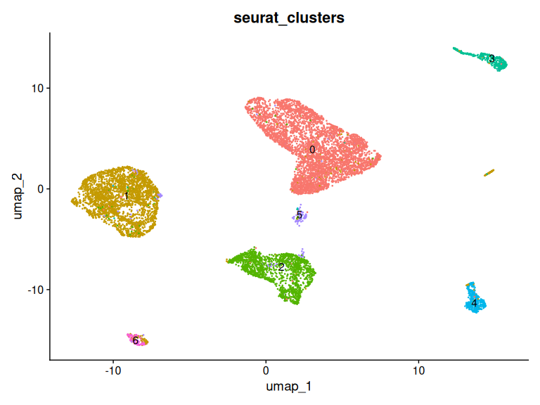
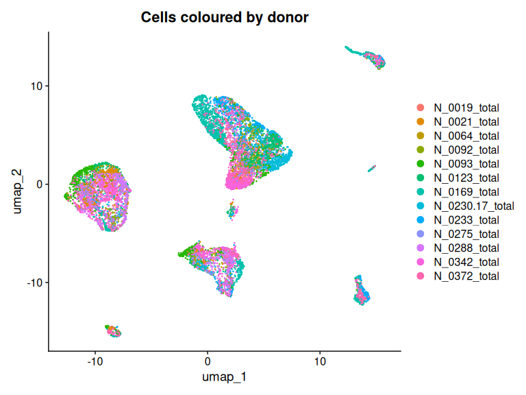
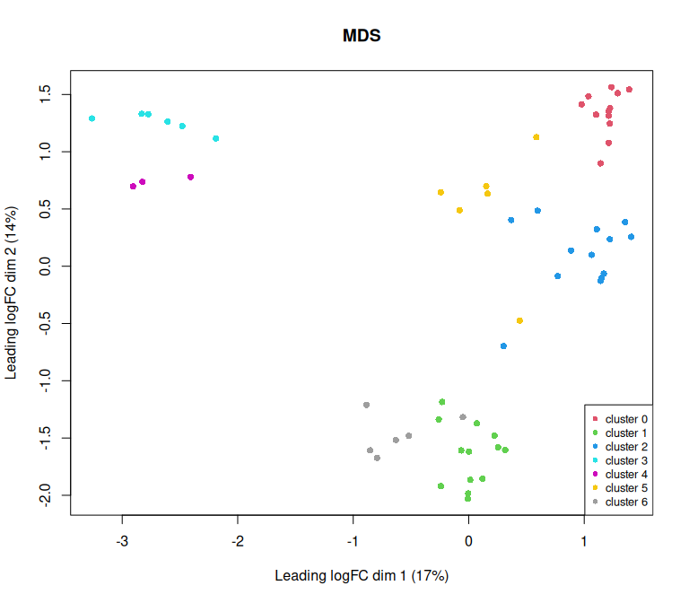
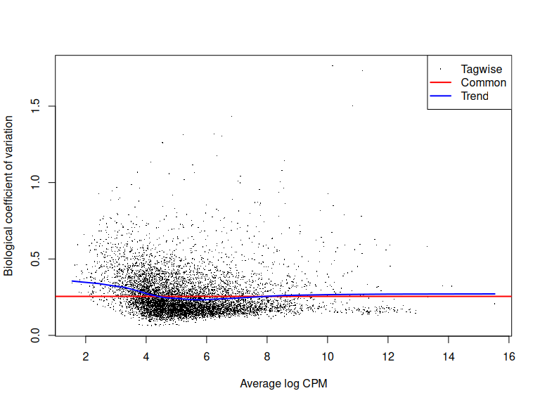
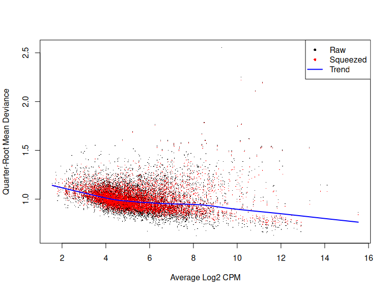
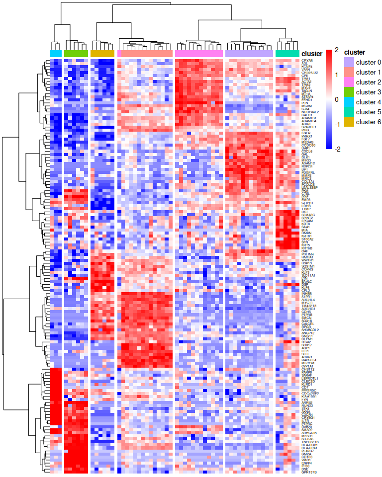

# Pseudobulk differential expression with edgeR


- [Before you start](#before-you-start)
- [Setup](#setup)
- [The data](#the-data)
- [A first look at the cells](#a-first-look-at-the-cells)
- [Building pseudobulk profiles](#building-pseudobulk-profiles)
- [Filtering](#filtering)
- [Normalization](#normalization)
- [Looking at the structure](#looking-at-the-structure)
- [The design](#the-design)
- [Dispersion](#dispersion)
- [Marker genes for each cluster](#marker-genes-for-each-cluster)
- [Heatmap of top markers](#heatmap-of-top-markers)
- [A note on conditions](#a-note-on-conditions)
- [Save your work](#save-your-work)
- [Session information](#session-information)

By now you have found marker genes with `FindAllMarkers()`, which tests
every cell against every other cell. That works for identifying cell
types, but it is the wrong tool for asking whether a gene differs
between *conditions*.

The reason is that cells from the same donor are not independent
observations. If you sequence 5,000 cells from one patient, you do not
have 5,000 independent measurements of that patient’s biology — you have
one patient, measured 5,000 times. Treating those cells as independent
inflates your sample size enormously and produces p-values that are far
too small. Run a cell-level test between two conditions with three
donors each and you will get thousands of “significant” genes, most of
which are telling you about donor identity rather than condition.

Pseudobulk analysis fixes this by summing counts across all cells of a
given type within each sample, producing one profile per sample per cell
type. You then analyze those profiles with the same tools people have
used for bulk RNA-seq for fifteen years, which are well-tested and which
treat samples as the unit of replication — because they are.

> **About this tutorial.** This is our own version of a published
> tutorial, rewritten to run in the course container — see the credits
> at the bottom for the original. The original is worth reading too. It
> is what you will find when you search for this analysis, and comparing
> the two is good practice for the thing you will do constantly in your
> own work: taking a tutorial written for someone else’s setup and
> making it run on yours.

## Before you start

We rendered this tutorial with:

``` bash
interactive -a cusanovichlab -n 4 -t 02:00:00
```

`interactive` allocates memory per core — 4 GB each by default — so that
is **16 GB** in total. Note there is no `--mem` flag: memory comes from
the number of cores you ask for. Pseudobulk profiles are small: the
heavy lifting collapses ten thousand cells into a few dozen columns.

It took about **2 minutes** to run when we did it. Ask for more time
than you expect to need — a job that hits its limit is killed part way
through.

When R runs out of memory on the cluster, the scheduler kills it with no
error message — the session simply stops mid-command. If that ever
happens to you, here or anywhere else, memory is the first thing to
check.

## Setup

``` r
library(Seurat)
library(edgeR)
library(ggplot2)
library(pheatmap)

# CHANGE THIS to your NetID.
NETID <- "your_netid"

WORK <- file.path("/xdisk/darrenc/cmm_523", NETID, "pseudobulk")
dir.create(file.path(WORK, "output"), recursive = TRUE, showWarnings = FALSE)

SHARED <- "/groups/darrenc/cmm_523/references/edgeR_pal"

WORK
```

    #> [1] "/xdisk/darrenc/cmm_523/your_netid/pseudobulk"

## The data

We will use the same dataset as the pseudobulk case study in the edgeR
User’s Guide (section 4.10), so you can compare your results directly
against theirs — a useful check that nothing has gone wrong.

The data come from a single-cell atlas of human breast tissue (Pal et
al. 2021, *EMBO Journal*). This subset contains normal breast epithelium
from 13 donors, already clustered by the original authors, and trimmed
to 2,000 genes to keep it small.

``` r
seu_file <- file.path(SHARED, "SeuratObj.rds")

if (!file.exists(seu_file)) {
  seu_file <- file.path(WORK, "SeuratObj.rds")
  if (!file.exists(seu_file)) {
    download.file("https://bioinf.wehi.edu.au/edgeR/UserGuideData/SeuratObj.rds",
                  seu_file, mode = "wb")
  }
}

raw <- readRDS(seu_file)

# This object was saved years ago, and it was subset to 2,000 genes without its
# gene-level metadata being updated to match. So it carries a meta.features
# table describing the full gene set, and a var.features list naming genes that
# are no longer in it. Seurat does not complain on load, but the first operation
# that revalidates the assay fails with "'meta.features' must have the same
# number of rows as 'data'".
#
# Rather than patch that, rebuild a clean object from the counts and the cell
# metadata, which is all we actually need. This is a useful move to know: when
# an object you were given misbehaves, you can usually extract the parts that
# matter and start again.
# Note `layer`, not `slot`. The `slot` argument is defunct in SeuratObject 5 --
# not merely deprecated, so it errors rather than warns. Older code and
# tutorials you find will use `slot`; this is the Seurat 5 spelling.
counts <- SeuratObject::GetAssayData(raw, assay = "RNA", layer = "counts")
meta   <- raw@meta.data

seu <- CreateSeuratObject(counts = counts, meta.data = meta)
seu
```

    #> An object of class Seurat 
    #> 13527 features across 10000 samples within 1 assay 
    #> Active assay: RNA (13527 features, 0 variable features)
    #>  1 layer present: counts

``` r
head(seu@meta.data)
```

    #>                                 orig.ident nCount_RNA nFeature_RNA        group
    #> N_0019_total_AAACCTGAGGGCTCTC-1          N       7886         2419 N_0019_total
    #> N_0019_total_AAACCTGGTACCGCTG-1          N       2306         1018 N_0019_total
    #> N_0019_total_AAACCTGTCTAGCACA-1          N       8569         2411 N_0019_total
    #> N_0019_total_AAACGGGAGGACAGAA-1          N       3774         1311 N_0019_total
    #> N_0019_total_AAACGGGCATATGAGA-1          N       5689         1753 N_0019_total
    #> N_0019_total_AAAGCAAGTGTAAGTA-1          N       3684         1350 N_0019_total
    #>                                 integrated_snn_res.0.05 seurat_clusters
    #> N_0019_total_AAACCTGAGGGCTCTC-1                       1               1
    #> N_0019_total_AAACCTGGTACCGCTG-1                       0               0
    #> N_0019_total_AAACCTGTCTAGCACA-1                       0               0
    #> N_0019_total_AAACGGGAGGACAGAA-1                       0               0
    #> N_0019_total_AAACGGGCATATGAGA-1                       1               1
    #> N_0019_total_AAAGCAAGTGTAAGTA-1                       3               3

``` r
table(seu$group)
```

    #> 
    #>    N_0019_total    N_0021_total    N_0064_total    N_0092_total    N_0093_total 
    #>             721             303             208             408            1079 
    #>    N_0123_total    N_0169_total N_0230.17_total    N_0233_total    N_0275_total 
    #>             666            1416             968            1170             245 
    #>    N_0288_total    N_0342_total    N_0372_total 
    #>             416            1685             715

``` r
table(seu$seurat_clusters)
```

    #> 
    #>    0    1    2    3    4    5    6 
    #> 4373 2943 1634  380  386  162  122

`group` identifies the donor each cell came from, and `seurat_clusters`
holds the cell clusters from the original analysis. Those are the two
things pseudobulk needs: a unit of replication and the groups you want
to compare.

## A first look at the cells

The edgeR guide shows these clusters on a t-SNE plot. We will use UMAP,
which you have already seen.

``` r
seu <- NormalizeData(seu)
seu <- FindVariableFeatures(seu)
seu <- ScaleData(seu)
seu <- RunPCA(seu)
seu <- RunUMAP(seu, dims = 1:20)

DimPlot(seu, reduction = "umap", group.by = "seurat_clusters", label = TRUE) +
  NoLegend()
```



The clusters come from the original authors, not from us. Our UMAP is a
fresh embedding of the same cells, so it will not look identical to
their t-SNE — but the same cluster labels should still group together.

``` r
DimPlot(seu, reduction = "umap", group.by = "group") +
  ggtitle("Cells coloured by donor")
```



Compare the two plots. If cells separated by donor rather than by
cluster, that would be a warning that donor differences were as large as
cell type differences. Here the donors are mixed within each cluster,
which is what you want to see.

## Building pseudobulk profiles

edgeR provides `Seurat2PB()`, which sums the counts for every
combination of sample and cluster.

``` r
y <- Seurat2PB(seu, sample = "group", cluster = "seurat_clusters")

# Seurat2PB copies whatever gene-level metadata the Seurat object was carrying
# into y$genes, and edgeR prints that alongside its results. Our object picked
# up columns from FindVariableFeatures() when we made the UMAP above, which
# would push logFC and the p-values off the right-hand edge of every results
# table. Keep just the gene names.
y$genes <- data.frame(gene = rownames(y), row.names = rownames(y))

y
```

    #> An object of class "DGEList"
    #> $counts
    #>        N_0019_total_cluster0 N_0019_total_cluster1 N_0019_total_cluster2
    #> MALAT1                 41643                 97838                 15572
    #> FTH1                   19273                 34629                  3878
    #> RPS18                  10975                 17979                  2817
    #> MT2A                   19401                 39831                  8798
    #> RPL41                   9860                 18402                  2943
    #>        N_0019_total_cluster3 N_0019_total_cluster4 N_0019_total_cluster5
    #> MALAT1                 10167                  3796                  4592
    #> FTH1                    8029                   571                  2639
    #> RPS18                    612                   546                  1607
    #> MT2A                     388                   115                  2638
    #> RPL41                    635                   587                  1283
    #>        N_0019_total_cluster6 N_0021_total_cluster0 N_0021_total_cluster1
    #> MALAT1                  3357                   974                 12588
    #> FTH1                    1014                   782                  9441
    #> RPS18                    369                   324                  5321
    #> MT2A                     235                   897                 12799
    #> RPL41                    349                   467                  7196
    #>        N_0021_total_cluster2 N_0021_total_cluster3 N_0021_total_cluster4
    #> MALAT1                  2803                   331                   136
    #> FTH1                    1632                    77                   146
    #> RPS18                    999                    41                    48
    #> MT2A                    2647                    34                    81
    #> RPL41                   1549                    54                    58
    #>        N_0021_total_cluster5 N_0021_total_cluster6 N_0064_total_cluster0
    #> MALAT1                   666                   422                  3523
    #> FTH1                     237                   550                  2390
    #> RPS18                    110                    98                  1002
    #> MT2A                     221                    96                  1857
    #> RPL41                    192                   167                  1015
    #>        N_0064_total_cluster1 N_0064_total_cluster2 N_0064_total_cluster3
    #> MALAT1                  8200                  2637                    46
    #> FTH1                    3642                   907                   100
    #> RPS18                   1359                   433                     1
    #> MT2A                    2741                  1133                    21
    #> RPL41                   1416                   554                     2
    #>        N_0064_total_cluster5 N_0092_total_cluster0 N_0092_total_cluster1
    #> MALAT1                   174                 12699                 24673
    #> FTH1                      14                 13870                 14720
    #> RPS18                      1                  5392                  9635
    #> MT2A                       5                  4922                 17006
    #> RPL41                     11                  4870                  8752
    #>        N_0092_total_cluster2 N_0092_total_cluster3 N_0092_total_cluster4
    #> MALAT1                  6159                  1847                   170
    #> FTH1                    2151                  3745                    29
    #> RPS18                   1502                   200                    60
    #> MT2A                    3809                   229                     2
    #> RPL41                   1783                   202                    35
    #>        N_0092_total_cluster5 N_0093_total_cluster0 N_0093_total_cluster1
    #> MALAT1                  1121                 43122                114821
    #> FTH1                    1430                 33417                 33721
    #> RPS18                   1047                  6533                 12411
    #> MT2A                     740                 28099                 22651
    #> RPL41                    789                  4409                  9696
    #>        N_0093_total_cluster2 N_0093_total_cluster3 N_0093_total_cluster4
    #> MALAT1                 47892                  2503                   980
    #> FTH1                   16650                  1607                   171
    #> RPS18                   5908                    40                   125
    #> MT2A                   24054                   203                     7
    #> RPL41                   4662                    38                   108
    #>        N_0093_total_cluster5 N_0093_total_cluster6 N_0123_total_cluster0
    #> MALAT1                  1855                  8825                 24808
    #> FTH1                     618                  4621                 17569
    #> RPS18                    245                   787                  7712
    #> MT2A                     386                   944                 16003
    #> RPL41                    161                   559                  7018
    #>        N_0123_total_cluster1 N_0123_total_cluster2 N_0123_total_cluster3
    #> MALAT1                 21661                  4949                  3755
    #> FTH1                    7221                  1990                  2872
    #> RPS18                   3852                  1121                   590
    #> MT2A                    7872                  3648                   295
    #> RPL41                   3220                  1150                   490
    #>        N_0123_total_cluster4 N_0123_total_cluster5 N_0123_total_cluster6
    #> MALAT1                   108                  4741                   222
    #> FTH1                      30                  2779                    69
    #> RPS18                     27                  1366                    57
    #> MT2A                       5                  1220                    68
    #> RPL41                     50                  1214                    42
    #>        N_0169_total_cluster0 N_0169_total_cluster1 N_0169_total_cluster2
    #> MALAT1                109483                114053                 39633
    #> FTH1                   27384                 11107                  3309
    #> RPS18                  14869                  8344                  3752
    #> MT2A                   22590                 21793                 12130
    #> RPL41                  26633                 14992                  7314
    #>        N_0169_total_cluster3 N_0169_total_cluster4 N_0169_total_cluster5
    #> MALAT1                 41650                 16670                  1818
    #> FTH1                   22764                  3182                   276
    #> RPS18                   1548                   985                   243
    #> MT2A                    3463                    98                   456
    #> RPL41                   2679                  1934                   386
    #>        N_0169_total_cluster6 N_0230.17_total_cluster0 N_0230.17_total_cluster1
    #> MALAT1                  6730                   130584                   116906
    #> FTH1                    1546                    77757                    39674
    #> RPS18                    898                    31980                    23732
    #> MT2A                     570                    68195                    76313
    #> RPL41                   1541                    42289                    33918
    #>        N_0230.17_total_cluster2 N_0230.17_total_cluster3
    #> MALAT1                    28949                     9116
    #> FTH1                       6105                     4084
    #> RPS18                      4292                      352
    #> MT2A                      18998                      372
    #> RPL41                      6776                      495
    #>        N_0230.17_total_cluster4 N_0230.17_total_cluster5
    #> MALAT1                     3479                     2960
    #> FTH1                        233                     1449
    #> RPS18                       402                      956
    #> MT2A                         23                     1700
    #> RPL41                       537                     1202
    #>        N_0230.17_total_cluster6 N_0233_total_cluster0 N_0233_total_cluster1
    #> MALAT1                     3535                188712                104530
    #> FTH1                        965                 42008                 24038
    #> RPS18                       760                 24728                 19462
    #> MT2A                        412                 31354                 34342
    #> RPL41                       984                 35890                 23473
    #>        N_0233_total_cluster2 N_0233_total_cluster3 N_0233_total_cluster4
    #> MALAT1                 68077                 39133                 30714
    #> FTH1                    5049                 27910                  3742
    #> RPS18                   7494                  1375                  2885
    #> MT2A                   10226                  2595                   176
    #> RPL41                  11348                  1982                  3827
    #>        N_0233_total_cluster5 N_0233_total_cluster6 N_0275_total_cluster0
    #> MALAT1                 16130                  9168                  6957
    #> FTH1                    5546                  1082                  2444
    #> RPS18                   2303                  1160                  1059
    #> MT2A                    3301                   389                  1883
    #> RPL41                   2863                  1436                   896
    #>        N_0275_total_cluster1 N_0275_total_cluster2 N_0275_total_cluster3
    #> MALAT1                 48362                 13810                   932
    #> FTH1                    8356                  2060                    63
    #> RPS18                   6812                  2202                    10
    #> MT2A                   11647                  4475                     4
    #> RPL41                   4893                  1823                     7
    #>        N_0275_total_cluster4 N_0275_total_cluster5 N_0288_total_cluster0
    #> MALAT1                   202                   467                  6729
    #> FTH1                      44                   150                  2111
    #> RPS18                     23                   142                  1315
    #> MT2A                       0                    43                  1405
    #> RPL41                     36                    84                  1102
    #>        N_0288_total_cluster1 N_0288_total_cluster2 N_0288_total_cluster3
    #> MALAT1                 76574                 28155                   207
    #> FTH1                   22784                  4844                   401
    #> RPS18                  12840                  3541                    24
    #> MT2A                   35708                  7782                    22
    #> RPL41                  10358                  3854                    19
    #>        N_0288_total_cluster5 N_0342_total_cluster0 N_0342_total_cluster1
    #> MALAT1                   699                 32025                176876
    #> FTH1                     128                 18449                 57729
    #> RPS18                     48                  5627                 18389
    #> MT2A                     199                 28153                 85843
    #> RPL41                     39                  6518                 23638
    #>        N_0342_total_cluster2 N_0342_total_cluster3 N_0342_total_cluster4
    #> MALAT1                 46573                  4575                   367
    #> FTH1                    7237                  1887                    62
    #> RPS18                   4223                    96                    37
    #> MT2A                   21627                   581                    91
    #> RPL41                   6812                   187                    61
    #>        N_0342_total_cluster5 N_0342_total_cluster6 N_0372_total_cluster0
    #> MALAT1                 11597                  1821                 43762
    #> FTH1                    3889                  1425                 23044
    #> RPS18                   1442                   166                  6666
    #> MT2A                   14880                   249                 28806
    #> RPL41                   1969                   204                  7098
    #>        N_0372_total_cluster1 N_0372_total_cluster2 N_0372_total_cluster3
    #> MALAT1                 53981                 17952                 12405
    #> FTH1                   18134                  2652                  9208
    #> RPS18                   5163                  1261                   222
    #> MT2A                   27687                  7826                  1300
    #> RPL41                   5991                  1679                   355
    #>        N_0372_total_cluster4 N_0372_total_cluster5 N_0372_total_cluster6
    #> MALAT1                  7434                  3343                  8310
    #> FTH1                     704                  1016                  7728
    #> RPS18                    587                   149                   645
    #> MT2A                      53                   191                   575
    #> RPL41                    710                   151                   825
    #> 13522 more rows ...
    #> 
    #> $samples
    #>                       group lib.size norm.factors       sample cluster
    #> N_0019_total_cluster0     1  1679441            1 N_0019_total       0
    #> N_0019_total_cluster1     1  2225898            1 N_0019_total       1
    #> N_0019_total_cluster2     1   350241            1 N_0019_total       2
    #> N_0019_total_cluster3     1   133909            1 N_0019_total       3
    #> N_0019_total_cluster4     1    49889            1 N_0019_total       4
    #> 80 more rows ...
    #> 
    #> $genes
    #>          gene
    #> MALAT1 MALAT1
    #> FTH1     FTH1
    #> RPS18   RPS18
    #> MT2A     MT2A
    #> RPL41   RPL41
    #> 13522 more rows ...

``` r
head(y$samples)
```

    #>                       group lib.size norm.factors       sample cluster
    #> N_0019_total_cluster0     1  1679441            1 N_0019_total       0
    #> N_0019_total_cluster1     1  2225898            1 N_0019_total       1
    #> N_0019_total_cluster2     1   350241            1 N_0019_total       2
    #> N_0019_total_cluster3     1   133909            1 N_0019_total       3
    #> N_0019_total_cluster4     1    49889            1 N_0019_total       4
    #> N_0019_total_cluster5     1   160445            1 N_0019_total       5

What came back is a `DGEList` — edgeR’s container for bulk RNA-seq.
Columns are now donor-by-cluster combinations rather than cells: about
ten thousand columns became fewer than a hundred.

## Filtering

First, drop pseudobulk profiles that are too thin to be worth anything.
A profile summed from a handful of cells is mostly noise. `Seurat2PB()`
does not report how many cells went into each profile, so library size
is the stand-in.

``` r
summary(y$samples$lib.size)
```

    #>    Min. 1st Qu.  Median    Mean 3rd Qu.    Max. 
    #>    1352   42181  165537  651543  776854 5011510

``` r
keep.samples <- y$samples$lib.size > 5e4
table(keep.samples)
```

    #> keep.samples
    #> FALSE  TRUE 
    #>    26    59

``` r
# Fail loudly rather than silently emptying the object.
stopifnot(sum(keep.samples) >= 3)

y <- y[, keep.samples]
```

Then drop genes not expressed at a useful level. `filterByExpr()` takes
the group structure into account rather than applying a flat cutoff.

``` r
keep.genes <- filterByExpr(y, group = y$samples$cluster,
                           min.count = 10, min.total.count = 20)
table(keep.genes)
```

    #> keep.genes
    #> FALSE  TRUE 
    #>  5660  7867

``` r
y <- y[keep.genes, , keep = FALSE]
dim(y)
```

    #> [1] 7867   59

## Normalization

``` r
y <- normLibSizes(y)
summary(y$samples$norm.factors)
```

    #>    Min. 1st Qu.  Median    Mean 3rd Qu.    Max. 
    #>  0.6732  0.9154  1.0265  1.0094  1.1135  1.2853

`normLibSizes()` computes TMM normalization factors, correcting for the
fact that a handful of very highly expressed genes can otherwise make
everything else look depleted. You may see older code call this
`calcNormFactors()` — same thing, previous name.

## Looking at the structure

`plotMDS()` gives a view of the data analogous to UMAP, where the
distance between each pair of points characterizes the similarity of
those pseudobulk samples. We expect to see clustering of samples from
the same cell type dominate over clustering of samples from the same
subject.

``` r
cluster <- as.factor(y$samples$cluster)
plotMDS(y, pch = 16, col = c(2:8)[cluster], main = "MDS")
legend("bottomright", legend = paste0("cluster ", levels(cluster)),
       pch = 16, col = 2:8, cex = 0.8)
```



## The design

We want to find genes that distinguish each cluster from the others,
while accounting for differences between donors.

``` r
donor <- factor(y$samples$sample)
design <- model.matrix(~ cluster + donor)
colnames(design) <- gsub("donor", "", colnames(design))
colnames(design)[1] <- "Int"
head(design)
```

    #>   Int cluster1 cluster2 cluster3 cluster4 cluster5 cluster6 N_0021_total
    #> 1   1        0        0        0        0        0        0            0
    #> 2   1        1        0        0        0        0        0            0
    #> 3   1        0        1        0        0        0        0            0
    #> 4   1        0        0        1        0        0        0            0
    #> 5   1        0        0        0        0        1        0            0
    #> 6   1        0        0        0        0        0        1            0
    #>   N_0064_total N_0092_total N_0093_total N_0123_total N_0169_total
    #> 1            0            0            0            0            0
    #> 2            0            0            0            0            0
    #> 3            0            0            0            0            0
    #> 4            0            0            0            0            0
    #> 5            0            0            0            0            0
    #> 6            0            0            0            0            0
    #>   N_0230.17_total N_0233_total N_0275_total N_0288_total N_0342_total
    #> 1               0            0            0            0            0
    #> 2               0            0            0            0            0
    #> 3               0            0            0            0            0
    #> 4               0            0            0            0            0
    #> 5               0            0            0            0            0
    #> 6               0            0            0            0            0
    #>   N_0372_total
    #> 1            0
    #> 2            0
    #> 3            0
    #> 4            0
    #> 5            0
    #> 6            0

Read the formula rather than the code. `~ cluster + donor` fits a
baseline for each donor and estimates the cluster effects on top of
that. A gene that simply differs between people is absorbed by the donor
terms, and does not contaminate the comparison between cell types. That
is what a cell-level test cannot do.

## Dispersion

``` r
y <- estimateDisp(y, design, robust = TRUE)
plotBCV(y)
```



The biological coefficient of variation is roughly the typical relative
variability of a gene between replicates.

``` r
fit <- glmQLFit(y, design, robust = TRUE)
plotQLDisp(fit)
```



## Marker genes for each cluster

To find markers, we compare each cluster against the average of all the
others. That comparison has to be written as a contrast.

``` r
ncls <- nlevels(cluster)
contr <- rbind(matrix(1 / (1 - ncls), ncls, ncls),
               matrix(0, ncol(design) - ncls, ncls))
diag(contr) <- 1
contr[1, ] <- 0
rownames(contr) <- colnames(design)
colnames(contr) <- paste0("cluster", levels(cluster))
contr
```

    #>                   cluster0   cluster1   cluster2   cluster3   cluster4
    #> Int              0.0000000  0.0000000  0.0000000  0.0000000  0.0000000
    #> cluster1        -0.1666667  1.0000000 -0.1666667 -0.1666667 -0.1666667
    #> cluster2        -0.1666667 -0.1666667  1.0000000 -0.1666667 -0.1666667
    #> cluster3        -0.1666667 -0.1666667 -0.1666667  1.0000000 -0.1666667
    #> cluster4        -0.1666667 -0.1666667 -0.1666667 -0.1666667  1.0000000
    #> cluster5        -0.1666667 -0.1666667 -0.1666667 -0.1666667 -0.1666667
    #> cluster6        -0.1666667 -0.1666667 -0.1666667 -0.1666667 -0.1666667
    #> N_0021_total     0.0000000  0.0000000  0.0000000  0.0000000  0.0000000
    #> N_0064_total     0.0000000  0.0000000  0.0000000  0.0000000  0.0000000
    #> N_0092_total     0.0000000  0.0000000  0.0000000  0.0000000  0.0000000
    #> N_0093_total     0.0000000  0.0000000  0.0000000  0.0000000  0.0000000
    #> N_0123_total     0.0000000  0.0000000  0.0000000  0.0000000  0.0000000
    #> N_0169_total     0.0000000  0.0000000  0.0000000  0.0000000  0.0000000
    #> N_0230.17_total  0.0000000  0.0000000  0.0000000  0.0000000  0.0000000
    #> N_0233_total     0.0000000  0.0000000  0.0000000  0.0000000  0.0000000
    #> N_0275_total     0.0000000  0.0000000  0.0000000  0.0000000  0.0000000
    #> N_0288_total     0.0000000  0.0000000  0.0000000  0.0000000  0.0000000
    #> N_0342_total     0.0000000  0.0000000  0.0000000  0.0000000  0.0000000
    #> N_0372_total     0.0000000  0.0000000  0.0000000  0.0000000  0.0000000
    #>                   cluster5   cluster6
    #> Int              0.0000000  0.0000000
    #> cluster1        -0.1666667 -0.1666667
    #> cluster2        -0.1666667 -0.1666667
    #> cluster3        -0.1666667 -0.1666667
    #> cluster4        -0.1666667 -0.1666667
    #> cluster5         1.0000000 -0.1666667
    #> cluster6        -0.1666667  1.0000000
    #> N_0021_total     0.0000000  0.0000000
    #> N_0064_total     0.0000000  0.0000000
    #> N_0092_total     0.0000000  0.0000000
    #> N_0093_total     0.0000000  0.0000000
    #> N_0123_total     0.0000000  0.0000000
    #> N_0169_total     0.0000000  0.0000000
    #> N_0230.17_total  0.0000000  0.0000000
    #> N_0233_total     0.0000000  0.0000000
    #> N_0275_total     0.0000000  0.0000000
    #> N_0288_total     0.0000000  0.0000000
    #> N_0342_total     0.0000000  0.0000000
    #> N_0372_total     0.0000000  0.0000000

Each column is one test. The `1` on the diagonal picks out one cluster;
the negative fractions average over the rest; the donor rows are zero
because donor is a nuisance we have adjusted for, not something we are
testing.

``` r
qlf <- list()
for (i in 1:ncls) {
  qlf[[i]] <- glmQLFTest(fit, contrast = contr[, i])
  qlf[[i]]$comparison <- paste0("cluster", levels(cluster)[i], "_vs_others")
}

topTags(qlf[[1]], n = 10L)
```

    #> Coefficient:  cluster0_vs_others 
    #>              gene    logFC   logCPM        F       PValue          FDR
    #> FBLN1       FBLN1 6.008470 6.782442 734.3620 7.191008e-39 5.657166e-35
    #> OGN           OGN 5.736805 5.839392 585.7090 5.665084e-36 2.228361e-32
    #> IGFBP6     IGFBP6 5.368960 6.786631 533.6868 3.254033e-34 8.533160e-31
    #> DPT           DPT 5.926321 6.312554 459.0401 1.832983e-33 3.605019e-30
    #> CFD           CFD 4.985577 8.900624 538.4030 1.870009e-32 2.942272e-29
    #> SERPINF1 SERPINF1 5.168391 6.919634 580.0074 3.105335e-32 4.071612e-29
    #> MFAP4       MFAP4 4.614728 5.947151 436.7289 5.145854e-32 5.783205e-29
    #> CRABP2     CRABP2 3.952278 6.351154 434.5896 6.609001e-32 6.499126e-29
    #> MMP2         MMP2 5.389541 6.789111 460.2753 1.104150e-31 9.651496e-29
    #> CLMP         CLMP 5.959429 7.510977 484.8619 1.263357e-31 9.938829e-29

``` r
dt <- lapply(lapply(qlf, decideTests), summary)
do.call("cbind", dt)
```

    #>        cluster0_vs_others cluster1_vs_others cluster2_vs_others
    #> Down                 1462                780               1453
    #> NotSig               4004               4867               4283
    #> Up                   2401               2220               2131
    #>        cluster3_vs_others cluster4_vs_others cluster5_vs_others
    #> Down                 1597               1617                253
    #> NotSig               4407               4929               6559
    #> Up                   1863               1321               1055
    #>        cluster6_vs_others
    #> Down                 1424
    #> NotSig               4863
    #> Up                   1580

That table is worth comparing against the edgeR guide. If your counts of
up- and down-regulated genes per cluster are close to theirs, the
analysis is working as intended.

## Heatmap of top markers

``` r
top <- 20
topMarkers <- list()
for (i in 1:ncls) {
  ord <- order(qlf[[i]]$table$PValue, decreasing = FALSE)
  up  <- qlf[[i]]$table$logFC > 0
  topMarkers[[i]] <- rownames(y)[ord[up][1:top]]
}
topMarkers <- unique(unlist(topMarkers))

lcpm  <- cpm(y, log = TRUE)
annot <- data.frame(cluster = paste0("cluster ", cluster))
rownames(annot) <- colnames(y)

pheatmap(lcpm[topMarkers, ],
         breaks = seq(-2, 2, length.out = 101),
         color = colorRampPalette(c("blue", "white", "red"))(100),
         scale = "row",
         cluster_cols = TRUE, border_color = NA,
         fontsize_row = 5,
         treeheight_row = 70, treeheight_col = 70,
         cutree_cols = ncls,
         clustering_method = "ward.D2",
         show_colnames = FALSE,
         annotation_col = annot)
```



Each column is a pseudobulk sample and each row a marker gene. If the
markers are doing their job, samples from the same cluster sit together
regardless of which donor they came from, and each cluster has its own
block of highly expressed genes.

## A note on conditions

This tutorial compares cell types. The same machinery is what you would
use to compare *conditions* — treated versus untreated, disease versus
healthy — and that is where pseudobulk matters most. Comparing two
obviously different cell types, the choice between a cell-level test and
a pseudobulk test mostly changes the length of your gene list. Comparing
two conditions with a handful of donors each, it changes whether your
result is real.

## Save your work

``` r
saveRDS(y,   file = file.path(WORK, "output", "pseudobulk_dgelist.rds"))
saveRDS(qlf, file = file.path(WORK, "output", "pseudobulk_markers.rds"))
```

## Session information

``` r
sessionInfo()
```

    #> R version 4.6.1 (2026-06-24)
    #> Platform: x86_64-pc-linux-gnu
    #> Running under: Ubuntu 24.04.4 LTS
    #> 
    #> Matrix products: default
    #> BLAS:   /usr/lib/x86_64-linux-gnu/openblas-pthread/libblas.so.3 
    #> LAPACK: /usr/lib/x86_64-linux-gnu/openblas-pthread/libopenblasp-r0.3.26.so;  LAPACK version 3.12.0
    #> 
    #> locale:
    #>  [1] LC_CTYPE=C.UTF-8       LC_NUMERIC=C           LC_TIME=C.UTF-8       
    #>  [4] LC_COLLATE=C.UTF-8     LC_MONETARY=C.UTF-8    LC_MESSAGES=C.UTF-8   
    #>  [7] LC_PAPER=C.UTF-8       LC_NAME=C              LC_ADDRESS=C          
    #> [10] LC_TELEPHONE=C         LC_MEASUREMENT=C.UTF-8 LC_IDENTIFICATION=C   
    #> 
    #> time zone: Etc/UTC
    #> tzcode source: system (glibc)
    #> 
    #> attached base packages:
    #> [1] stats     graphics  grDevices utils     datasets  methods   base     
    #> 
    #> other attached packages:
    #> [1] pheatmap_1.0.13    ggplot2_4.0.3      edgeR_4.10.5       limma_3.68.5      
    #> [5] Seurat_5.5.1       SeuratObject_5.4.0 sp_2.2-3          
    #> 
    #> loaded via a namespace (and not attached):
    #>   [1] deldir_2.0-4           pbapply_1.7-4          gridExtra_2.3.1       
    #>   [4] rlang_1.3.0            magrittr_2.0.5         RcppAnnoy_0.0.23      
    #>   [7] otel_0.2.0             spatstat.geom_3.8-2    matrixStats_1.5.0     
    #>  [10] ggridges_0.5.7         compiler_4.6.1         png_0.1-9             
    #>  [13] vctrs_0.7.3            reshape2_1.4.5         stringr_1.6.0         
    #>  [16] pkgconfig_2.0.3        fastmap_1.2.0          labeling_0.4.3        
    #>  [19] promises_1.5.0         rmarkdown_2.31         purrr_1.2.2           
    #>  [22] xfun_0.60              jsonlite_2.0.0         goftest_1.2-3         
    #>  [25] later_1.4.8            spatstat.utils_3.2-4   irlba_2.3.7           
    #>  [28] parallel_4.6.1         cluster_2.1.8.3        R6_2.6.1              
    #>  [31] ica_1.0-3              stringi_1.8.9          RColorBrewer_1.1-3    
    #>  [34] spatstat.data_3.1-9    reticulate_1.46.0      parallelly_1.48.0     
    #>  [37] spatstat.univar_3.2-0  lmtest_0.9-40          scattermore_1.2       
    #>  [40] Rcpp_1.1.2             knitr_1.51             tensor_1.5.1          
    #>  [43] future.apply_1.20.2    zoo_1.9-0              sctransform_0.4.3     
    #>  [46] httpuv_1.6.17          Matrix_1.7-6           splines_4.6.1         
    #>  [49] igraph_2.3.3           tidyselect_1.2.1       dichromat_2.0-1       
    #>  [52] abind_1.4-8            yaml_2.3.12            spatstat.random_3.5-1 
    #>  [55] codetools_0.2-20       miniUI_0.1.2           spatstat.explore_3.8-2
    #>  [58] listenv_1.0.0          lattice_0.22-9         tibble_3.3.1          
    #>  [61] plyr_1.8.9             withr_3.0.3            shiny_1.14.0          
    #>  [64] S7_0.2.2               ROCR_1.0-12            evaluate_1.0.5        
    #>  [67] Rtsne_0.17             future_1.75.0          fastDummies_1.7.6     
    #>  [70] survival_3.8-9         polyclip_1.10-7        fitdistrplus_1.2-6    
    #>  [73] pillar_1.11.1          KernSmooth_2.23-26     plotly_4.12.1         
    #>  [76] generics_0.1.4         RcppHNSW_0.7.0         scales_1.4.0          
    #>  [79] globals_0.19.1         xtable_1.8-8           glue_1.8.1            
    #>  [82] tools_4.6.1            data.table_1.18.4      RSpectra_0.16-2       
    #>  [85] locfit_1.5-9.12        RANN_2.6.2             dotCall64_1.2         
    #>  [88] cowplot_1.2.0          grid_4.6.1             tidyr_1.3.2           
    #>  [91] nlme_3.1-170           patchwork_1.3.2        cli_3.6.6             
    #>  [94] spatstat.sparse_3.2-0  spam_2.11-4            viridisLite_0.4.3     
    #>  [97] dplyr_1.2.1            uwot_0.2.4             gtable_0.3.6          
    #> [100] digest_0.6.39          progressr_1.0.0        ggrepel_0.9.8         
    #> [103] htmlwidgets_1.6.4      farver_2.1.2           htmltools_0.5.9       
    #> [106] lifecycle_1.0.5        httr_1.4.8             statmod_1.5.2         
    #> [109] mime_0.13              MASS_7.3-66

------------------------------------------------------------------------

*Adapted from section 4.10 of the [edgeR User’s
Guide](https://bioconductor.org/packages/release/bioc/html/edgeR.html),
using the same data, updated for current edgeR (`normLibSizes`, native
`Seurat2PB`) and Seurat 5.*
