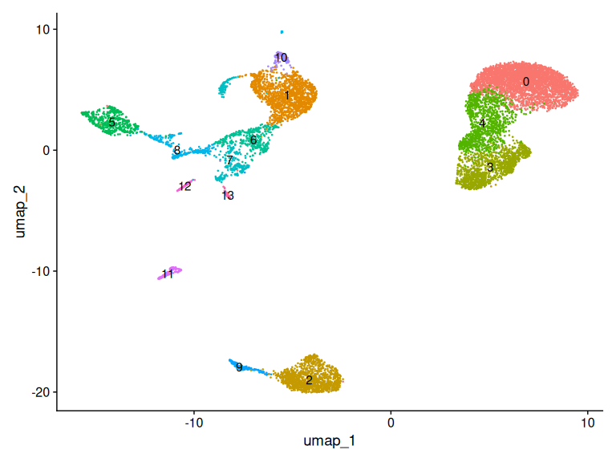
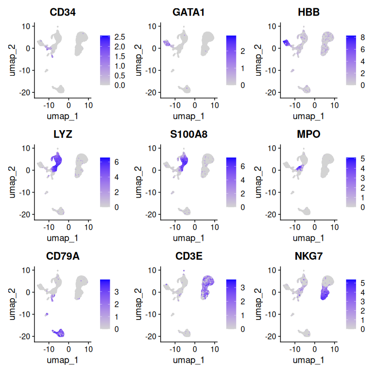
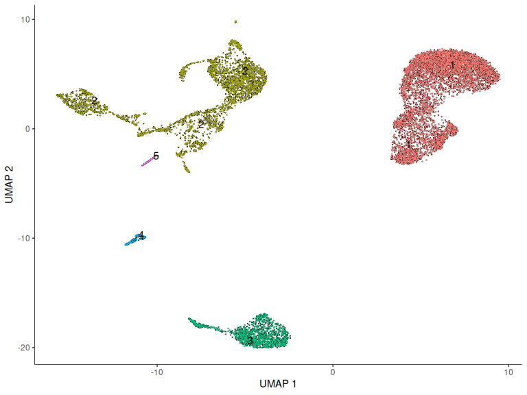
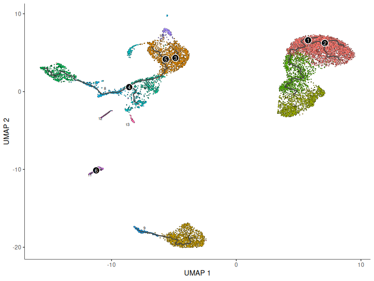
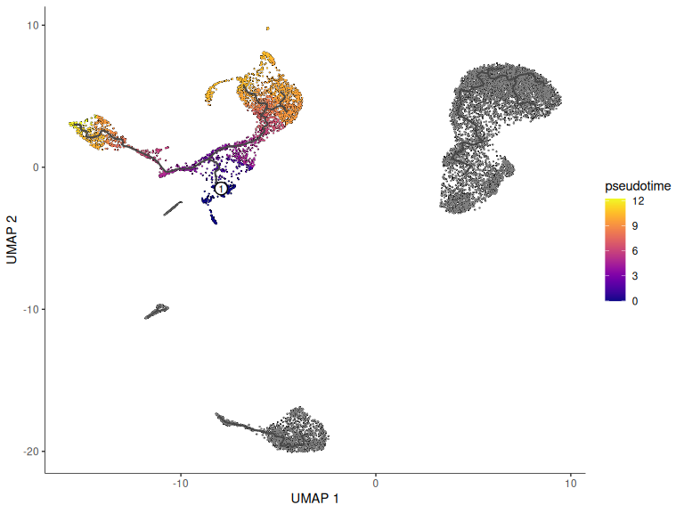
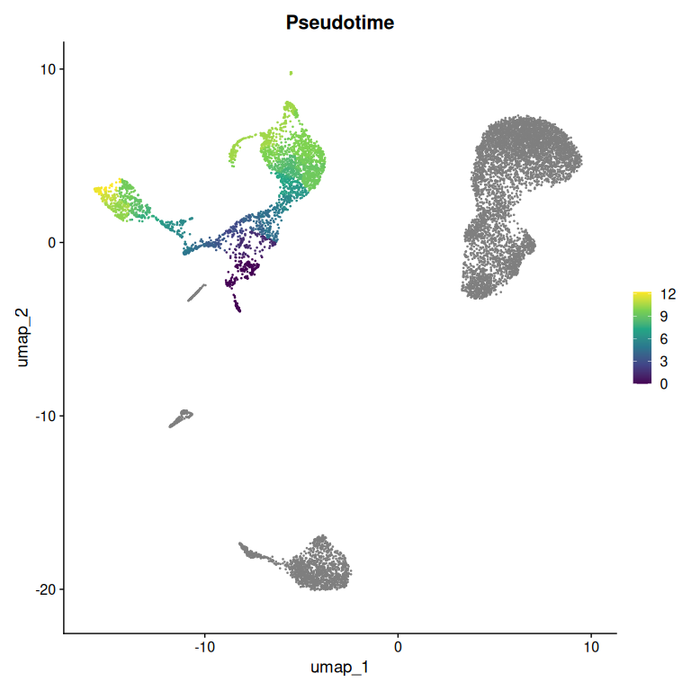
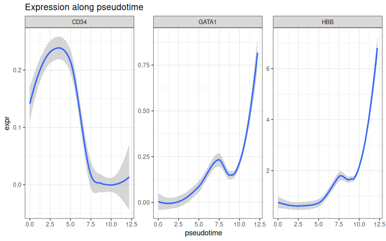
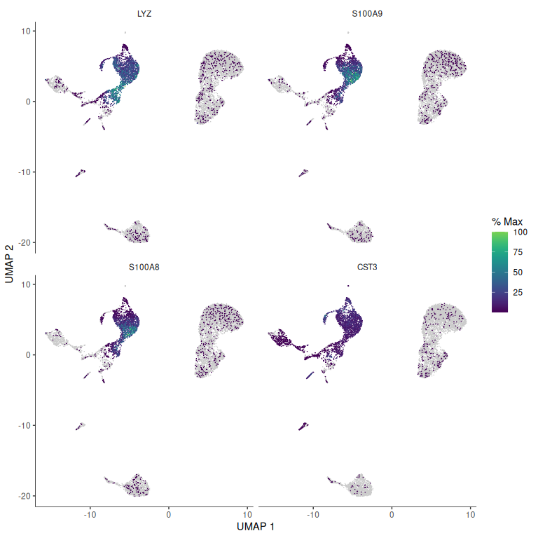

# Trajectory inference with monocle3


- [Before you start](#before-you-start)
- [Setup](#setup)
- [The data](#the-data)
- [Standard processing first](#standard-processing-first)
- [Converting to a cell_data_set](#converting-to-a-cell_data_set)
- [Clustering in monocle3](#clustering-in-monocle3)
- [Learning the graph](#learning-the-graph)
- [Choosing a root](#choosing-a-root)
- [Checking it against known
  biology](#checking-it-against-known-biology)
- [Genes that change along the
  trajectory](#genes-that-change-along-the-trajectory)
- [What this cannot tell you](#what-this-cannot-tell-you)
- [Save your work](#save-your-work)
- [Session information](#session-information)

Clustering assumes cells fall into discrete groups. For many tissues
that is a reasonable approximation — a B cell is a B cell. But
differentiation is not discrete. A haematopoietic stem cell becoming an
erythrocyte passes through a continuum of states, and forcing that
continuum into clusters throws away the thing you probably care about:
the order.

Trajectory inference fits a path through the data and places each cell
along it. The resulting coordinate is usually called **pseudotime** —
not time in hours, but position along the inferred path.

Two warnings before you start, because this is the technique in this
course most likely to produce a confident wrong answer.

A trajectory algorithm will fit a trajectory to anything. Give it
discrete cell types with no developmental relationship and it will still
draw a path through them, and that path will look perfectly plausible.
The algorithm has no way to tell you that your data has no trajectory in
it.

And pseudotime is not time. Cells at the same pseudotime are at similar
transcriptional states, which may or may not mean they are at the same
point in a real process.

> **About this tutorial.** This is our own version of a published
> tutorial, rewritten to run in the course container — see the credits
> at the bottom for the original. The original is worth reading too. It
> is what you will find when you search for this analysis, and comparing
> the two is good practice for the thing you will do constantly in your
> own work: taking a tutorial written for someone else’s setup and
> making it run on yours.

## Before you start

We rendered this tutorial with:

``` bash
interactive -a cusanovichlab -n 8 -t 03:00:00
```

`interactive` allocates memory per core — 4 GB each by default — so that
is **32 GB** in total. Note there is no `--mem` flag: memory comes from
the number of cores you ask for.

It took about **6 minutes** to run when we did it. Ask for more time
than you expect to need — a job that hits its limit is killed part way
through.

When R runs out of memory on the cluster, the scheduler kills it with no
error message — the session simply stops mid-command. If that ever
happens to you, here or anywhere else, memory is the first thing to
check.

## Setup

``` r
library(Seurat)
library(SeuratData)
library(monocle3)
library(ggplot2)
library(dplyr)
library(patchwork)

# CHANGE THIS to your NetID.
NETID <- "your_netid"


WORK <- file.path("/xdisk/darrenc/cmm_523", NETID, "trajectory")
dir.create(file.path(WORK, "output"), recursive = TRUE, showWarnings = FALSE)

SHARED_DATA <- "/groups/darrenc/cmm_523/references/Rdatalib"
MY_DATA     <- file.path("/xdisk/darrenc/cmm_523", NETID, "Rdatalib")
dir.create(MY_DATA, recursive = TRUE, showWarnings = FALSE)
.libPaths(c(MY_DATA, SHARED_DATA, .libPaths()))


options(future.globals.maxSize = 8000 * 1024^2)
WORK
```

    #> [1] "/xdisk/darrenc/cmm_523/your_netid/trajectory"

## The data

For this tutorial, we will use bone marrow data. Bone marrow is where
haematopoiesis is actively happening — so there is a real continuum to
find, not one we are imposing.

``` r
if (!requireNamespace("hcabm40k.SeuratData", quietly = TRUE)) {
  InstallData("hcabm40k")
}
data("hcabm40k", package = "hcabm40k.SeuratData")
bm <- UpdateSeuratObject(hcabm40k)

bm
```

    #> An object of class Seurat 
    #> 17369 features across 40000 samples within 1 assay 
    #> Active assay: RNA (17369 features, 0 variable features)
    #>  2 layers present: counts, data

40,000 cells is more than we need and enough to make every step slow.
Let’s subsample.

``` r
set.seed(42)
bm <- bm[, sample(ncol(bm), 10000)]
dim(bm)
```

    #> [1] 17369 10000

## Standard processing first

Trajectory inference operates on an embedding, so we need one. This is
the ordinary Seurat workflow.

``` r
bm <- NormalizeData(bm)
bm <- FindVariableFeatures(bm, nfeatures = 2000)
bm <- ScaleData(bm)
bm <- RunPCA(bm, npcs = 50)
bm <- FindNeighbors(bm, dims = 1:30)
bm <- FindClusters(bm, resolution = 0.5)
```

    #> Modularity Optimizer version 1.3.0 by Ludo Waltman and Nees Jan van Eck
    #> 
    #> Number of nodes: 10000
    #> Number of edges: 393360
    #> 
    #> Running Louvain algorithm...
    #> Maximum modularity in 10 random starts: 0.9042
    #> Number of communities: 14
    #> Elapsed time: 1 seconds

``` r
bm <- RunUMAP(bm, dims = 1:30)

DimPlot(bm, label = TRUE) + NoLegend()
```



``` r
FeaturePlot(bm, features = c("CD34", "GATA1", "HBB",
                             "LYZ", "S100A8", "MPO",
                             "CD79A", "CD3E", "NKG7"), ncol = 3)
```



Orient yourself with these before going further.

- `CD34` marks progenitors. Wherever it is highest is where the
  trajectory should start.
- `GATA1` and `HBB` mark the erythroid branch — `GATA1` early, `HBB` in
  maturing red cells.
- `LYZ` and `S100A8` mark monocytes, the mature end of the myeloid
  branch. You will likely find a large population of these. `MPO` also
  marks the myeloid branch, but *early* — it is expressed in immature
  granulocyte precursors and switched off as they mature, so it will not
  light up the mature monocytes. This is worth noticing in general: a
  marker is specific to a stage, not just a lineage.
- `CD79A` marks B cells, which do develop in bone marrow.
- `CD3E` marks T cells and `NKG7` NK cells.

Look at where the T cells sit. They should form their own island,
disconnected from everything else. That is correct biology, not a
problem with the analysis: T cells *develop in the thymus*, not the bone
marrow. The T cells here are mature cells that have migrated back
through the circulation. There is no T cell differentiation happening in
this tissue, so there is no trajectory to find — and we will see below
whether the algorithm correctly declines to invent one. If you can see
the other lineages arranged around a common progenitor origin, there is
a trajectory to find.

## Converting to a cell_data_set

monocle3 uses its own object class. We convert with a small helper
rather than `SeuratWrappers::as.cell_data_set()`, because SeuratWrappers
pulls in a large tree of spatial-transcriptomics packages for that one
function.

``` r
source("seurat_to_cds.R")

cds <- seurat_to_cds(bm, reductions = c(pca = "PCA", umap = "UMAP"))
cds
```

    #> class: cell_data_set 
    #> dim: 17369 10000 
    #> metadata(1): cds_version
    #> assays(1): counts
    #> rownames(17369): RP11-34P13.7 FO538757.2 ... AC233755.1 AC240274.1
    #> rowData names(1): gene_short_name
    #> colnames(10000): MantonBM1_HiSeq_8-CCCAATCGTATGCTTG-1
    #>   MantonBM1_HiSeq_7-GCTTCCAAGATGTAAC-1 ...
    #>   MantonBM8_HiSeq_3-CAGTCCTGTCCCGACA-1
    #>   MantonBM8_HiSeq_6-AAAGCAATCCTTTACA-1
    #> colData names(7): orig.ident nCount_RNA ... seurat_ident Size_Factor
    #> reducedDimNames(2): PCA UMAP
    #> mainExpName: NULL
    #> altExpNames(0):

Read `seurat_to_cds.R` if you have not. It is about thirty lines: it
pulls the counts, builds a table of cell metadata and a table of gene
metadata, hands all three to `new_cell_data_set()`, and copies the
reductions across. A `cell_data_set` is not a mysterious object, and
knowing what a wrapper actually does is worth the ten minutes.

## Clustering in monocle3

monocle3 needs its own clustering, because it uses **partitions** —
groups of cells it considers connected — to decide where one trajectory
ends and another begins.

``` r
cds <- cluster_cells(cds, reduction_method = "UMAP")

plot_cells(cds, color_cells_by = "partition", show_trajectory_graph = FALSE,
           group_label_size = 4)
```



Look for the T cells here. If monocle3 has put them in their own
partition, it has correctly declined to connect them to the rest — which
is the right answer, since there is no T cell differentiation happening
in bone marrow. Had it joined them to the progenitors, the trajectory
would be drawing a developmental path that does not exist.

Partitions matter more than they look. Cells in different partitions get
separate trajectories with separate roots. If monocle3 splits something
you believe is one continuous process, the trajectory will be wrong in a
way that is hard to see afterwards.

## Learning the graph

``` r
cds <- learn_graph(cds, use_partition = TRUE)
```

    #> 
      |                                                                            
      |                                                                      |   0%
      |                                                                            
      |======================================================================| 100%
    #> 
      |                                                                            
      |                                                                      |   0%
      |                                                                            
      |======================================================================| 100%
    #> 
      |                                                                            
      |                                                                      |   0%
      |                                                                            
      |======================================================================| 100%

``` r
plot_cells(cds,
           color_cells_by = "seurat_clusters",
           label_groups_by_cluster = FALSE,
           label_leaves = FALSE,
           label_branch_points = TRUE,
           graph_label_size = 3)
```



The black line is the principal graph — the skeleton monocle3 fits
through the data. Branch points are where it thinks a decision happens.

## Choosing a root

Here is the step where biology has to enter, and where the method cannot
help you. Pseudotime is a distance from a starting point, and **you
choose the starting point.** Choose a different root and every cell’s
pseudotime changes.

We pick the cell with the highest `CD34` expression, because progenitors
are where haematopoiesis starts.

``` r
cd34 <- LayerData(bm, assay = "RNA", layer = "data")["CD34", ]
root_cell <- names(which.max(cd34))

cat("root cell:", root_cell, "\n")
```

    #> root cell: MantonBM7_HiSeq_4-CTCGTCAGTACTCAAC-1

``` r
cat("CD34 (normalized):", round(max(cd34), 2), "\n")
```

    #> CD34 (normalized): 2.56

``` r
cds <- order_cells(cds, root_cells = root_cell)
```

In an interactive session `order_cells(cds)` opens a picker and you
click the root yourself. That does not work in a rendered document, and
it does not work in a batch job — hence choosing programmatically here.
It is also more defensible: “the cell with the highest CD34” is a
statement someone can disagree with, while “the one I clicked” is not.

``` r
plot_cells(cds,
           color_cells_by = "pseudotime",
           label_cell_groups = FALSE,
           label_leaves = FALSE,
           label_branch_points = FALSE,
           graph_label_size = 3)
```



## Checking it against known biology

A trajectory is a hypothesis. Test it against genes whose behaviour you
already know.

``` r
bm$pseudotime <- pseudotime(cds)[colnames(bm)]

FeaturePlot(bm, features = "pseudotime") +
  scale_colour_viridis_c() +
  ggtitle("Pseudotime")
```



``` r
genes <- c("CD34", "GATA1", "HBB")
df <- data.frame(
  pseudotime = bm$pseudotime,
  t(as.matrix(LayerData(bm, assay = "RNA", layer = "data")[genes, ]))
)
df <- df[is.finite(df$pseudotime), ]

df |>
  tidyr::pivot_longer(-pseudotime, names_to = "gene", values_to = "expr") |>
  ggplot(aes(pseudotime, expr)) +
  geom_smooth(method = "loess", formula = y ~ x) +
  facet_wrap(~ gene, scales = "free_y") +
  theme_bw() +
  labs(title = "Expression along pseudotime")
```



`CD34` should fall as pseudotime increases; `GATA1` should rise and then
fall; `HBB` should rise late and steeply. If instead `CD34` rises, your
root is at the wrong end — flip it and re-run. That is a normal thing to
have happen, and catching it is exactly why you check against known
markers rather than trusting the plot.

## Genes that change along the trajectory

``` r
# graph_test reports on every gene it tests -- thousands of lines of progress
# output that tell you nothing useful. output: false hides it; the results
# themselves are shown in the next chunk.
graph_res <- graph_test(cds, neighbor_graph = "principal_graph",
                        cores = 4, verbose = FALSE)
```

``` r
graph_res |>
  filter(q_value < 0.01) |>
  arrange(desc(morans_I)) |>
  select(gene_short_name, morans_I, q_value) |>
  head(20)
```

    #>          gene_short_name  morans_I q_value
    #> LYZ                  LYZ 0.9201556       0
    #> S100A9            S100A9 0.8974544       0
    #> S100A8            S100A8 0.8870050       0
    #> CST3                CST3 0.8692068       0
    #> TYROBP            TYROBP 0.8586944       0
    #> AHSP                AHSP 0.8390393       0
    #> HLA-DRA          HLA-DRA 0.8390064       0
    #> FAM178B          FAM178B 0.8319750       0
    #> S100A12          S100A12 0.8270819       0
    #> NKG7                NKG7 0.8246374       0
    #> FCN1                FCN1 0.8242881       0
    #> GYPA                GYPA 0.8232127       0
    #> CD79A              CD79A 0.8177145       0
    #> CSTA                CSTA 0.7988076       0
    #> KCNH2              KCNH2 0.7982866       0
    #> GYPB                GYPB 0.7793610       0
    #> GZMB                GZMB 0.7747123       0
    #> ALAS2              ALAS2 0.7691965       0
    #> GNLY                GNLY 0.7672983       0
    #> KIAA0101        KIAA0101 0.7634108       0

Moran’s I measures spatial autocorrelation on the graph: genes whose
expression varies smoothly along the trajectory rather than randomly.
High values are genes that track the process.

``` r
top <- graph_res |>
  filter(q_value < 0.01) |>
  arrange(desc(morans_I)) |>
  head(4) |>
  pull(gene_short_name)

plot_cells(cds, genes = top, show_trajectory_graph = FALSE,
           label_cell_groups = FALSE, label_leaves = FALSE)
```



## What this cannot tell you

Worth stating plainly, because trajectory plots are persuasive out of
proportion to their evidence.

The trajectory is a fit to your embedding, and the embedding depends on
your choice of variable features, number of PCs, and UMAP parameters.
Change those and the trajectory can change. Pseudotime ordering is only
as good as the root, which you chose. And a branch in the graph is not
proof of a fate decision — it can equally reflect two cell types that
happen to sit near each other.

None of that makes the method useless. It makes it a hypothesis
generator. The right follow-up to a trajectory is an experiment, not a
p-value.

## Save your work

``` r
saveRDS(cds, file = file.path(WORK, "output", "trajectory_cds.rds"))
saveRDS(bm,  file = file.path(WORK, "output", "trajectory_seurat.rds"))
write.csv(graph_res, file = file.path(WORK, "output", "graph_test_results.csv"))
```

## Session information

``` r
sessionInfo()
```

    #> R version 4.6.1 (2026-06-24)
    #> Platform: x86_64-pc-linux-gnu
    #> Running under: Ubuntu 24.04.4 LTS
    #> 
    #> Matrix products: default
    #> BLAS:   /usr/lib/x86_64-linux-gnu/openblas-pthread/libblas.so.3 
    #> LAPACK: /usr/lib/x86_64-linux-gnu/openblas-pthread/libopenblasp-r0.3.26.so;  LAPACK version 3.12.0
    #> 
    #> locale:
    #>  [1] LC_CTYPE=C.UTF-8       LC_NUMERIC=C           LC_TIME=C.UTF-8       
    #>  [4] LC_COLLATE=C.UTF-8     LC_MONETARY=C.UTF-8    LC_MESSAGES=C.UTF-8   
    #>  [7] LC_PAPER=C.UTF-8       LC_NAME=C              LC_ADDRESS=C          
    #> [10] LC_TELEPHONE=C         LC_MEASUREMENT=C.UTF-8 LC_IDENTIFICATION=C   
    #> 
    #> time zone: Etc/UTC
    #> tzcode source: system (glibc)
    #> 
    #> attached base packages:
    #> [1] stats4    stats     graphics  grDevices utils     datasets  methods  
    #> [8] base     
    #> 
    #> other attached packages:
    #>  [1] future_1.75.0               patchwork_1.3.2            
    #>  [3] dplyr_1.2.1                 ggplot2_4.0.3              
    #>  [5] monocle3_1.4.27             SingleCellExperiment_1.34.0
    #>  [7] SummarizedExperiment_1.42.0 GenomicRanges_1.64.0       
    #>  [9] Seqinfo_1.2.0               IRanges_2.46.0             
    #> [11] S4Vectors_0.50.2            MatrixGenerics_1.24.0      
    #> [13] matrixStats_1.5.0           Biobase_2.72.0             
    #> [15] BiocGenerics_0.58.1         generics_0.1.4             
    #> [17] SeuratData_0.2.2.9002       Seurat_5.5.1               
    #> [19] SeuratObject_5.4.0          sp_2.2-3                   
    #> 
    #> loaded via a namespace (and not attached):
    #>   [1] RColorBrewer_1.1-3        wk_0.9.5                 
    #>   [3] jsonlite_2.0.0            magrittr_2.0.5           
    #>   [5] spatstat.utils_3.2-4      nloptr_2.2.1             
    #>   [7] farver_2.1.2              rmarkdown_2.31           
    #>   [9] vctrs_0.7.3               spdep_1.4-2              
    #>  [11] ROCR_1.0-12               minqa_1.2.8              
    #>  [13] spatstat.explore_3.8-2    htmltools_0.5.9          
    #>  [15] S4Arrays_1.12.0           s2_1.1.11                
    #>  [17] SparseArray_1.12.2        spData_2.3.5             
    #>  [19] sctransform_0.4.3         parallelly_1.48.0        
    #>  [21] KernSmooth_2.23-26        htmlwidgets_1.6.4        
    #>  [23] ica_1.0-3                 plyr_1.8.9               
    #>  [25] plotly_4.12.1             zoo_1.9-0                
    #>  [27] igraph_2.3.3              mime_0.13                
    #>  [29] lifecycle_1.0.5           pkgconfig_2.0.3          
    #>  [31] Matrix_1.7-6              R6_2.6.1                 
    #>  [33] fastmap_1.2.0             rbibutils_2.4.1          
    #>  [35] fitdistrplus_1.2-6        shiny_1.14.0             
    #>  [37] digest_0.6.39             tensor_1.5.1             
    #>  [39] RSpectra_0.16-2           irlba_2.3.7              
    #>  [41] labeling_0.4.3            progressr_1.0.0          
    #>  [43] spatstat.sparse_3.2-0     mgcv_1.9-4               
    #>  [45] httr_1.4.8                polyclip_1.10-7          
    #>  [47] abind_1.4-8               compiler_4.6.1           
    #>  [49] proxy_0.4-29              withr_3.0.3              
    #>  [51] S7_0.2.2                  DBI_1.3.0                
    #>  [53] viridis_0.6.5             fastDummies_1.7.6        
    #>  [55] MASS_7.3-66               rappdirs_0.3.4           
    #>  [57] DelayedArray_0.38.2       classInt_0.4-11          
    #>  [59] units_1.0-1               tools_4.6.1              
    #>  [61] lmtest_0.9-40             otel_0.2.0               
    #>  [63] httpuv_1.6.17             future.apply_1.20.2      
    #>  [65] goftest_1.2-3             glue_1.8.1               
    #>  [67] nlme_3.1-170              promises_1.5.0           
    #>  [69] sf_1.1-2                  grid_4.6.1               
    #>  [71] Rtsne_0.17                cluster_2.1.8.3          
    #>  [73] reshape2_1.4.5            gtable_0.3.6             
    #>  [75] spatstat.data_3.1-9       class_7.3-24             
    #>  [77] tidyr_1.3.2               data.table_1.18.4        
    #>  [79] XVector_0.52.0            hcabm40k.SeuratData_3.0.0
    #>  [81] spatstat.geom_3.8-2       RcppAnnoy_0.0.23         
    #>  [83] ggrepel_0.9.8             RANN_2.6.2               
    #>  [85] pillar_1.11.1             stringr_1.6.0            
    #>  [87] spam_2.11-4               RcppHNSW_0.7.0           
    #>  [89] later_1.4.8               splines_4.6.1            
    #>  [91] lattice_0.22-9            survival_3.8-9           
    #>  [93] deldir_2.0-4              tidyselect_1.2.1         
    #>  [95] miniUI_0.1.2              pbapply_1.7-4            
    #>  [97] knitr_1.51                reformulas_0.4.4         
    #>  [99] gridExtra_2.3.1           scattermore_1.2          
    #> [101] xfun_0.60                 leidenbase_0.1.37        
    #> [103] stringi_1.8.9             boot_1.3-32              
    #> [105] yaml_2.3.12               evaluate_1.0.5           
    #> [107] codetools_0.2-20          tibble_3.3.1             
    #> [109] cli_3.6.6                 uwot_0.2.4               
    #> [111] pbmcapply_1.5.1           Rdpack_2.6.6             
    #> [113] xtable_1.8-8              reticulate_1.46.0        
    #> [115] dichromat_2.0-1           Rcpp_1.1.2               
    #> [117] globals_0.19.1            spatstat.random_3.5-1    
    #> [119] png_0.1-9                 spatstat.univar_3.2-0    
    #> [121] parallel_4.6.1            assertthat_0.2.1         
    #> [123] dotCall64_1.2             lme4_2.0-6               
    #> [125] listenv_1.0.0             slam_0.1-56              
    #> [127] viridisLite_0.4.3         e1071_1.7-17             
    #> [129] scales_1.4.0              ggridges_0.5.7           
    #> [131] purrr_1.2.2               crayon_1.5.3             
    #> [133] rlang_1.3.0               cowplot_1.2.0

------------------------------------------------------------------------

*Adapted from the [monocle3
documentation](https://cole-trapnell-lab.github.io/monocle3/docs/trajectories/)
and the Seurat-wrappers monocle3 vignette, updated for Seurat 5 and
rewritten to avoid the SeuratWrappers dependency.*
