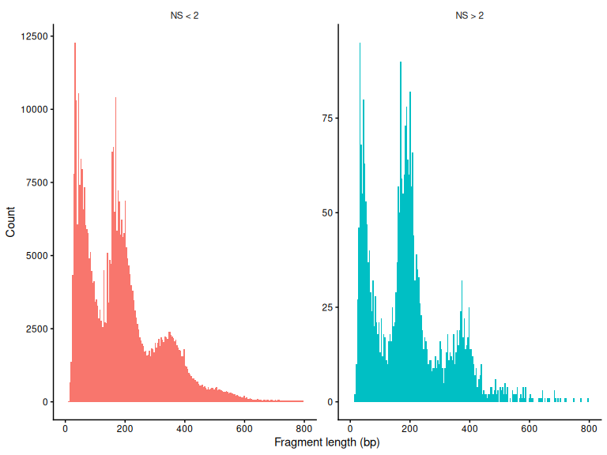
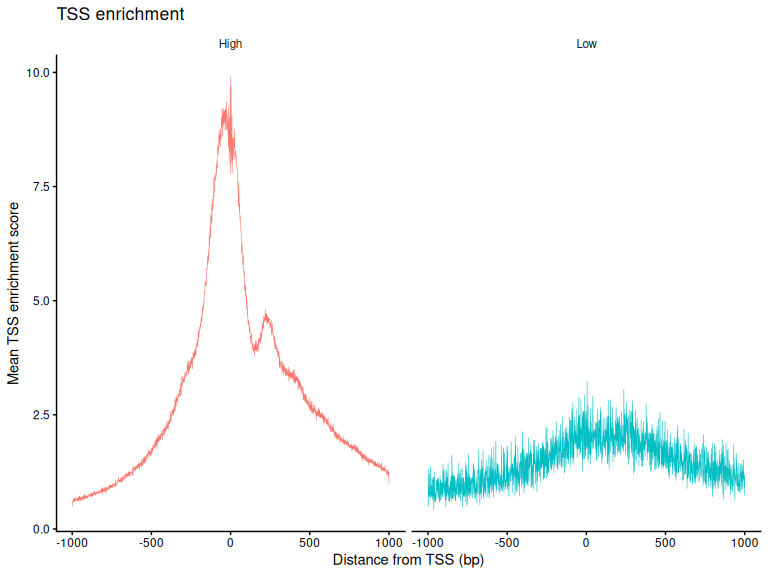
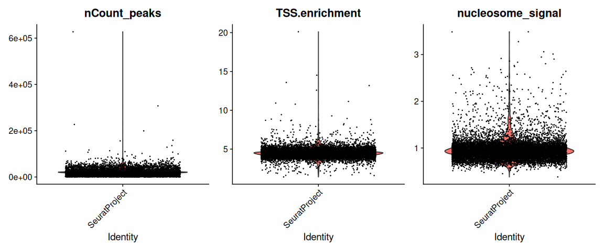
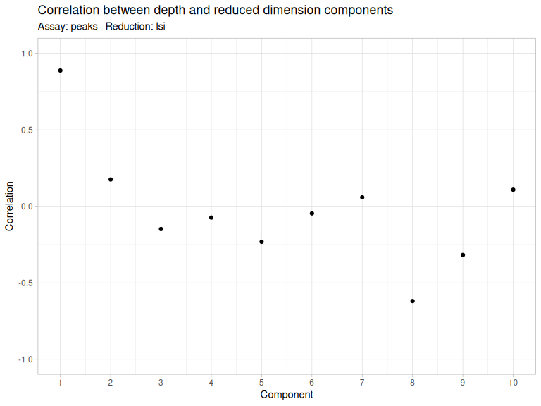
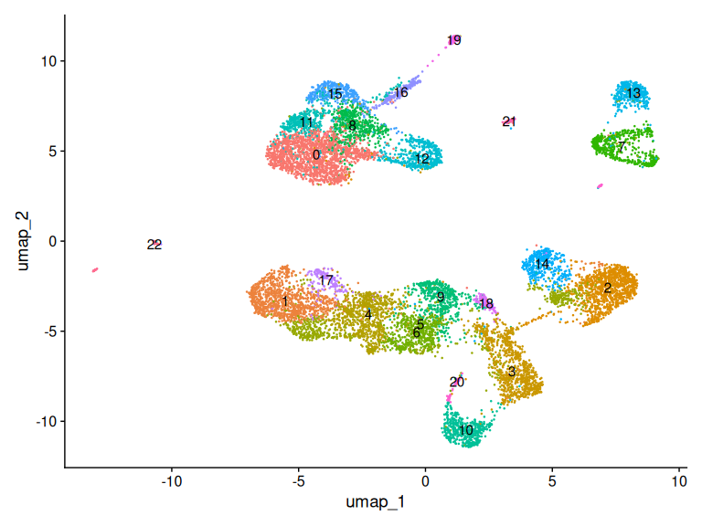
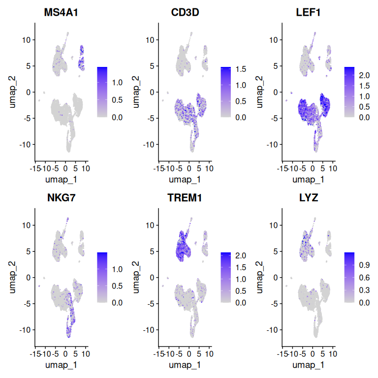
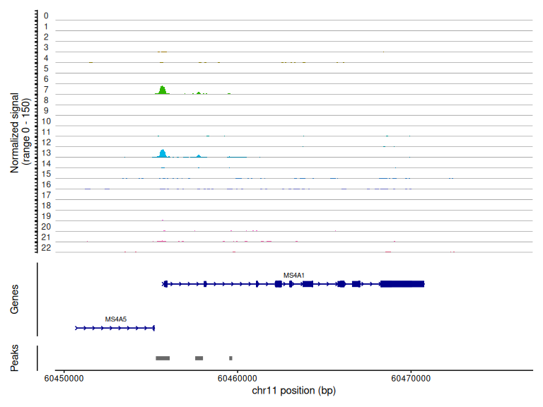
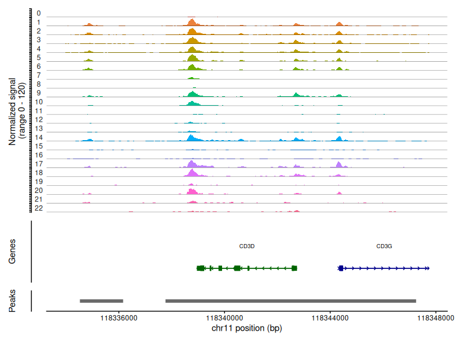

# Single-cell ATAC-seq with Signac


- [Before you start](#before-you-start)
- [Setup](#setup)
- [The data](#the-data)
- [Gene annotation](#gene-annotation)
- [Building the object](#building-the-object)
- [Quality control](#quality-control)
- [Normalization and dimensional
  reduction](#normalization-and-dimensional-reduction)
- [Gene activity](#gene-activity)
- [Coverage plots](#coverage-plots)
- [Save your work](#save-your-work)
- [Session information](#session-information)

Everything so far has been RNA. scATAC-seq measures something different:
which regions of the genome are open, and therefore which regulatory
elements a cell is using. Where RNA tells you what a cell is currently
making, ATAC tells you something about what it is equipped to make.

The data has a different shape too, and that shape drives every
methodological difference you are about to meet. An scRNA count matrix
is genes by cells, maybe 20,000 rows, with counts in the tens or
hundreds. An scATAC matrix is peaks by cells — often 100,000+ rows — and
the values are mostly 0, 1, or 2. There are only two copies of any locus
in a diploid cell, so “how open is this peak” is nearly a binary
question per cell.

Sparse, near-binary, high-dimensional data does not suit the tools built
for RNA. Signac handles it with a different normalization (TF-IDF,
borrowed from text search) and a different dimensional reduction (LSI
rather than PCA).

## Before you start

This tutorial needs about **32 GB of memory** and runs in **45–60
minutes**. It reads the fragment file several times, which is most of
that time.

``` bash
interactive -a cusanovichlab -n 8 -t 03:00:00
```

## Setup

``` r
library(Signac)
library(Seurat)
library(EnsDb.Hsapiens.v86)
# GenomeInfoDb provides standardChromosomes(), seqlevels() and genome().
# Signac imports these internally but does not attach them for you.
library(GenomeInfoDb)
library(GenomicRanges)
library(ggplot2)
library(patchwork)
library(dplyr)

set.seed(1234)

# CHANGE THIS to your NetID.
NETID <- "your_netid"

if (nzchar(Sys.getenv("CMM523_NETID"))) NETID <- Sys.getenv("CMM523_NETID")

WORK <- file.path("/xdisk/darrenc/cmm_523", NETID, "signac")
dir.create(file.path(WORK, "output"), recursive = TRUE, showWarnings = FALSE)

SHARED <- "/groups/darrenc/cmm_523/references/pbmc_multiome"

WORK
```

    #> [1] "/xdisk/darrenc/cmm_523/darrenc/signac"

## The data

10x Genomics Multiome on about 10,000 PBMCs — both RNA and ATAC measured
in the same cells. This tutorial uses only the ATAC half; the [RNA+ATAC
tutorial](08_rna_atac.md) comes back for the rest, so the download
serves twice.

Three files:

- the **feature-by-cell matrix**, containing both gene expression and
  peaks
- the **ATAC fragment file**, a record of every sequenced fragment and
  the cell it came from
- its **index**, which lets Signac read regions of the fragment file
  without loading all of it

The fragment file is the one with no RNA equivalent, and it is what
makes the coverage plots at the end of this tutorial possible. The peak
matrix has already thrown away everything outside a peak; the fragment
file still has it.

``` r
files <- c(
  "pbmc_granulocyte_sorted_10k_filtered_feature_bc_matrix.h5",
  "pbmc_granulocyte_sorted_10k_atac_fragments.tsv.gz",
  "pbmc_granulocyte_sorted_10k_atac_fragments.tsv.gz.tbi"
)

base_url <- paste0("https://cf.10xgenomics.com/samples/cell-arc/1.0.0/",
                   "pbmc_granulocyte_sorted_10k/")

get_file <- function(f) {
  shared <- file.path(SHARED, f)
  if (file.exists(shared)) return(shared)

  local <- file.path(WORK, f)
  if (!file.exists(local)) {
    message("Downloading ", f, " ...")
    download.file(paste0(base_url, f), local, mode = "wb")
  }
  local
}

counts_file <- get_file(files[1])
frag_file   <- get_file(files[2])
invisible(get_file(files[3]))   # index must sit beside the fragment file
```

``` r
inputdata <- Read10X_h5(counts_file)
names(inputdata)
```

    #> [1] "Gene Expression" "Peaks"

``` r
atac_counts <- inputdata$Peaks
dim(atac_counts)
```

    #> [1] 108377  11909

``` r
atac_counts[1:5, 1:3]
```

    #> 5 x 3 sparse Matrix of class "dgCMatrix"
    #>                    AAACAGCCAAGGAATC-1 AAACAGCCAATCCCTT-1 AAACAGCCAATGCGCT-1
    #> chr1:10109-10357                    .                  .                  .
    #> chr1:180730-181630                  .                  .                  .
    #> chr1:191491-191736                  .                  .                  .
    #> chr1:267816-268196                  .                  .                  .
    #> chr1:586028-586373                  .                  .                  .

Look at those values. Mostly zeros, with the occasional 1 or 2. That is
what near-binary means in practice, and it is why the RNA toolkit does
not transfer.

## Gene annotation

Signac needs to know where genes are so it can label plots and compute
gene activity. We pull that from an Ensembl database package.

``` r
# This dataset was mapped against GRCh38-2020-A, so we need an hg38 annotation.
# EnsDb.Hsapiens.v86 is hg38; EnsDb.Hsapiens.v75 is hg19. Getting this wrong is
# not a loud failure -- the code runs, TSS enrichment is computed against
# coordinates that do not correspond to your peaks, every cell scores near zero,
# and your QC filter then silently discards the entire dataset. Always check
# which build your data was aligned to before choosing an annotation.
annotation <- GetGRangesFromEnsDb(ensdb = EnsDb.Hsapiens.v86)

# Ensembl calls chromosomes "1", "2", "X". UCSC's hg38 calls them "chr1",
# "chr2", "chrX". Rename directly rather than using seqlevelsStyle() -- the
# style-conversion route depends on GenomeInfoDb's mapping tables and is a
# recurring source of the error "Annotation genome does not match genome of
# the object".
seqlevels(annotation) <- paste0("chr", seqlevels(annotation))
genome(annotation) <- "hg38"

annotation[1:3]
```

    #> GRanges object with 3 ranges and 5 metadata columns:
    #>                   seqnames        ranges strand |           tx_id   gene_name
    #>                      <Rle>     <IRanges>  <Rle> |     <character> <character>
    #>   ENSE00001489430     chrX 276322-276394      + | ENST00000399012      PLCXD1
    #>   ENSE00001536003     chrX 276324-276394      + | ENST00000484611      PLCXD1
    #>   ENSE00002160563     chrX 276353-276394      + | ENST00000430923      PLCXD1
    #>                           gene_id   gene_biotype     type
    #>                       <character>    <character> <factor>
    #>   ENSE00001489430 ENSG00000182378 protein_coding     exon
    #>   ENSE00001536003 ENSG00000182378 protein_coding     exon
    #>   ENSE00002160563 ENSG00000182378 protein_coding     exon
    #>   -------
    #>   seqinfo: 25 sequences (1 circular) from hg38 genome

## Building the object

``` r
# Keep only the standard chromosomes. Peaks on scaffolds and alt contigs are
# not useful here and cause problems downstream.
grange_counts <- StringToGRanges(rownames(atac_counts), sep = c(":", "-"))
grange_use    <- seqnames(grange_counts) %in% standardChromosomes(grange_counts)
atac_counts   <- atac_counts[as.vector(grange_use), ]

chrom_assay <- CreateChromatinAssay(
  counts = atac_counts,
  sep = c(":", "-"),
  genome = "hg38",
  fragments = frag_file,
  min.cells = 10,
  min.features = 200,
  annotation = annotation
)

pbmc <- CreateSeuratObject(
  counts = chrom_assay,
  assay = "peaks"
)

pbmc
```

    #> An object of class Seurat 
    #> 106056 features across 11831 samples within 1 assay 
    #> Active assay: peaks (106056 features, 0 variable features)
    #>  2 layers present: counts, data

``` r
granges(pbmc)[1:5]
```

    #> GRanges object with 5 ranges and 0 metadata columns:
    #>       seqnames        ranges strand
    #>          <Rle>     <IRanges>  <Rle>
    #>   [1]     chr1   10109-10357      *
    #>   [2]     chr1 180730-181630      *
    #>   [3]     chr1 191491-191736      *
    #>   [4]     chr1 267816-268196      *
    #>   [5]     chr1 586028-586373      *
    #>   -------
    #>   seqinfo: 24 sequences from an unspecified genome; no seqlengths

Each feature is a genomic interval rather than a gene name. That is the
other structural difference from RNA data, and it is why you can ask
questions of ATAC data — what is near this peak, do these two peaks
overlap — that make no sense for a gene count matrix.

## Quality control

ATAC has its own QC metrics, and they measure things that have no RNA
analogue.

``` r
pbmc <- NucleosomeSignal(object = pbmc)

# fast = FALSE keeps the per-position signal around the TSS, not just the
# summary score. TSSPlot() needs it; the default (fast = TRUE) computes the
# score and throws the profile away, and TSSPlot() then fails with
# "Position enrichment matrix not present in assay".
pbmc <- TSSEnrichment(object = pbmc, fast = FALSE)

head(pbmc@meta.data[, c("nCount_peaks", "TSS.enrichment", "nucleosome_signal")], 5)
```

    #>                    nCount_peaks TSS.enrichment nucleosome_signal
    #> AAACAGCCAAGGAATC-1        55550       5.099441         0.9045426
    #> AAACAGCCAATCCCTT-1        20485       4.478054         0.8805970
    #> AAACAGCCAATGCGCT-1        16674       4.299700         0.9619565
    #> AAACAGCCACACTAAT-1         2007       4.523255         0.9644970
    #> AAACAGCCACCAACCG-1         7658       3.753666         0.9200000

Note where these came from: both were computed from the fragment file,
not read out of a metadata table. Cell Ranger ARC does not ship the
per-barcode QC csv that the older ATAC pipeline did, and relying on a
file’s columns is fragile anyway — a renamed column gives you `NA`, and
`NA < 0.05` quietly removes every cell in your dataset.

What each metric is telling you:

**Nucleosome signal** is the ratio of fragments longer than one
nucleosome to those shorter. Tn5 cuts accessible DNA, so a good library
shows clear laddering — sub-nucleosomal fragments, then mono-, then
di-nucleosomal. A high ratio means poor chromatin digestion.

**TSS enrichment** is the ratio of signal at transcription start sites
to flanking background. Promoters are open in essentially every cell, so
this works as close to a universal positive control: low TSS enrichment
means the assay did not work in that cell, however many reads it has.

``` r
pbmc$nucleosome_group <- ifelse(pbmc$nucleosome_signal > 2, "NS > 2", "NS < 2")
FragmentHistogram(object = pbmc, group.by = "nucleosome_group")
```



That plot is worth dwelling on. The good group shows the nucleosomal
laddering described above. The bad group does not — you can see the
failure directly in the fragment length distribution rather than
inferring it from a summary statistic.

``` r
pbmc$high.tss <- ifelse(pbmc$TSS.enrichment > 2, "High", "Low")
TSSPlot(pbmc, group.by = "high.tss") + NoLegend()
```



``` r
VlnPlot(
  object = pbmc,
  features = c("nCount_peaks", "TSS.enrichment", "nucleosome_signal"),
  pt.size = 0.1,
  ncol = 3
)
```



Look at the distributions before choosing thresholds. A cut is only
sensible relative to what it is being applied to.

``` r
qc <- pbmc@meta.data[, c("nCount_peaks", "TSS.enrichment", "nucleosome_signal")]
summary(qc)
```

    #>   nCount_peaks    TSS.enrichment   nucleosome_signal
    #>  Min.   :   404   Min.   : 1.419   Min.   :0.3808   
    #>  1st Qu.: 14657   1st Qu.: 4.170   1st Qu.:0.8343   
    #>  Median : 19915   Median : 4.469   Median :0.9315   
    #>  Mean   : 20560   Mean   : 4.492   Mean   :0.9546   
    #>  3rd Qu.: 24292   3rd Qu.: 4.769   3rd Qu.:1.0263   
    #>  Max.   :627380   Max.   :20.113   Max.   :3.4878

``` r
cat("cells with any NA in a QC metric:", sum(!complete.cases(qc)), "\n")
```

    #> cells with any NA in a QC metric: 0

``` r
before <- ncol(pbmc)

keep <- pbmc$nCount_peaks      > 1000 &
        pbmc$nCount_peaks      < 100000 &
        pbmc$nucleosome_signal < 2 &
        pbmc$TSS.enrichment    > 1

# What each criterion removes on its own. If one is discarding almost
# everything, that is the threshold to question -- or the sign that the metric
# was not computed the way you assumed.
data.frame(
  criterion = c("counts > 1000", "counts < 100000",
                "nucleosome < 2", "TSS > 1"),
  n_passing = c(
    sum(pbmc$nCount_peaks      > 1000,   na.rm = TRUE),
    sum(pbmc$nCount_peaks      < 100000, na.rm = TRUE),
    sum(pbmc$nucleosome_signal < 2,      na.rm = TRUE),
    sum(pbmc$TSS.enrichment    > 1,      na.rm = TRUE)
  ),
  of_total = before
)
```

    #>         criterion n_passing of_total
    #> 1   counts > 1000     11599    11831
    #> 2 counts < 100000     11816    11831
    #> 3  nucleosome < 2     11743    11831
    #> 4         TSS > 1     11831    11831

``` r
pbmc <- pbmc[, which(keep)]
cat("kept", ncol(pbmc), "of", before, "cells\n")
```

    #> kept 11498 of 11831 cells

``` r
# Fail here rather than several steps downstream. A filter that removes almost
# everything is a mistake, not a result.
stopifnot(ncol(pbmc) > 500)

pbmc
```

    #> An object of class Seurat 
    #> 106056 features across 11498 samples within 1 assay 
    #> Active assay: peaks (106056 features, 0 variable features)
    #>  2 layers present: counts, data

## Normalization and dimensional reduction

Here is where ATAC diverges most sharply from RNA.

``` r
pbmc <- RunTFIDF(pbmc)
pbmc <- FindTopFeatures(pbmc, min.cutoff = "q0")
pbmc <- RunSVD(pbmc)

# How many components did we actually get? RunSVD() asks for 50 by default but
# can return fewer, and asking for dimensions that do not exist fails later
# with "subscript out of bounds" -- an error that points at RunUMAP rather than
# at the real cause here.
n_lsi <- ncol(Embeddings(pbmc, "lsi"))
n_lsi
```

    #> [1] 50

**TF-IDF** comes from document retrieval. Treat each cell as a document
and each peak as a word: a peak open in every cell is uninformative,
like the word “the”, while a peak open in a few cells is highly
informative. TF-IDF weights peaks by how rare they are. This is a better
fit than log-normalization, which assumes a count distribution ATAC data
does not have.

**SVD on the TF-IDF matrix** is latent semantic indexing — the same
technique used for finding documents by topic. Together, TF-IDF followed
by SVD is what people mean by LSI in the ATAC literature.

``` r
DepthCor(pbmc)
```



This plot exists because of a specific, well-known artefact: **the first
LSI component usually captures sequencing depth rather than biology.**
If the correlation at component 1 is strongly negative, exclude it —
which is why everything below uses `dims = 2:30` rather than `1:30`.

Nothing warns you about this. Include component 1 and your clusters will
partly reflect how deeply each cell was sequenced, and the UMAP will
look perfectly reasonable.

Everything below therefore starts at component 2.

``` r
# Skip component 1 (depth), use what is available up to 30.
use_dims <- 2:min(30, n_lsi)
range(use_dims)
```

    #> [1]  2 30

``` r
pbmc <- RunUMAP(object = pbmc, reduction = "lsi", dims = use_dims)
pbmc <- FindNeighbors(object = pbmc, reduction = "lsi", dims = use_dims)
pbmc <- FindClusters(object = pbmc, algorithm = 3, resolution = 1.2, verbose = FALSE)

DimPlot(object = pbmc, label = TRUE) + NoLegend()
```



## Gene activity

Clusters of peaks are hard to interpret directly. The usual move is to
summarize accessibility over each gene body and promoter, producing a
matrix that looks like gene expression and can be handled with familiar
tools.

``` r
gene.activities <- GeneActivity(pbmc)

pbmc[["RNA"]] <- CreateAssayObject(counts = gene.activities)
pbmc <- NormalizeData(
  object = pbmc,
  assay = "RNA",
  normalization.method = "LogNormalize",
  scale.factor = median(pbmc$nCount_RNA)
)

dim(gene.activities)
```

    #> [1] 19607 11498

Be clear about what this is: a **proxy**, not a measurement.
Accessibility over a gene body correlates with expression, loosely. A
gene can be open and not transcribed. Gene activity is useful for
recognizing cell types; it is not a substitute for measuring RNA.

``` r
DefaultAssay(pbmc) <- "RNA"

FeaturePlot(
  object = pbmc,
  features = c("MS4A1", "CD3D", "LEF1", "NKG7", "TREM1", "LYZ"),
  pt.size = 0.1,
  max.cutoff = "q95",
  ncol = 3
)
```



Recognizable: `MS4A1` for B cells, `CD3D` for T cells, `LYZ` for
monocytes. The signal is noisier than the RNA equivalent, which is what
you should expect from a proxy.

## Coverage plots

This is the visualization with no RNA counterpart, and it is the reason
the fragment file was worth keeping.

``` r
DefaultAssay(pbmc) <- "peaks"

CoveragePlot(
  object = pbmc,
  region = "MS4A1",
  extend.upstream = 5000,
  extend.downstream = 5000
)
```



Each row is a cluster, and the height is accessibility across the locus.
You are looking at the regulatory landscape of a gene, cell type by cell
type: which promoter is open, which enhancers are used, and by whom. A
`FeaturePlot` tells you a gene is on in B cells. This tells you *where*
the chromatin is open to make that happen.

``` r
CoveragePlot(
  object = pbmc,
  region = "CD3D",
  extend.upstream = 5000,
  extend.downstream = 5000
)
```



## Save your work

``` r
saveRDS(pbmc, file = file.path(WORK, "output", "pbmc_atac.rds"))
```

Keep this. The RNA+ATAC integration tutorial starts from it.

## Session information

``` r
sessionInfo()
```

    #> R version 4.6.1 (2026-06-24)
    #> Platform: x86_64-pc-linux-gnu
    #> Running under: Ubuntu 24.04.4 LTS
    #> 
    #> Matrix products: default
    #> BLAS:   /usr/lib/x86_64-linux-gnu/openblas-pthread/libblas.so.3 
    #> LAPACK: /usr/lib/x86_64-linux-gnu/openblas-pthread/libopenblasp-r0.3.26.so;  LAPACK version 3.12.0
    #> 
    #> locale:
    #>  [1] LC_CTYPE=C.UTF-8       LC_NUMERIC=C           LC_TIME=C.UTF-8       
    #>  [4] LC_COLLATE=C.UTF-8     LC_MONETARY=C.UTF-8    LC_MESSAGES=C.UTF-8   
    #>  [7] LC_PAPER=C.UTF-8       LC_NAME=C              LC_ADDRESS=C          
    #> [10] LC_TELEPHONE=C         LC_MEASUREMENT=C.UTF-8 LC_IDENTIFICATION=C   
    #> 
    #> time zone: Etc/UTC
    #> tzcode source: system (glibc)
    #> 
    #> attached base packages:
    #> [1] stats4    stats     graphics  grDevices utils     datasets  methods  
    #> [8] base     
    #> 
    #> other attached packages:
    #>  [1] future_1.75.0             dplyr_1.2.1              
    #>  [3] patchwork_1.3.2           ggplot2_4.0.3            
    #>  [5] GenomeInfoDb_1.48.0       EnsDb.Hsapiens.v86_2.99.0
    #>  [7] ensembldb_2.36.1          AnnotationFilter_1.36.0  
    #>  [9] GenomicFeatures_1.64.0    AnnotationDbi_1.74.0     
    #> [11] Biobase_2.72.0            GenomicRanges_1.64.0     
    #> [13] Seqinfo_1.2.0             IRanges_2.46.0           
    #> [15] S4Vectors_0.50.2          BiocGenerics_0.58.1      
    #> [17] generics_0.1.4            Seurat_5.5.1             
    #> [19] SeuratObject_5.4.0        sp_2.2-3                 
    #> [21] Signac_1.17.1            
    #> 
    #> loaded via a namespace (and not attached):
    #>   [1] RcppAnnoy_0.0.23            splines_4.6.1              
    #>   [3] later_1.4.8                 BiocIO_1.22.0              
    #>   [5] bitops_1.1-0                tibble_3.3.1               
    #>   [7] polyclip_1.10-7             rpart_4.1.27               
    #>   [9] XML_3.99-0.23               fastDummies_1.7.6          
    #>  [11] lifecycle_1.0.5             hdf5r_1.3.12               
    #>  [13] globals_0.19.1              lattice_0.22-9             
    #>  [15] MASS_7.3-66                 backports_1.5.1            
    #>  [17] magrittr_2.0.5              Hmisc_5.2-6                
    #>  [19] plotly_4.12.1               rmarkdown_2.31             
    #>  [21] yaml_2.3.12                 httpuv_1.6.17              
    #>  [23] otel_0.2.0                  sctransform_0.4.3          
    #>  [25] spam_2.11-4                 spatstat.sparse_3.2-0      
    #>  [27] reticulate_1.46.0           cowplot_1.2.0              
    #>  [29] pbapply_1.7-4               DBI_1.3.0                  
    #>  [31] RColorBrewer_1.1-3          abind_1.4-8                
    #>  [33] Rtsne_0.17                  purrr_1.2.2                
    #>  [35] biovizBase_1.60.0           RCurl_1.98-1.19            
    #>  [37] nnet_7.3-21                 VariantAnnotation_1.58.0   
    #>  [39] ggrepel_0.9.8               irlba_2.3.7                
    #>  [41] listenv_1.0.0               spatstat.utils_3.2-4       
    #>  [43] goftest_1.2-3               RSpectra_0.16-2            
    #>  [45] spatstat.random_3.5-1       fitdistrplus_1.2-6         
    #>  [47] parallelly_1.48.0           codetools_0.2-20           
    #>  [49] DelayedArray_0.38.2         RcppRoll_0.3.2             
    #>  [51] tidyselect_1.2.1            UCSC.utils_1.8.0           
    #>  [53] farver_2.1.2                base64enc_0.1-6            
    #>  [55] matrixStats_1.5.0           spatstat.explore_3.8-2     
    #>  [57] GenomicAlignments_1.48.0    jsonlite_2.0.0             
    #>  [59] Formula_1.2-5               progressr_1.0.0            
    #>  [61] ggridges_0.5.7              survival_3.8-9             
    #>  [63] tools_4.6.1                 ica_1.0-3                  
    #>  [65] Rcpp_1.1.2                  glue_1.8.1                 
    #>  [67] gridExtra_2.3.1             SparseArray_1.12.2         
    #>  [69] xfun_0.60                   MatrixGenerics_1.24.0      
    #>  [71] withr_3.0.3                 fastmap_1.2.0              
    #>  [73] digest_0.6.39               R6_2.6.1                   
    #>  [75] mime_0.13                   colorspace_2.1-3           
    #>  [77] scattermore_1.2             tensor_1.5.1               
    #>  [79] dichromat_2.0-1             spatstat.data_3.1-9        
    #>  [81] RSQLite_3.53.3              cigarillo_1.2.1            
    #>  [83] tidyr_1.3.2                 data.table_1.18.4          
    #>  [85] rtracklayer_1.72.0          httr_1.4.8                 
    #>  [87] htmlwidgets_1.6.4           S4Arrays_1.12.0            
    #>  [89] uwot_0.2.4                  pkgconfig_2.0.3            
    #>  [91] gtable_0.3.6                blob_1.3.0                 
    #>  [93] lmtest_0.9-40               S7_0.2.2                   
    #>  [95] XVector_0.52.0              htmltools_0.5.9            
    #>  [97] dotCall64_1.2               ProtGenerics_1.44.0        
    #>  [99] scales_1.4.0                png_0.1-9                  
    #> [101] spatstat.univar_3.2-0       rstudioapi_0.19.0          
    #> [103] knitr_1.51                  reshape2_1.4.5             
    #> [105] rjson_0.2.23                checkmate_2.3.4            
    #> [107] nlme_3.1-170                curl_7.1.0                 
    #> [109] zoo_1.9-0                   cachem_1.1.0               
    #> [111] stringr_1.6.0               KernSmooth_2.23-26         
    #> [113] vipor_0.4.7                 parallel_4.6.1             
    #> [115] miniUI_0.1.2                foreign_0.8-91             
    #> [117] ggrastr_1.0.2               restfulr_0.0.17            
    #> [119] pillar_1.11.1               grid_4.6.1                 
    #> [121] vctrs_0.7.3                 RANN_2.6.2                 
    #> [123] promises_1.5.0              xtable_1.8-8               
    #> [125] cluster_2.1.8.3             beeswarm_0.4.0             
    #> [127] htmlTable_2.5.0             evaluate_1.0.5             
    #> [129] cli_3.6.6                   compiler_4.6.1             
    #> [131] Rsamtools_2.28.0            rlang_1.3.0                
    #> [133] crayon_1.5.3                future.apply_1.20.2        
    #> [135] labeling_0.4.3              ggbeeswarm_0.7.3           
    #> [137] plyr_1.8.9                  stringi_1.8.9              
    #> [139] viridisLite_0.4.3           deldir_2.0-4               
    #> [141] BiocParallel_1.46.0         Biostrings_2.80.2          
    #> [143] lazyeval_0.2.3              spatstat.geom_3.8-2        
    #> [145] Matrix_1.7-6                BSgenome_1.80.0            
    #> [147] RcppHNSW_0.7.0              sparseMatrixStats_1.24.0   
    #> [149] bit64_4.8.2                 KEGGREST_1.52.2            
    #> [151] shiny_1.14.0                SummarizedExperiment_1.42.0
    #> [153] ROCR_1.0-12                 igraph_2.3.3               
    #> [155] memoise_2.0.1               fastmatch_1.1-8            
    #> [157] bit_4.6.0

------------------------------------------------------------------------

*Adapted from the [Signac
PBMC](https://stuartlab.org/signac/articles/pbmc_vignette) and
[multiomic](https://stuartlab.org/signac/articles/pbmc_multiomic)
vignettes, updated for Signac 1.17 and Seurat 5.*
