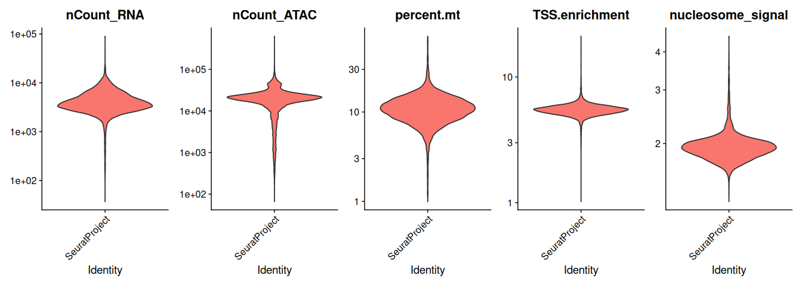
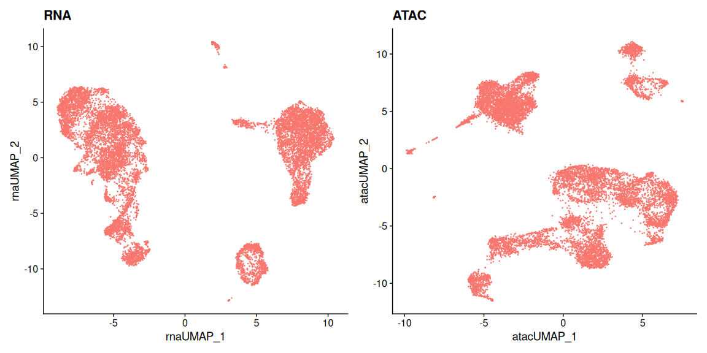
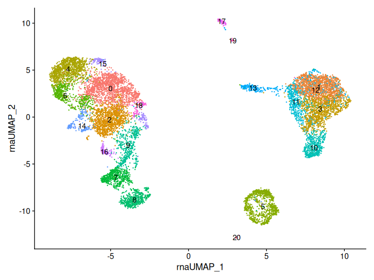
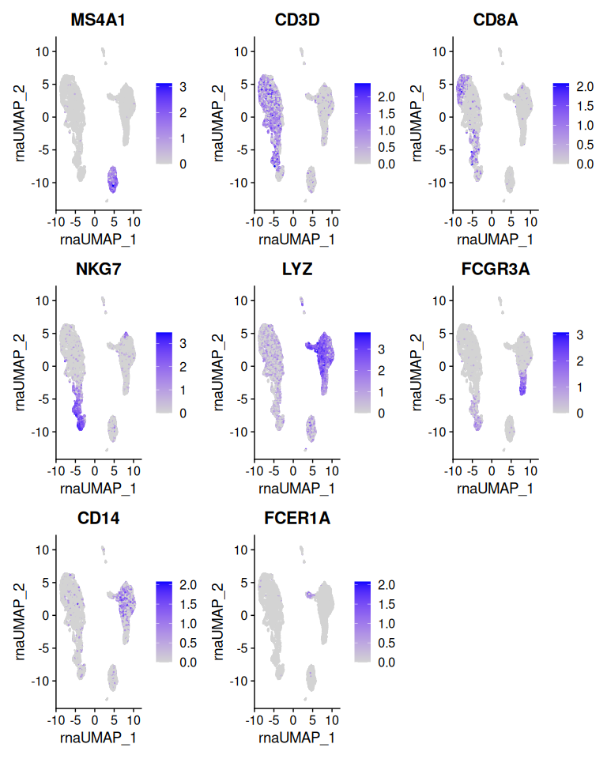
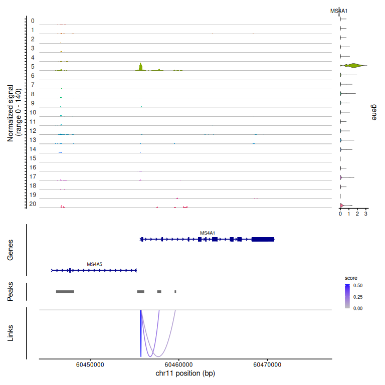
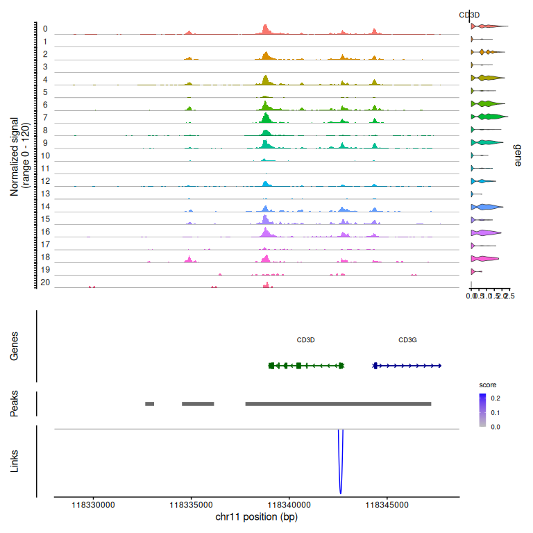

# Joint RNA and ATAC analysis


- [Before you start](#before-you-start)
- [Setup](#setup)
- [Loading both modalities](#loading-both-modalities)
- [Building the object](#building-the-object)
- [Quality control on both
  modalities](#quality-control-on-both-modalities)
- [Processing each modality](#processing-each-modality)
- [Annotating cell types](#annotating-cell-types)
- [Linking peaks to genes](#linking-peaks-to-genes)
- [What a link is and is not](#what-a-link-is-and-is-not)
- [Save your work](#save-your-work)
- [Session information](#session-information)

The [Signac tutorial](07_signac.md) analyzed chromatin accessibility on
its own, and the [Seurat intro](01_seurat_intro.md) analyzed expression
on its own. This one uses both, measured **in the same cells**.

That last part is what makes multiome data different from having an RNA
dataset and an ATAC dataset. With separate experiments you can integrate
them — match cells that look similar across modalities and hope the
matching is right. With multiome you do not have to: cell barcode
`AAACAGCCAAGGAATC-1` has an expression profile and an accessibility
profile, and they came from the same nucleus.

That removes a whole category of uncertainty, and it lets you ask
questions that are otherwise out of reach. Chief among them: **which
regulatory elements control which genes?** Answering that requires
knowing, cell by cell, whether a peak being open coincides with a gene
being expressed. You cannot do that if your peaks and your genes came
from different cells.

## Before you start

This tutorial needs about **48 GB of memory** and runs in **60–90
minutes**.

``` bash
interactive -a cusanovichlab -n 12 -t 03:00:00
```

`interactive` allocates memory per core, so `-n 12` at the default 4 GB
per core gives you 48 GB.

## Setup

``` r
library(Signac)
library(Seurat)
library(EnsDb.Hsapiens.v86)
library(GenomeInfoDb)
library(GenomicRanges)
library(BSgenome.Hsapiens.UCSC.hg38)
library(ggplot2)
library(patchwork)
library(dplyr)

set.seed(1234)

# CHANGE THIS to your NetID.
NETID <- "your_netid"

if (nzchar(Sys.getenv("CMM523_NETID"))) NETID <- Sys.getenv("CMM523_NETID")

WORK <- file.path("/xdisk/darrenc/cmm_523", NETID, "rna_atac")
dir.create(file.path(WORK, "output"), recursive = TRUE, showWarnings = FALSE)

SHARED <- "/groups/darrenc/cmm_523/references/pbmc_multiome"

WORK
```

    #> [1] "/xdisk/darrenc/cmm_523/darrenc/rna_atac"

## Loading both modalities

Same dataset as the Signac tutorial, but this time we keep the gene
expression as well as the peaks.

``` r
h5_file   <- file.path(SHARED, "pbmc_granulocyte_sorted_10k_filtered_feature_bc_matrix.h5")
frag_file <- file.path(SHARED, "pbmc_granulocyte_sorted_10k_atac_fragments.tsv.gz")

stopifnot(file.exists(h5_file), file.exists(frag_file))

inputdata <- Read10X_h5(h5_file)
names(inputdata)
```

    #> [1] "Gene Expression" "Peaks"

``` r
rna_counts  <- inputdata$`Gene Expression`
atac_counts <- inputdata$Peaks

dim(rna_counts)
```

    #> [1] 36601 11909

``` r
dim(atac_counts)
```

    #> [1] 108377  11909

Two matrices, same columns. Confirm that rather than assume it — this is
the property the entire tutorial depends on:

``` r
identical(colnames(rna_counts), colnames(atac_counts))
```

    #> [1] TRUE

## Building the object

``` r
pbmc <- CreateSeuratObject(counts = rna_counts, assay = "RNA")
pbmc[["percent.mt"]] <- PercentageFeatureSet(pbmc, pattern = "^MT-")

annotation <- GetGRangesFromEnsDb(ensdb = EnsDb.Hsapiens.v86)
seqlevels(annotation) <- paste0("chr", seqlevels(annotation))
genome(annotation) <- "hg38"

grange_counts <- StringToGRanges(rownames(atac_counts), sep = c(":", "-"))
grange_use    <- seqnames(grange_counts) %in% standardChromosomes(grange_counts)
atac_counts   <- atac_counts[as.vector(grange_use), ]

pbmc[["ATAC"]] <- CreateChromatinAssay(
  counts = atac_counts,
  sep = c(":", "-"),
  genome = "hg38",
  fragments = frag_file,
  min.cells = 10,
  annotation = annotation
)

pbmc
```

    #> An object of class Seurat 
    #> 142657 features across 11909 samples within 2 assays 
    #> Active assay: RNA (36601 features, 0 variable features)
    #>  1 layer present: counts
    #>  1 other assay present: ATAC

One object, two assays. `DefaultAssay()` decides which one a function
acts on, and forgetting to set it is the commonest mistake in multimodal
work — the code runs, it just answers about the wrong modality.

## Quality control on both modalities

A cell has to pass QC in both assays to be usable. Failing either one
makes it useless for joint analysis, however good the other looks.

``` r
DefaultAssay(pbmc) <- "ATAC"
pbmc <- NucleosomeSignal(pbmc)
pbmc <- TSSEnrichment(pbmc, fast = FALSE)

summary(pbmc@meta.data[, c("nCount_RNA", "nCount_ATAC", "percent.mt",
                           "TSS.enrichment", "nucleosome_signal")])
```

    #>    nCount_RNA     nCount_ATAC       percent.mt     TSS.enrichment   
    #>  Min.   :   36   Min.   :    65   Min.   : 0.000   Min.   : 0.0243  
    #>  1st Qu.: 2918   1st Qu.: 14464   1st Qu.: 7.574   1st Qu.: 4.1688  
    #>  Median : 3776   Median : 19856   Median : 9.744   Median : 4.4693  
    #>  Mean   : 4402   Mean   : 20428   Mean   :10.267   Mean   : 4.4991  
    #>  3rd Qu.: 5243   3rd Qu.: 24251   3rd Qu.:12.250   3rd Qu.: 4.7712  
    #>  Max.   :89927   Max.   :627380   Max.   :69.444   Max.   :20.1132  
    #>  nucleosome_signal
    #>  Min.   :0.2857   
    #>  1st Qu.:0.8341   
    #>  Median :0.9314   
    #>  Mean   :0.9546   
    #>  3rd Qu.:1.0273   
    #>  Max.   :3.5080

``` r
VlnPlot(
  pbmc,
  features = c("nCount_RNA", "nCount_ATAC", "percent.mt",
               "TSS.enrichment", "nucleosome_signal"),
  ncol = 5, log = TRUE, pt.size = 0
) + NoLegend()
```



``` r
before <- ncol(pbmc)

keep <- pbmc$nCount_ATAC       < 1e5 &
        pbmc$nCount_ATAC       > 1000 &
        pbmc$nCount_RNA        < 25000 &
        pbmc$nCount_RNA        > 1000 &
        pbmc$percent.mt        < 20 &
        pbmc$nucleosome_signal < 2 &
        pbmc$TSS.enrichment    > 1

data.frame(
  criterion = c("ATAC < 1e5", "ATAC > 1000", "RNA < 25000", "RNA > 1000",
                "percent.mt < 20", "nucleosome < 2", "TSS > 1"),
  n_passing = c(
    sum(pbmc$nCount_ATAC       < 1e5,   na.rm = TRUE),
    sum(pbmc$nCount_ATAC       > 1000,  na.rm = TRUE),
    sum(pbmc$nCount_RNA        < 25000, na.rm = TRUE),
    sum(pbmc$nCount_RNA        > 1000,  na.rm = TRUE),
    sum(pbmc$percent.mt        < 20,    na.rm = TRUE),
    sum(pbmc$nucleosome_signal < 2,     na.rm = TRUE),
    sum(pbmc$TSS.enrichment    > 1,     na.rm = TRUE)
  ),
  of_total = before
)
```

    #>         criterion n_passing of_total
    #> 1      ATAC < 1e5     11894    11909
    #> 2     ATAC > 1000     11599    11909
    #> 3     RNA < 25000     11905    11909
    #> 4      RNA > 1000     11729    11909
    #> 5 percent.mt < 20     11658    11909
    #> 6  nucleosome < 2     11820    11909
    #> 7         TSS > 1     11908    11909

``` r
pbmc <- pbmc[, which(keep)]
cat("kept", ncol(pbmc), "of", before, "cells\n")
```

    #> kept 11172 of 11909 cells

``` r
stopifnot(ncol(pbmc) > 500)
```

Note that requiring both modalities to pass costs you cells. That is the
price of multiome data, and it is worth knowing before you design an
experiment around it: you will recover fewer usable cells than you would
from either assay run alone.

## Processing each modality

Each gets the treatment appropriate to its data type — SCTransform and
PCA for RNA, TF-IDF and LSI for ATAC. Same object, different pipelines.

``` r
DefaultAssay(pbmc) <- "RNA"
pbmc <- SCTransform(pbmc, verbose = FALSE)
pbmc <- RunPCA(pbmc)
pbmc <- RunUMAP(pbmc, dims = 1:50, reduction.name = "umap.rna",
                reduction.key = "rnaUMAP_")
```

``` r
DefaultAssay(pbmc) <- "ATAC"
pbmc <- RunTFIDF(pbmc)
pbmc <- FindTopFeatures(pbmc, min.cutoff = "q0")
pbmc <- RunSVD(pbmc)

n_lsi <- ncol(Embeddings(pbmc, "lsi"))
use_dims <- 2:min(50, n_lsi)   # component 1 tracks sequencing depth

pbmc <- RunUMAP(pbmc, reduction = "lsi", dims = use_dims,
                reduction.name = "umap.atac", reduction.key = "atacUMAP_")
```

``` r
p1 <- DimPlot(pbmc, reduction = "umap.rna") + ggtitle("RNA") + NoLegend()
p2 <- DimPlot(pbmc, reduction = "umap.atac") + ggtitle("ATAC") + NoLegend()
p1 + p2
```



Two views of the same cells. They agree on the broad structure and
disagree on the details, which is the interesting part — the modalities
are measuring related but distinct things, and where they disagree is
often where the biology is.

## Annotating cell types

``` r
DefaultAssay(pbmc) <- "SCT"
pbmc <- FindNeighbors(pbmc, dims = 1:50)
pbmc <- FindClusters(pbmc, resolution = 0.8, verbose = FALSE)

DimPlot(pbmc, reduction = "umap.rna", label = TRUE) + NoLegend()
```



``` r
FeaturePlot(
  pbmc, reduction = "umap.rna",
  features = c("MS4A1", "CD3D", "CD8A", "NKG7", "LYZ", "FCGR3A",
               "CD14", "FCER1A", "PPBP"),
  ncol = 3
)
```



## Linking peaks to genes

This is the analysis multiome data exists for. For each gene,
`LinkPeaks()` looks at nearby peaks and asks whether accessibility
correlates with expression across cells — while controlling for GC
content, overall accessibility, and peak size, so that the result is not
simply driven by which peaks are big or open in everything.

``` r
DefaultAssay(pbmc) <- "ATAC"

pbmc <- RegionStats(pbmc, genome = BSgenome.Hsapiens.UCSC.hg38)

pbmc <- LinkPeaks(
  object = pbmc,
  peak.assay = "ATAC",
  expression.assay = "SCT",
  genes.use = c("MS4A1", "CD3D", "LYZ", "NKG7")
)

links <- Links(pbmc)
length(links)
```

    #> [1] 29

``` r
head(as.data.frame(links), 10)
```

    #>    seqnames    start      end  width strand     score  gene
    #> 1     chr11 60357989 60455752  97764      * 0.1558907 MS4A1
    #> 2     chr11 60396836 60455752  58917      * 0.1835564 MS4A1
    #> 3     chr11 60455689 60455752     64      * 0.5220711 MS4A1
    #> 4     chr11 60455752 60457782   2031      * 0.2699105 MS4A1
    #> 5     chr11 60455752 60459606   3855      * 0.1240619 MS4A1
    #> 6     chr11 60455752 60477293  21542      * 0.3517806 MS4A1
    #> 7     chr11 60455752 60486118  30367      * 0.2387122 MS4A1
    #> 8     chr11 60455752 60498802  43051      * 0.3811856 MS4A1
    #> 9     chr11 60455752 60571126 115375      * 0.1435933 MS4A1
    #> 10    chr11 60455752 60633879 178128      * 0.1856793 MS4A1
    #>                       peak   zscore       pvalue
    #> 1  chr11-60357719-60358258 2.145285 1.596503e-02
    #> 2  chr11-60396248-60397424 2.143089 1.605296e-02
    #> 3  chr11-60455290-60456088 8.260612 7.246344e-17
    #> 4  chr11-60457557-60458006 4.154366 1.630951e-05
    #> 5  chr11-60459521-60459691 2.193627 1.413113e-02
    #> 6  chr11-60476867-60477719 4.033220 2.750885e-05
    #> 7  chr11-60485853-60486383 3.186090 7.210478e-04
    #> 8  chr11-60498212-60499391 5.199900 9.969786e-08
    #> 9  chr11-60570897-60571354 2.088681 1.836820e-02
    #> 10 chr11-60633727-60634031 2.669075 3.803018e-03

Restricting to four genes keeps this fast. Running genome-wide is the
same call without `genes.use`, and it takes hours rather than minutes.

``` r
CoveragePlot(
  object = pbmc,
  region = "MS4A1",
  features = "MS4A1",
  expression.assay = "SCT",
  extend.upstream = 10000,
  extend.downstream = 5000
)
```



Read this plot carefully, because it is the payoff of the whole
tutorial. The coverage tracks show accessibility per cell type. The
panel on the right shows expression of the same gene in the same cells.
The arcs at the bottom are the inferred peak-to-gene links. You are
looking at a regulatory hypothesis: *this* element, open in *these*
cells, appears to drive *this* gene.

``` r
CoveragePlot(
  object = pbmc,
  region = "CD3D",
  features = "CD3D",
  expression.assay = "SCT",
  extend.upstream = 10000,
  extend.downstream = 5000
)
```



## What a link is and is not

A link is a correlation across cells, computed with a null model that
accounts for some obvious confounders. It is not evidence that the
element regulates the gene.

Two peaks near each other tend to be open in the same cells whether or
not either controls the gene. A peak can correlate with expression
because both respond to the same upstream signal. And the method only
considers peaks within a fixed window, so genuine long-range
interactions are invisible to it by construction.

What links are good for is narrowing the field. Genome-wide you might
have 100,000 peaks and no idea which matter for your gene of interest.
Linking gives you five candidates worth testing — and testing means a
perturbation experiment, not a smaller p-value.

## Save your work

``` r
saveRDS(pbmc, file = file.path(WORK, "output", "pbmc_multiome.rds"))
```

The [WNN tutorial](09_wnn.md) starts from this object.

## Session information

``` r
sessionInfo()
```

    #> R version 4.6.1 (2026-06-24)
    #> Platform: x86_64-pc-linux-gnu
    #> Running under: Ubuntu 24.04.4 LTS
    #> 
    #> Matrix products: default
    #> BLAS:   /usr/lib/x86_64-linux-gnu/openblas-pthread/libblas.so.3 
    #> LAPACK: /usr/lib/x86_64-linux-gnu/openblas-pthread/libopenblasp-r0.3.26.so;  LAPACK version 3.12.0
    #> 
    #> locale:
    #>  [1] LC_CTYPE=C.UTF-8       LC_NUMERIC=C           LC_TIME=C.UTF-8       
    #>  [4] LC_COLLATE=C.UTF-8     LC_MONETARY=C.UTF-8    LC_MESSAGES=C.UTF-8   
    #>  [7] LC_PAPER=C.UTF-8       LC_NAME=C              LC_ADDRESS=C          
    #> [10] LC_TELEPHONE=C         LC_MEASUREMENT=C.UTF-8 LC_IDENTIFICATION=C   
    #> 
    #> time zone: Etc/UTC
    #> tzcode source: system (glibc)
    #> 
    #> attached base packages:
    #> [1] stats4    stats     graphics  grDevices utils     datasets  methods  
    #> [8] base     
    #> 
    #> other attached packages:
    #>  [1] future_1.75.0                     dplyr_1.2.1                      
    #>  [3] patchwork_1.3.2                   ggplot2_4.0.3                    
    #>  [5] BSgenome.Hsapiens.UCSC.hg38_1.4.5 BSgenome_1.80.0                  
    #>  [7] rtracklayer_1.72.0                BiocIO_1.22.0                    
    #>  [9] Biostrings_2.80.2                 XVector_0.52.0                   
    #> [11] GenomeInfoDb_1.48.0               EnsDb.Hsapiens.v86_2.99.0        
    #> [13] ensembldb_2.36.1                  AnnotationFilter_1.36.0          
    #> [15] GenomicFeatures_1.64.0            AnnotationDbi_1.74.0             
    #> [17] Biobase_2.72.0                    GenomicRanges_1.64.0             
    #> [19] Seqinfo_1.2.0                     IRanges_2.46.0                   
    #> [21] S4Vectors_0.50.2                  BiocGenerics_0.58.1              
    #> [23] generics_0.1.4                    Seurat_5.5.1                     
    #> [25] SeuratObject_5.4.0                sp_2.2-3                         
    #> [27] Signac_1.17.1                    
    #> 
    #> loaded via a namespace (and not attached):
    #>   [1] RcppAnnoy_0.0.23            splines_4.6.1              
    #>   [3] later_1.4.8                 bitops_1.1-0               
    #>   [5] tibble_3.3.1                polyclip_1.10-7            
    #>   [7] rpart_4.1.27                XML_3.99-0.23              
    #>   [9] fastDummies_1.7.6           lifecycle_1.0.5            
    #>  [11] hdf5r_1.3.12                globals_0.19.1             
    #>  [13] lattice_0.22-9              MASS_7.3-66                
    #>  [15] backports_1.5.1             magrittr_2.0.5             
    #>  [17] Hmisc_5.2-6                 plotly_4.12.1              
    #>  [19] rmarkdown_2.31              yaml_2.3.12                
    #>  [21] httpuv_1.6.17               otel_0.2.0                 
    #>  [23] glmGamPoi_1.24.0            sctransform_0.4.3          
    #>  [25] spam_2.11-4                 spatstat.sparse_3.2-0      
    #>  [27] reticulate_1.46.0           cowplot_1.2.0              
    #>  [29] pbapply_1.7-4               DBI_1.3.0                  
    #>  [31] RColorBrewer_1.1-3          abind_1.4-8                
    #>  [33] Rtsne_0.17                  purrr_1.2.2                
    #>  [35] biovizBase_1.60.0           RCurl_1.98-1.19            
    #>  [37] nnet_7.3-21                 tweenr_2.0.3               
    #>  [39] VariantAnnotation_1.58.0    ggrepel_0.9.8              
    #>  [41] irlba_2.3.7                 listenv_1.0.0              
    #>  [43] spatstat.utils_3.2-4        goftest_1.2-3              
    #>  [45] RSpectra_0.16-2             spatstat.random_3.5-1      
    #>  [47] fitdistrplus_1.2-6          parallelly_1.48.0          
    #>  [49] DelayedMatrixStats_1.34.0   codetools_0.2-20           
    #>  [51] DelayedArray_0.38.2         RcppRoll_0.3.2             
    #>  [53] ggforce_0.5.0               tidyselect_1.2.1           
    #>  [55] UCSC.utils_1.8.0            farver_2.1.2               
    #>  [57] base64enc_0.1-6             matrixStats_1.5.0          
    #>  [59] spatstat.explore_3.8-2      GenomicAlignments_1.48.0   
    #>  [61] jsonlite_2.0.0              Formula_1.2-5              
    #>  [63] progressr_1.0.0             ggridges_0.5.7             
    #>  [65] survival_3.8-9              tools_4.6.1                
    #>  [67] ica_1.0-3                   Rcpp_1.1.2                 
    #>  [69] glue_1.8.1                  gridExtra_2.3.1            
    #>  [71] SparseArray_1.12.2          xfun_0.60                  
    #>  [73] MatrixGenerics_1.24.0       withr_3.0.3                
    #>  [75] fastmap_1.2.0               digest_0.6.39              
    #>  [77] R6_2.6.1                    mime_0.13                  
    #>  [79] colorspace_2.1-3            scattermore_1.2            
    #>  [81] tensor_1.5.1                dichromat_2.0-1            
    #>  [83] spatstat.data_3.1-9         RSQLite_3.53.3             
    #>  [85] cigarillo_1.2.1             tidyr_1.3.2                
    #>  [87] data.table_1.18.4           httr_1.4.8                 
    #>  [89] htmlwidgets_1.6.4           S4Arrays_1.12.0            
    #>  [91] uwot_0.2.4                  pkgconfig_2.0.3            
    #>  [93] gtable_0.3.6                blob_1.3.0                 
    #>  [95] lmtest_0.9-40               S7_0.2.2                   
    #>  [97] htmltools_0.5.9             dotCall64_1.2              
    #>  [99] ProtGenerics_1.44.0         scales_1.4.0               
    #> [101] png_0.1-9                   spatstat.univar_3.2-0      
    #> [103] rstudioapi_0.19.0           knitr_1.51                 
    #> [105] reshape2_1.4.5              rjson_0.2.23               
    #> [107] checkmate_2.3.4             nlme_3.1-170               
    #> [109] curl_7.1.0                  zoo_1.9-0                  
    #> [111] cachem_1.1.0                stringr_1.6.0              
    #> [113] KernSmooth_2.23-26          vipor_0.4.7                
    #> [115] parallel_4.6.1              miniUI_0.1.2               
    #> [117] foreign_0.8-91              ggrastr_1.0.2              
    #> [119] restfulr_0.0.17             pillar_1.11.1              
    #> [121] grid_4.6.1                  vctrs_0.7.3                
    #> [123] RANN_2.6.2                  promises_1.5.0             
    #> [125] beachmat_2.28.0             xtable_1.8-8               
    #> [127] cluster_2.1.8.3             beeswarm_0.4.0             
    #> [129] htmlTable_2.5.0             evaluate_1.0.5             
    #> [131] cli_3.6.6                   compiler_4.6.1             
    #> [133] Rsamtools_2.28.0            rlang_1.3.0                
    #> [135] crayon_1.5.3                future.apply_1.20.2        
    #> [137] labeling_0.4.3              ggbeeswarm_0.7.3           
    #> [139] plyr_1.8.9                  stringi_1.8.9              
    #> [141] viridisLite_0.4.3           deldir_2.0-4               
    #> [143] BiocParallel_1.46.0         lazyeval_0.2.3             
    #> [145] spatstat.geom_3.8-2         Matrix_1.7-6               
    #> [147] RcppHNSW_0.7.0              sparseMatrixStats_1.24.0   
    #> [149] bit64_4.8.2                 KEGGREST_1.52.2            
    #> [151] shiny_1.14.0                SummarizedExperiment_1.42.0
    #> [153] ROCR_1.0-12                 igraph_2.3.3               
    #> [155] memoise_2.0.1               fastmatch_1.1-8            
    #> [157] bit_4.6.0

------------------------------------------------------------------------

*Adapted from the [Signac multiomic
vignette](https://stuartlab.org/signac/articles/pbmc_multiomic), updated
for Signac 1.17 and Seurat 5.*
