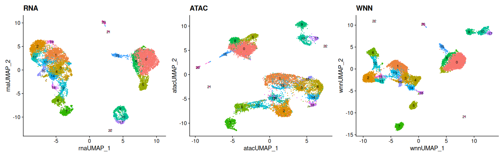
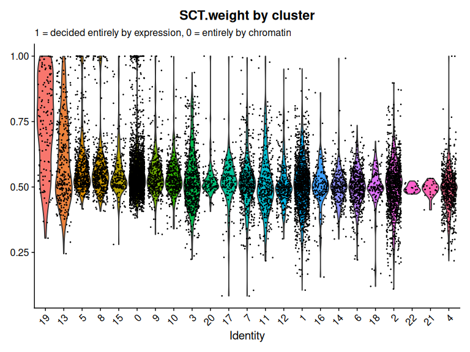
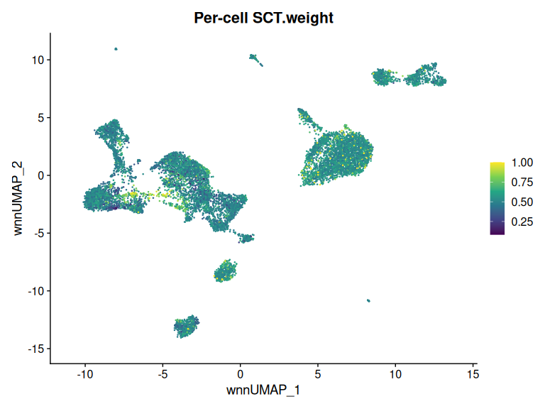
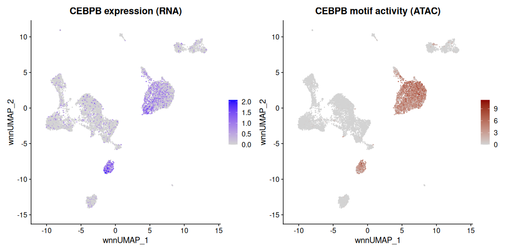

# Weighted nearest neighbors and motif activity


- [Before you start](#before-you-start)
- [Setup](#setup)
- [Starting from the previous
  tutorial](#starting-from-the-previous-tutorial)
- [Weighted nearest neighbors](#weighted-nearest-neighbors)
- [Looking at the weights](#looking-at-the-weights)
- [Motif analysis](#motif-analysis)
- [TF expression versus motif
  activity](#tf-expression-versus-motif-activity)
- [Finding cell-type-specific
  factors](#finding-cell-type-specific-factors)
- [What motif activity cannot tell
  you](#what-motif-activity-cannot-tell-you)
- [Save your work](#save-your-work)
- [Session information](#session-information)

The [previous tutorial](08_rna_atac.md) processed RNA and ATAC
separately and produced two UMAPs of the same cells. That leaves an
awkward question: which one do you cluster on?

Neither answer is satisfying. Cluster on RNA and you ignore the
chromatin evidence. Cluster on ATAC and you ignore expression.
Concatenating the two is worse than it sounds — the modalities have
different scales, different noise characteristics, and different numbers
of features, so whichever has more variance simply wins.

Weighted nearest neighbors solves this per cell rather than globally.
For each individual cell, WNN asks which modality better predicts its
neighbors, and weights accordingly. A cell whose identity is clear from
expression leans on RNA; one distinguished mainly by its regulatory
state leans on ATAC. The weights are learned from the data, not set by
you.

This tutorial then does something ATAC makes possible and RNA does not:
infers which **transcription factors** are active in each cell, by
asking which binding motifs are enriched in the regions that cell has
open.

## Before you start

This tutorial is the most demanding in the course. It needs about **64
GB of memory** and runs in **3–5 hours**, most of that in the chromVAR
step.

``` bash
interactive -a cusanovichlab -n 16 -t 08:00:00
```

Do not run this interactively and wait. Write a batch script and come
back.

## Setup

``` r
library(Signac)
library(Seurat)
library(EnsDb.Hsapiens.v86)
library(GenomeInfoDb)
library(GenomicRanges)
library(BSgenome.Hsapiens.UCSC.hg38)
library(chromVAR)
library(SummarizedExperiment)
library(BiocParallel)
library(motifmatchr)
library(TFBSTools)
library(JASPAR2024)
library(RSQLite)
library(presto)
library(ggplot2)
library(patchwork)
library(dplyr)

set.seed(1234)

# CHANGE THIS to your NetID.
NETID <- "your_netid"

if (nzchar(Sys.getenv("CMM523_NETID"))) NETID <- Sys.getenv("CMM523_NETID")

WORK <- file.path("/xdisk/darrenc/cmm_523", NETID, "wnn")
dir.create(file.path(WORK, "output"), recursive = TRUE, showWarnings = FALSE)

PREV <- file.path("/xdisk/darrenc/cmm_523", NETID, "rna_atac", "output",
                  "pbmc_multiome.rds")

options(future.globals.maxSize = 16000 * 1024^2)

# Run chromVAR serially. It parallelizes through BiocParallel, and each worker
# forks a copy of the peak matrix -- with ~100,000 peaks and 11,000 cells that
# multiplies memory fast and gets the job killed by the scheduler. The failure
# does not look like a memory error either: you get
# "wrong args for environment subassignment" from BiocParallel's result
# collector, because it is trying to gather a result from a worker that no
# longer exists. Serial is slower and it finishes.
BiocParallel::register(BiocParallel::SerialParam())

WORK
```

    #> [1] "/xdisk/darrenc/cmm_523/darrenc/wnn"

## Starting from the previous tutorial

``` r
stopifnot(file.exists(PREV))
pbmc <- readRDS(PREV)
pbmc
```

    #> An object of class Seurat 
    #> 167092 features across 11172 samples within 3 assays 
    #> Active assay: ATAC (106056 features, 106056 variable features)
    #>  2 layers present: counts, data
    #>  2 other assays present: RNA, SCT
    #>  4 dimensional reductions calculated: pca, umap.rna, lsi, umap.atac

If that `stopifnot` fails, run the [RNA+ATAC tutorial](08_rna_atac.md)
first — this one starts where that one stopped.

## Weighted nearest neighbors

``` r
pbmc <- FindMultiModalNeighbors(
  pbmc,
  reduction.list = list("pca", "lsi"),
  dims.list = list(1:50, 2:50)
)

pbmc <- RunUMAP(pbmc, nn.name = "weighted.nn",
                reduction.name = "wnn.umap", reduction.key = "wnnUMAP_")

pbmc <- FindClusters(pbmc, graph.name = "wsnn", algorithm = 3, verbose = FALSE)
```

Note `dims.list = list(1:50, 2:50)`. The RNA reduction uses all 50
components; the ATAC one starts at 2, because the first LSI component
tracks sequencing depth rather than biology. That asymmetry is easy to
miss and it matters.

``` r
p1 <- DimPlot(pbmc, reduction = "umap.rna",  label = TRUE, label.size = 3) +
  ggtitle("RNA") + NoLegend()
p2 <- DimPlot(pbmc, reduction = "umap.atac", label = TRUE, label.size = 3) +
  ggtitle("ATAC") + NoLegend()
p3 <- DimPlot(pbmc, reduction = "wnn.umap",  label = TRUE, label.size = 3) +
  ggtitle("WNN") + NoLegend()

p1 + p2 + p3
```



## Looking at the weights

The weights are the interesting output, and they are easy to overlook.

`FindMultiModalNeighbors()` writes one weight column per modality into
the metadata, named after the **assay** behind each reduction — not
after the reduction. Our PCA was computed on the `SCT` assay, so the
column is `SCT.weight` rather than `RNA.weight`. Find it rather than
assuming:

``` r
weight_cols <- grep("\\.weight$", colnames(pbmc@meta.data), value = TRUE)
weight_cols
```

    #> [1] "SCT.weight"  "ATAC.weight"

``` r
rna_weight <- weight_cols[1]
summary(pbmc@meta.data[[rna_weight]])
```

    #>    Min. 1st Qu.  Median    Mean 3rd Qu.    Max. 
    #> 0.08336 0.47942 0.52089 0.53439 0.57330 1.00000

``` r
VlnPlot(pbmc, features = rna_weight, group.by = "seurat_clusters",
        sort = TRUE, pt.size = 0.1) +
  NoLegend() +
  labs(title = paste(rna_weight, "by cluster"),
       subtitle = "1 = decided entirely by expression, 0 = entirely by chromatin")
```



``` r
FeaturePlot(pbmc, reduction = "wnn.umap", features = rna_weight) +
  scale_colour_viridis_c() +
  ggtitle(paste("Per-cell", rna_weight))
```



Cells on the right of that violin plot were defined mostly by
expression; those on the left by chromatin. This is a real result about
your data rather than a diagnostic. If a population sits near 0.5, both
modalities contributed — and if one sits at an extreme, that tells you
something about which measurement carries the information for that cell
type.

## Motif analysis

Everything so far treated peaks as anonymous coordinates. Now we ask
what is *in* them.

The logic: transcription factors bind specific sequence motifs. If a
cell’s open regions are enriched for a particular motif, that factor is
plausibly active in that cell. This gives a per-cell estimate of TF
activity — something RNA alone cannot provide, because a transcription
factor’s mRNA level is a poor guide to whether the protein is bound and
working.

``` r
DefaultAssay(pbmc) <- "ATAC"

# JASPAR2024 changed its interface. getMatrixSet() will NOT accept a JASPAR2024
# object directly -- it fails with "unable to find an inherited method for
# function 'getMatrixSet' for signature 'JASPAR2024'". You have to open a
# connection to the bundled SQLite database and pass that instead. Older code
# and tutorials using JASPAR2020 pass the object, which is why this is a common
# thing to get stuck on.
jaspar     <- JASPAR2024::JASPAR2024()
jaspar_con <- RSQLite::dbConnect(RSQLite::SQLite(), db(jaspar))

pwm_set <- TFBSTools::getMatrixSet(
  jaspar_con,
  opts = list(species = 9606, collection = "CORE", all_versions = FALSE)
)

length(pwm_set)
```

    #> [1] 720

``` r
motif.matrix <- CreateMotifMatrix(
  features = granges(pbmc),
  pwm = pwm_set,
  genome = BSgenome.Hsapiens.UCSC.hg38,
  use.counts = FALSE
)

motif.object <- CreateMotifObject(data = motif.matrix, pwm = pwm_set)
Motifs(pbmc[["ATAC"]]) <- motif.object

dim(motif.matrix)
```

    #> [1] 106056    720

That matrix is peaks by motifs: for each peak, which transcription
factor motifs it contains.

Older tutorials do this with `Signac::RunChromVAR()`. That wrapper was
removed in Signac 1.17, so we call chromVAR directly. It is no harder,
and it makes visible what the wrapper was hiding — which is worth seeing
once.

``` r
# This is the slow step: 30-60 minutes.

# 1. chromVAR works on a SummarizedExperiment, not a Seurat object. Build one
#    from the peak counts and their genomic ranges.
peak_counts <- LayerData(pbmc, assay = "ATAC", layer = "counts")
peak_ranges <- granges(pbmc)

se <- SummarizedExperiment(
  assays = list(counts = peak_counts),
  rowRanges = peak_ranges
)

# 2. Compute GC content per peak. This is the correction that stops the result
#    being a readout of sequence composition -- GC-rich regions are more
#    accessible in essentially every assay, so without this the motifs that
#    happen to be GC-rich would look universally "active".
se <- addGCBias(se, genome = BSgenome.Hsapiens.UCSC.hg38)

# 3. The peak-by-motif matrix we built above, pulled back out of the object.
motif_ix <- GetMotifData(object = pbmc, assay = "ATAC", slot = "data")

# 4. Deviations. chromVAR compares observed accessibility at each motif's sites
#    against a background set of peaks matched for GC content and overall
#    accessibility, then reports a z-score per motif per cell.
dev <- computeDeviations(object = se, annotations = motif_ix)

# That took an hour, so write it out. Saving any result that was expensive to
# compute is a good habit -- you will want it again.
saveRDS(dev, file.path(WORK, "output", "chromvar_deviations.rds"))

# 5. Put the z-scores into the Seurat object as their own assay.
pbmc[["chromvar"]] <- CreateAssayObject(data = assays(dev)$z)

DefaultAssay(pbmc) <- "chromvar"
pbmc
```

    #> An object of class Seurat 
    #> 167812 features across 11172 samples within 4 assays 
    #> Active assay: chromvar (720 features, 0 variable features)
    #>  1 layer present: data
    #>  3 other assays present: RNA, ATAC, SCT
    #>  5 dimensional reductions calculated: pca, umap.rna, lsi, umap.atac, wnn.umap

So the deviation score is: how much more (or less) accessible that
motif’s sites are in this cell than in comparable peaks. Those
background corrections are the whole method — without them you would
mostly be measuring which cells have more open chromatin overall, and
every motif would look active in the same cells.

## TF expression versus motif activity

Here is where having both modalities pays off, because you can compare a
factor’s mRNA against its inferred activity in the same cells.

``` r
# assay = "ATAC" is not optional here. The motif data lives in the ATAC assay,
# but the default assay is now "chromvar" -- and ConvertMotifID looks in the
# default unless told otherwise, failing with "Cannot run ConvertMotifID on a
# standard Assay object". Anywhere you touch motifs after this point, name the
# assay.
motif.name <- ConvertMotifID(pbmc, name = "CEBPB", assay = "ATAC")

DefaultAssay(pbmc) <- "SCT"
gene_plot <- FeaturePlot(pbmc, features = "CEBPB", reduction = "wnn.umap") +
  ggtitle("CEBPB expression (RNA)")

DefaultAssay(pbmc) <- "chromvar"
motif_plot <- FeaturePlot(pbmc, features = motif.name, reduction = "wnn.umap",
                          min.cutoff = 0, cols = c("lightgrey", "darkred")) +
  ggtitle("CEBPB motif activity (ATAC)")

gene_plot | motif_plot
```



These two panels do not have to agree, and where they disagree is
informative. A factor can be transcribed without being active — held
inactive by phosphorylation state, localization, or a missing cofactor.
It can also be active with low mRNA, because a little protein goes a
long way and mRNA is noisy in single cells.

## Finding cell-type-specific factors

The strongest evidence for a factor mattering in a cell type is when
expression and motif activity agree. We test both and intersect.

``` r
markers_rna <- presto::wilcoxauc(pbmc, group_by = "seurat_clusters",
                                 seurat_assay = "SCT", assay = "data")
markers_motifs <- presto::wilcoxauc(pbmc, group_by = "seurat_clusters",
                                    seurat_assay = "chromvar", assay = "data")

motif.names <- markers_motifs$feature
colnames(markers_rna)    <- paste0("RNA.",   colnames(markers_rna))
colnames(markers_motifs) <- paste0("motif.", colnames(markers_motifs))
markers_rna$gene    <- markers_rna$RNA.feature
markers_motifs$gene <- ConvertMotifID(pbmc, id = motif.names, assay = "ATAC")

topTFs <- function(celltype, padj.cutoff = 1e-2) {
  ctmarkers_rna <- dplyr::filter(
    markers_rna, RNA.group == celltype,
    RNA.padj < padj.cutoff, RNA.logFC > 0) %>% arrange(-RNA.auc)

  ctmarkers_motif <- dplyr::filter(
    markers_motifs, motif.group == celltype,
    motif.padj < padj.cutoff, motif.logFC > 0) %>% arrange(-motif.auc)

  top_tfs <- inner_join(
    x = ctmarkers_rna[, c("RNA.feature", "gene", "RNA.auc", "RNA.padj")],
    y = ctmarkers_motif[, c("motif.feature", "gene", "motif.auc", "motif.padj")],
    by = "gene"
  )
  top_tfs$avg_auc <- (top_tfs$RNA.auc + top_tfs$motif.auc) / 2
  arrange(top_tfs, -avg_auc)
}

for (ct in head(levels(pbmc$seurat_clusters), 6)) {
  cat("\n--- cluster", ct, "---\n")
  print(head(topTFs(ct)[, c("gene", "RNA.auc", "motif.auc", "avg_auc")], 4))
}
```

    #> 
    #> --- cluster 0 ---
    #>    gene   RNA.auc motif.auc   avg_auc
    #> 1   FOS 0.9066331 0.9369494 0.9217913
    #> 2 BACH1 0.8576660 0.9325554 0.8951107
    #> 3  ETV6 0.8602019 0.8773863 0.8687941
    #> 4   JUN 0.7656221 0.9288418 0.8472320
    #> 
    #> --- cluster 1 ---
    #>    gene   RNA.auc motif.auc   avg_auc
    #> 1  TCF7 0.7614602 0.6631919 0.7123261
    #> 2 FOXP1 0.7439536 0.5994160 0.6716848
    #> 3  ZEB1 0.6029424 0.6618768 0.6324096
    #> 4 KLF12 0.5802499 0.5312664 0.5557581
    #> 
    #> --- cluster 2 ---
    #>    gene   RNA.auc motif.auc   avg_auc
    #> 1  TCF7 0.7268420 0.7146675 0.7207547
    #> 2 FOXP1 0.7362672 0.5934838 0.6648755
    #> 3  ZEB1 0.6159154 0.6989304 0.6574229
    #> 4 RUNX2 0.6037125 0.6256294 0.6146710
    #> 
    #> --- cluster 3 ---
    #>    gene   RNA.auc motif.auc   avg_auc
    #> 1  TCF7 0.6827563 0.6998569 0.6913066
    #> 2 KLF12 0.7162470 0.5711257 0.6436864
    #> 3  CTCF 0.5318090 0.7424809 0.6371449
    #> 4  ZEB1 0.6265308 0.6427955 0.6346631
    #> 
    #> --- cluster 4 ---
    #>    gene   RNA.auc motif.auc   avg_auc
    #> 1  TCF7 0.6253986 0.6547040 0.6400513
    #> 2 KLF12 0.6868242 0.5654190 0.6261216
    #> 3 RUNX2 0.5790814 0.6274301 0.6032557
    #> 4  ZEB1 0.6246100 0.5597552 0.5921826
    #> 
    #> --- cluster 5 ---
    #>     gene   RNA.auc motif.auc   avg_auc
    #> 1  CEBPB 0.8676007 0.7962376 0.8319191
    #> 2 POU2F2 0.8543410 0.7338494 0.7940952
    #> 3  CEBPA 0.7182649 0.7993547 0.7588098
    #> 4   RARA 0.6716280 0.8367362 0.7541821

A factor appearing here is expressed *and* has enriched motif
accessibility in that cluster. That is much better evidence than either
alone — though still correlative, and still a hypothesis rather than a
result.

## What motif activity cannot tell you

Worth being explicit, because chromVAR output is easy to over-read.

Motifs are short and degenerate. A given motif occurs in far more places
in the genome than the factor actually binds, so motif presence is a
weak proxy for occupancy.

Related factors share motifs. Many JASPAR entries are near-identical
across a family, and chromVAR cannot distinguish family members. A
“CEBPB” signal may equally be CEBPA, CEBPD, or several others.

And an enriched motif does not establish direction. A factor’s sites
being open is consistent with it binding there, with it having bound
previously, or with something else keeping that chromatin accessible.

What this is good for is generating a short list of candidate regulators
from an unbiased genome-wide measurement. The next step is a
perturbation, a ChIP, or a footprinting analysis — not a stronger claim
from the same data.

## Save your work

``` r
saveRDS(pbmc, file = file.path(WORK, "output", "pbmc_wnn_chromvar.rds"))
RSQLite::dbDisconnect(jaspar_con)
```

## Session information

``` r
sessionInfo()
```

    #> R version 4.6.1 (2026-06-24)
    #> Platform: x86_64-pc-linux-gnu
    #> Running under: Ubuntu 24.04.4 LTS
    #> 
    #> Matrix products: default
    #> BLAS:   /usr/lib/x86_64-linux-gnu/openblas-pthread/libblas.so.3 
    #> LAPACK: /usr/lib/x86_64-linux-gnu/openblas-pthread/libopenblasp-r0.3.26.so;  LAPACK version 3.12.0
    #> 
    #> locale:
    #>  [1] LC_CTYPE=C.UTF-8       LC_NUMERIC=C           LC_TIME=C.UTF-8       
    #>  [4] LC_COLLATE=C.UTF-8     LC_MONETARY=C.UTF-8    LC_MESSAGES=C.UTF-8   
    #>  [7] LC_PAPER=C.UTF-8       LC_NAME=C              LC_ADDRESS=C          
    #> [10] LC_TELEPHONE=C         LC_MEASUREMENT=C.UTF-8 LC_IDENTIFICATION=C   
    #> 
    #> time zone: Etc/UTC
    #> tzcode source: system (glibc)
    #> 
    #> attached base packages:
    #> [1] stats4    stats     graphics  grDevices utils     datasets  methods  
    #> [8] base     
    #> 
    #> other attached packages:
    #>  [1] future_1.75.0                     dplyr_1.2.1                      
    #>  [3] patchwork_1.3.2                   ggplot2_4.0.3                    
    #>  [5] presto_1.1.0                      RSQLite_3.53.3                   
    #>  [7] JASPAR2024_0.99.7                 BiocFileCache_3.2.0              
    #>  [9] dbplyr_2.6.0                      TFBSTools_1.50.0                 
    #> [11] motifmatchr_1.34.0                BiocParallel_1.46.0              
    #> [13] SummarizedExperiment_1.42.0       MatrixGenerics_1.24.0            
    #> [15] matrixStats_1.5.0                 chromVAR_1.34.1                  
    #> [17] BSgenome.Hsapiens.UCSC.hg38_1.4.5 BSgenome_1.80.0                  
    #> [19] rtracklayer_1.72.0                BiocIO_1.22.0                    
    #> [21] Biostrings_2.80.2                 XVector_0.52.0                   
    #> [23] GenomeInfoDb_1.48.0               EnsDb.Hsapiens.v86_2.99.0        
    #> [25] ensembldb_2.36.1                  AnnotationFilter_1.36.0          
    #> [27] GenomicFeatures_1.64.0            AnnotationDbi_1.74.0             
    #> [29] Biobase_2.72.0                    GenomicRanges_1.64.0             
    #> [31] Seqinfo_1.2.0                     IRanges_2.46.0                   
    #> [33] S4Vectors_0.50.2                  BiocGenerics_0.58.1              
    #> [35] generics_0.1.4                    Seurat_5.5.1                     
    #> [37] SeuratObject_5.4.0                sp_2.2-3                         
    #> [39] Signac_1.17.1                    
    #> 
    #> loaded via a namespace (and not attached):
    #>   [1] RcppAnnoy_0.0.23            splines_4.6.1              
    #>   [3] later_1.4.8                 filelock_1.0.3             
    #>   [5] bitops_1.1-0                tibble_3.3.1               
    #>   [7] polyclip_1.10-7             DirichletMultinomial_1.54.0
    #>   [9] XML_3.99-0.23               fastDummies_1.7.6          
    #>  [11] httr2_1.3.0                 lifecycle_1.0.5            
    #>  [13] pwalign_1.8.0               globals_0.19.1             
    #>  [15] lattice_0.22-9              MASS_7.3-66                
    #>  [17] magrittr_2.0.5              plotly_4.12.1              
    #>  [19] rmarkdown_2.31              yaml_2.3.12                
    #>  [21] httpuv_1.6.17               otel_0.2.0                 
    #>  [23] sctransform_0.4.3           spam_2.11-4                
    #>  [25] spatstat.sparse_3.2-0       reticulate_1.46.0          
    #>  [27] cowplot_1.2.0               pbapply_1.7-4              
    #>  [29] DBI_1.3.0                   RColorBrewer_1.1-3         
    #>  [31] abind_1.4-8                 Rtsne_0.17                 
    #>  [33] purrr_1.2.2                 RCurl_1.98-1.19            
    #>  [35] ggrepel_0.9.8               irlba_2.3.7                
    #>  [37] listenv_1.0.0               spatstat.utils_3.2-4       
    #>  [39] seqLogo_1.78.0              goftest_1.2-3              
    #>  [41] RSpectra_0.16-2             spatstat.random_3.5-1      
    #>  [43] fitdistrplus_1.2-6          parallelly_1.48.0          
    #>  [45] codetools_0.2-20            DelayedArray_0.38.2        
    #>  [47] RcppRoll_0.3.2              DT_0.34.0                  
    #>  [49] tidyselect_1.2.1            UCSC.utils_1.8.0           
    #>  [51] farver_2.1.2                spatstat.explore_3.8-2     
    #>  [53] GenomicAlignments_1.48.0    jsonlite_2.0.0             
    #>  [55] progressr_1.0.0             ggridges_0.5.7             
    #>  [57] survival_3.8-9              tools_4.6.1                
    #>  [59] TFMPvalue_1.0.0             ica_1.0-3                  
    #>  [61] Rcpp_1.1.2                  glue_1.8.1                 
    #>  [63] gridExtra_2.3.1             SparseArray_1.12.2         
    #>  [65] xfun_0.60                   withr_3.0.3                
    #>  [67] fastmap_1.2.0               caTools_1.18.4             
    #>  [69] digest_0.6.39               R6_2.6.1                   
    #>  [71] mime_0.13                   nabor_0.5.0                
    #>  [73] scattermore_1.2             gtools_3.9.5               
    #>  [75] tensor_1.5.1                dichromat_2.0-1            
    #>  [77] spatstat.data_3.1-9         cigarillo_1.2.1            
    #>  [79] tidyr_1.3.2                 data.table_1.18.4          
    #>  [81] httr_1.4.8                  htmlwidgets_1.6.4          
    #>  [83] S4Arrays_1.12.0             uwot_0.2.4                 
    #>  [85] pkgconfig_2.0.3             gtable_0.3.6               
    #>  [87] blob_1.3.0                  lmtest_0.9-40              
    #>  [89] S7_0.2.2                    htmltools_0.5.9            
    #>  [91] dotCall64_1.2               ProtGenerics_1.44.0        
    #>  [93] scales_1.4.0                png_0.1-9                  
    #>  [95] spatstat.univar_3.2-0       knitr_1.51                 
    #>  [97] reshape2_1.4.5              rjson_0.2.23               
    #>  [99] nlme_3.1-170                curl_7.1.0                 
    #> [101] zoo_1.9-0                   cachem_1.1.0               
    #> [103] stringr_1.6.0               KernSmooth_2.23-26         
    #> [105] vipor_0.4.7                 parallel_4.6.1             
    #> [107] miniUI_0.1.2                ggrastr_1.0.2              
    #> [109] restfulr_0.0.17             pillar_1.11.1              
    #> [111] grid_4.6.1                  vctrs_0.7.3                
    #> [113] RANN_2.6.2                  promises_1.5.0             
    #> [115] xtable_1.8-8                cluster_2.1.8.3            
    #> [117] beeswarm_0.4.0              evaluate_1.0.5             
    #> [119] cli_3.6.6                   compiler_4.6.1             
    #> [121] Rsamtools_2.28.0            rlang_1.3.0                
    #> [123] crayon_1.5.3                future.apply_1.20.2        
    #> [125] labeling_0.4.3              ggbeeswarm_0.7.3           
    #> [127] plyr_1.8.9                  stringi_1.8.9              
    #> [129] viridisLite_0.4.3           deldir_2.0-4               
    #> [131] lazyeval_0.2.3              spatstat.geom_3.8-2        
    #> [133] Matrix_1.7-6                RcppHNSW_0.7.0             
    #> [135] sparseMatrixStats_1.24.0    bit64_4.8.2                
    #> [137] KEGGREST_1.52.2             shiny_1.14.0               
    #> [139] ROCR_1.0-12                 igraph_2.3.3               
    #> [141] memoise_2.0.1               fastmatch_1.1-8            
    #> [143] bit_4.6.0

------------------------------------------------------------------------

*Adapted from the Seurat [WNN
vignette](https://satijalab.org/seurat/articles/weighted_nearest_neighbor_analysis)
and the Signac [motif analysis
vignette](https://stuartlab.org/signac/articles/motif_vignette), updated
for Seurat 5, Signac 1.17 and JASPAR2024.*
